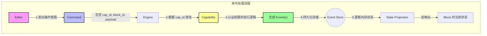
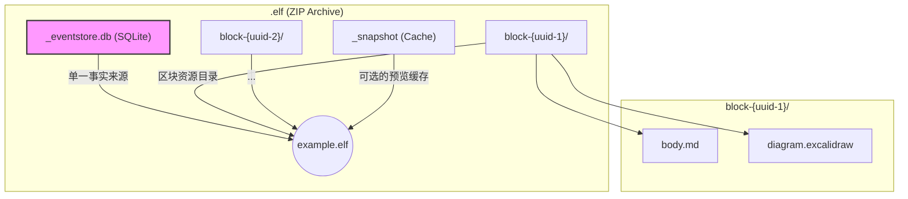
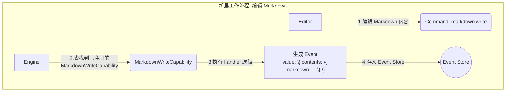

# Elfiee 架构概览

本文档旨在提供 Elfiee 系统的高级架构概览，阐述其核心设计原则、关键组件以及扩展机制。

## 1. 核心三大理念 (Three Core Principles)

Elfiee 的设计基于三大核心原则，它们共同构建了一个健壮、可追溯且高度可扩展的系统。

1.  **区块化编辑 (Block-based Editing)**: 所有内容都被组织成独立的、带类型的“区块” (`Block`)。每个文档都是由这些区块构成的复合体，而非单一的文本流。
2.  **事件溯源 (Event Sourcing)**: 系统中的任何状态变更都不是直接修改数据，而是通过记录一个不可变的“事件” (`Event`) 来完成。完整的历史记录使得版本控制、协作和调试变得简单可靠。
3.  **能力驱动架构 (Capability-based Architecture)**: 功能并非写死在核心引擎中，而是被定义为可动态注册的“能力” (`Capability`)。这些能力与特定的区块类型关联，决定了用户能对区块执行何种操作。

## 2. 核心实体与流程 (Core Entities & Flow)

系统的运作围绕着几个核心实体展开，它们之间的交互构成了整个命令处理流程。

- **`Editor` (编辑者)**: 代表与系统交互的用户或自动化代理。
- **`Block` (区块)**: 内容的基本单元，拥有唯一的 `block_id` 和类型 `block_type`。
- **`Command` (命令)**: `Editor` 发出的意图，表示想要执行某个操作，例如“创建一个区块”或“更新一段文字”。
- **`Capability` (能力)**: 定义了具体操作的逻辑。它接收 `Command`，执行后生成 `Event`。
- **`Event` (事件)**: 对系统状态变更的唯一、不可变的记录。它是系统的“事实来源”。

### 命令处理流程

`Editor` 的操作意图被包装成 `Command`，由 `Engine`（引擎）根据其 `cap_id` 调度给对应的 `Capability` 处理，最终生成 `Event` 并存入 `Event Store`（事件存储）。系统的当前状态是通过重放这些事件来构建的。

## 3. .elf 文件格式

`.elf` 文件是一个标准的 `ZIP` 压缩包，它将构成一个完整文档所需的所有信息都打包在一起。

### 文件内部结构

解压后，`.elf` 文件包含事件日志、缓存和与 `Block` 相关的资源。

- **`_eventstore.db`**: 一个 `SQLite` 数据库，是整个文件的核心。它以只追加的方式记录了所有的 `Event`，是重建任何历史状态的唯一依据。
- **`block-{uuid}/`**: 每个 `Block` 都可以拥有一个专属目录，用于存放代码、图片、图表文件等“重度”资源。这使得 `.elf` 文件可以自包含所有依赖。
- **`_snapshot`**: 一个可选的、人类可读的缓存文件（如 `Markdown`），用于在不支持完整 Elfiee 引擎的环境中提供快速预览。

## 4. 扩展系统 (The Extension System)

Elfiee 的强大之处在于其可扩展性。开发者无需修改核心代码，即可通过创建“扩展” (`Extension`) 来增加对新内容类型的支持。

### 如何创建扩展

创建一个扩展的核心是定义一个新的 `block_type` 并为其实现相应的 `Capability`。

1.  **定义 `block_type`**: 为你的新内容类型选择一个唯一的名称，例如 `custom/mermaid`。
2.  **实现 `Capability`**: 创建一个或多个 `Capability` 来操作这种新类型的 `Block`。例如，为 `custom/mermaid` 类型实现一个 `mermaid.write` 能力。
3.  **实现 `handler`**: 在 `Capability` 的 `handler` 函数中，编写具体的业务逻辑。例如，`mermaid.write` 的 `handler` 会接收新的图表代码，并生成一个更新 `Block` 内容的 `Event`。
4.  **注册 `Capability`**: 将你实现的 `Capability` 注册到系统的 `CapabilityRegistry` 中，这样引擎就能在接收到相应 `Command` 时找到它。

### 扩展工作流程示例

下图展示了 `markdown.write` 这个扩展 `Capability` 是如何工作的：

通过这个模式，Elfiee 可以轻松支持任何类型的内容，从代码片段、数学公式到复杂的看板或白板，只需为其实现相应的 `Capability` 即可。
