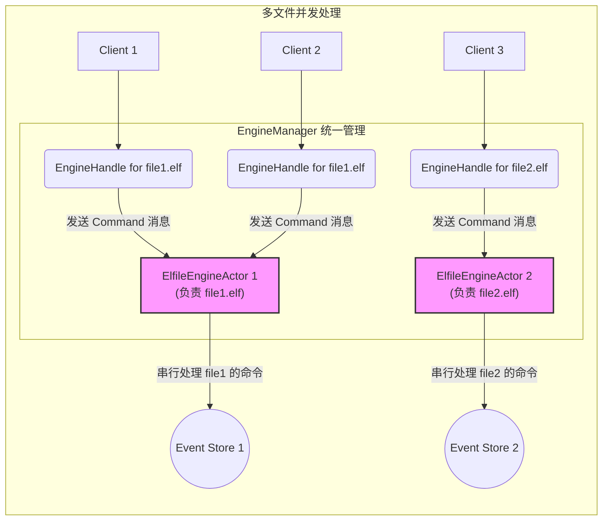
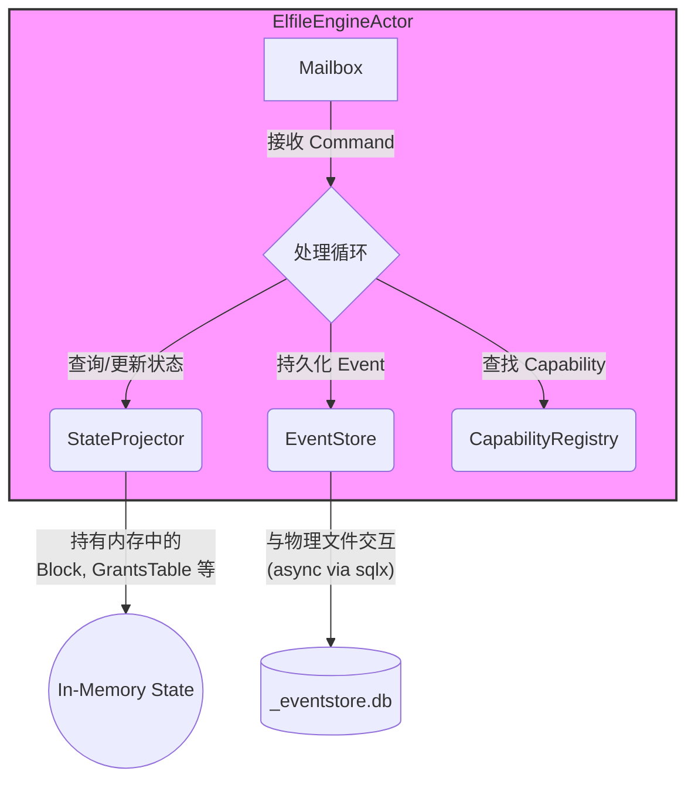
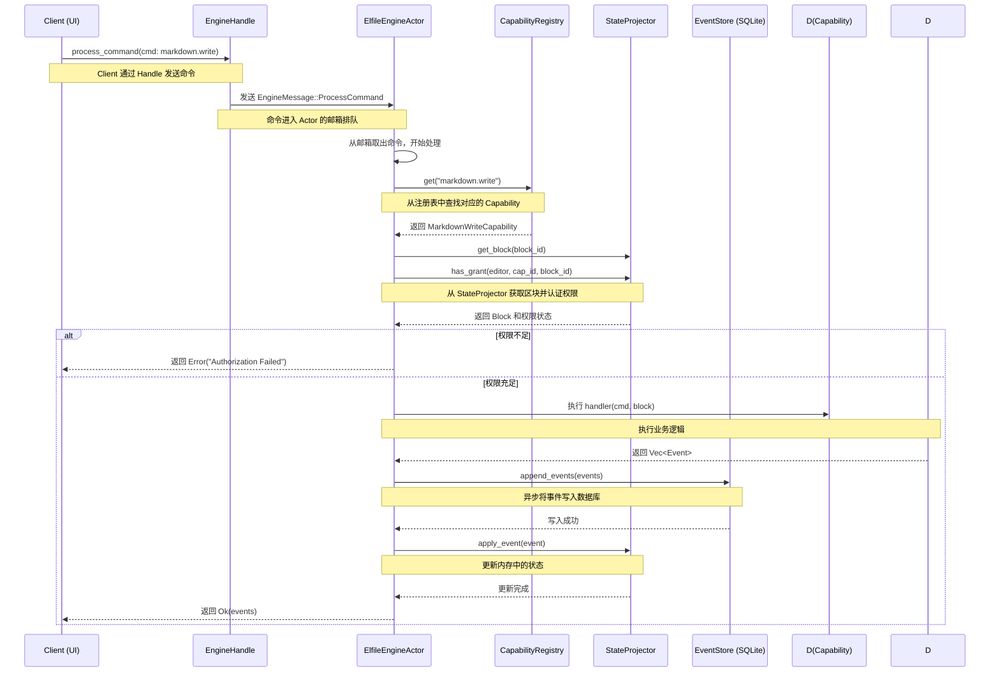

# Elfiee 引擎设计理念

本文档聚焦于 Elfiee 的核心——`Elfile Engine`（文件引擎），详细解释其设计思想、内部组件以及工作流程。

## 1. 为何采用 Actor 模型？ (Why the Actor Model?)

在 Elfiee 中，用户可能同时打开并编辑多个 `.elf` 文件，未来甚至可能支持多人协作编辑同一个文件。这带来了并发控制的挑战。

**问题**: 如果多个操作（`Command`）同时尝试修改同一个文件的状态，如何避免数据竞争和状态不一致？

**解决方案**: Elfiee 采用了 `Actor` 模型。系统不直接操作文件，而是为每一个打开的 `.elf` 文件在内存中创建一个专属的 `ElfileEngineActor`。

- **独立性**: 每个 `Actor` 独立负责一个文件的所有操作，其内部状态（如 `Block` 列表）与其它 `Actor` 完全隔离。
- **串行处理**: 所有针对该文件的 `Command` 都会被发送到对应 `Actor` 的“邮箱” (`Mailbox` / `mpsc channel`) 中排队。`Actor` 会按顺序逐一处理这些消息，从而天然地避免了并发冲突。
- **无锁并发**: 不同的文件由不同的 `Actor` 在不同的线程中处理，实现了文件间的真并发，而文件内的操作则通过消息队列实现了无锁化的串行执行，既保证了安全又提升了性能。

## 2. 引擎的核心组件 (Core Engine Components)

`Elfile Engine` 由几个关键组件协同工作：

- **`EngineManager`**: 引擎管理器。它是所有 `Actor` 的“总管”，负责创建、查询和销毁特定文件的 `ElfileEngineActor` 实例。当应用打开一个新文件时，就是由它来启动一个新的引擎 `Actor`。

- **`ElfileEngineActor`**: 引擎 `Actor`。每个实例对应一个打开的 `.elf` 文件，是命令处理的核心。它拥有自己的邮箱，用于接收和处理所有针对该文件的 `Command`。

- **`StateProjector`**: 状态投影器。`Actor` 内部持有的一个组件，负责在内存中维护文件的当前状态。它通过在启动时重放 `Event Store` 中的所有事件来初始化，并在每次有新事件提交后更新自身状态。所有读取操作（如获取区块内容）都直接查询这个内存状态，速度极快。

- **`EventStore`**: 事件存储。它是一个与物理数据库 (`_eventstore.db`) 交互的接口，提供了将 `Event` 追加到数据库和从数据库读取所有 `Event` 的功能。引擎使用 `sqlx` 库来异步执行这些数据库操作，避免阻塞 `Actor` 的主循环。

## 3. 一次命令的生命周期 (Lifecycle of a Command)

理解一个 `Command` 如何在引擎中被处理，是理解整个系统的关键。以下是 `markdown.write` 命令的完整流程：

**流程总结**：

1.  **发送**: 客户端通过 `EngineHandle` 发送一个 `Command`。
2.  **接收**: `ElfileEngineActor` 从其邮箱中接收到该 `Command`。
3.  **分发**: `Actor` 从 `CapabilityRegistry` 中查找与 `Command` 的 `cap_id` 匹配的 `Capability`。
4.  **认证**: `Actor` 使用 `StateProjector` 中缓存的 `GrantsTable` 来检查 `Editor` 是否有权执行此操作。
5.  **执行**: 如果认证通过，`Actor` 调用 `Capability` 的 `handler` 方法，执行核心业务逻辑。
6.  **生成事件**: `handler` 返回一个或多个 `Event` 对象，这些对象描述了刚刚发生的状态变更。
7.  **持久化**: `Actor` 通过 `EventStore` 将这些新生成的 `Event` 异步地写入 `_eventstore.db`。这是整个流程中唯一涉及磁盘I/O的关键步骤。
8.  **更新状态**: 事件成功持久化后，`Actor` 将这些事件应用到自己的 `StateProjector`，使其内存状态与持久化状态保持一致。
9.  **响应**: `Actor` 将生成的 `Event` 返回给调用方。
