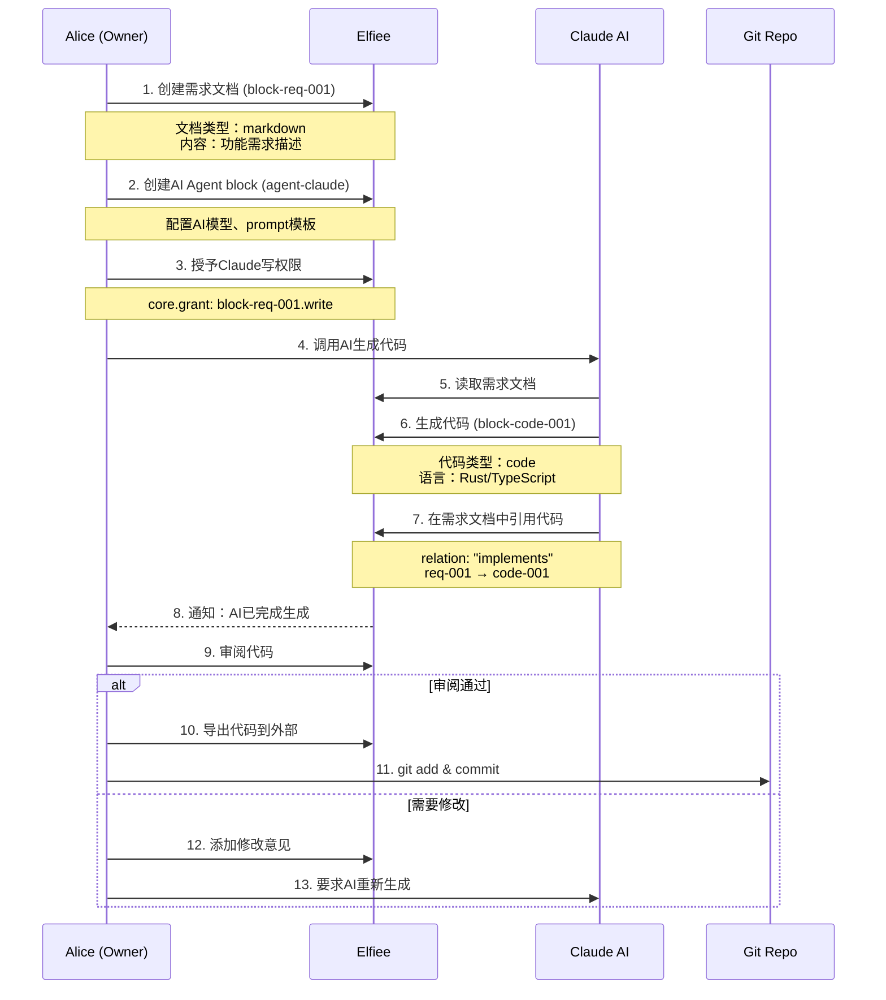
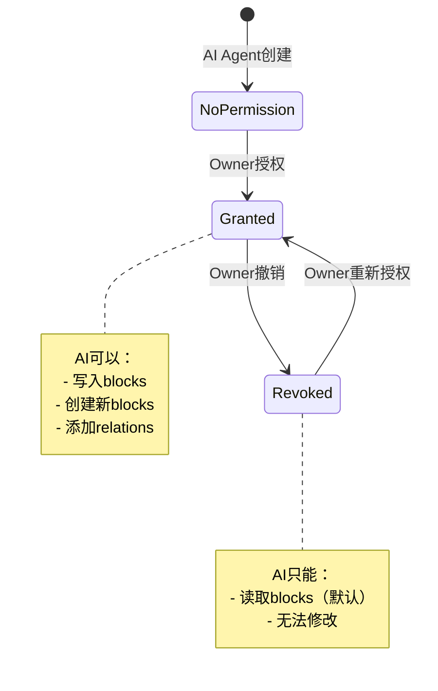
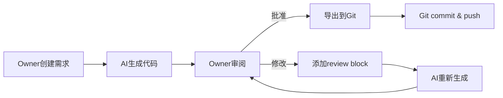

# Elfiee Phase 2: AI Agent集成与Dogfooding

**版本**: 1.0
**创建日期**: 2026-01-06
**目标周期**: 3周（2026-01-06 至 2026-01-24）
**当前状态**: MVP完成，进入Phase 2设计阶段

---

## 1. 开发目标

### 1.1 核心目标

将Elfiee从文档编辑器升级为**AI辅助的项目开发环境**，通过集成AI Agent实现自举式开发（dogfooding），即使用Elfiee本身来开发和改进Elfiee。

### 1.2 具体目标

1. **AI Agent集成**：支持AI作为独立Editor角色参与文档编辑和代码生成
2. **开发工作流**：完整的需求→AI生成→审阅→集成的闭环
3. **权限模型优化**：适配"单人单机多角色"（Owner + 多个AI Agent）场景
4. **代码与文档联动**：实现.elf文件与外部代码仓库的双向同步
5. **可追溯性**：所有AI操作可审计、可回溯、可撤销

### 1.3 成功标准

- ✅ 使用Elfiee创建需求文档，AI生成代码，Owner审阅后集成
- ✅ AI操作完全受CBAC权限控制，可随时撤销授权
- ✅ 所有AI生成的代码可追溯到原始需求文档
- ✅ 代码导出后可直接用于Git提交

---

## 2. 用户故事

### 2.1 主场景：AI辅助开发新功能

**角色**：
- **Alice**（Owner）：项目负责人
- **Claude AI**（AI Agent）：代码生成助手
- **Copilot AI**（AI Agent）：代码审查助手

**流程**：



**详细步骤**：

1. **引入项目上下文**
   - Alice打开Elfiee，创建新的.elf文件：`elfiee-features.elf`
   - 使用`core.create`创建项目配置block（类似`.claude.json`）
   - 定义项目结构、编码规范、依赖关系

2. **编写需求文档**
   - 创建markdown block：`block-req-timeline-feature`
   - 描述需求：实现时间轴功能，支持事件历史可视化
   - 添加技术约束：必须使用React + Zustand，遵循现有架构

3. **配置AI Agent**
   - 创建AI Agent block：`agent-claude-coder`
   - 配置：
     ```json
     {
       "model": "claude-sonnet-4-5",
       "provider": "anthropic",
       "tools": ["read_file", "write_file", "execute_command"],
       "prompt_template": "你是Elfiee项目的代码生成助手..."
     }
     ```

4. **授予权限**
   - Owner执行`core.grant`：
     ```typescript
     TauriClient.block.grant({
       target_editor: "agent-claude-coder",
       capability: "code.write",
       target_block: "block-timeline-*" // 通配符授权
     })
     ```

5. **AI生成代码**
   - Alice在需求文档中调用`@agent-claude-coder`
   - AI读取需求文档和项目配置
   - AI生成代码文件：
     - `src/components/Timeline.tsx`（React组件）
     - `src/lib/timeline-store.ts`（Zustand store）
   - AI创建code blocks并在需求文档中添加引用关系：
     ```
     block-req-timeline (markdown)
       └─ implements → block-timeline-component (code)
       └─ implements → block-timeline-store (code)
     ```

6. **审阅与修改**
   - Alice查看生成的代码
   - 如有问题，添加注释block：`block-review-001`
   - 通过relation链接：`block-review-001 → annotates → block-timeline-component`
   - AI根据注释重新生成

7. **导出与集成**
   - Alice确认代码无误后，执行`file.export`命令
   - Elfiee将code blocks导出到外部文件系统：
     ```
     elfiee-features.elf → export to → /path/to/elfiee/src/
     ```
   - Alice使用Git提交：
     ```bash
     git add src/components/Timeline.tsx src/lib/timeline-store.ts
     git commit -m "feat: Add timeline visualization

     Generated by AI Agent (agent-claude-coder)
     Based on requirement: block-req-timeline-feature

     Co-Authored-By: Claude AI <noreply@anthropic.com>"
     ```

### 2.2 辅助场景

**场景2.1：代码审查**
- Owner创建PR需求文档
- 调用AI Agent（Copilot）审查代码
- AI生成review block，指出潜在问题
- Owner根据建议修改代码

**场景2.2：批量重构**
- Owner创建重构需求文档
- 授予AI写权限到多个文件blocks
- AI批量修改代码结构
- Owner逐个审阅变更

**场景2.3：文档生成**
- Owner创建现有代码的blocks
- 调用AI Agent生成API文档
- AI分析代码结构，生成markdown文档
- Owner审阅后导出到`/docs`

---

## 3. 技术与功能选型

### 3.1 核心功能模块

#### 3.1.1 AI Agent Block Type

**定义**：
```rust
// src-tauri/src/extensions/ai_agent/mod.rs
#[derive(Debug, Clone, Serialize, Deserialize, Type)]
pub struct AIAgentConfig {
    pub model: String,           // "claude-sonnet-4-5"
    pub provider: String,         // "anthropic" | "openai"
    pub api_key_env: String,      // "ANTHROPIC_API_KEY"
    pub tools: Vec<String>,       // ["read_file", "write_file"]
    pub prompt_template: String,  // System prompt
    pub max_tokens: u32,          // 默认8000
    pub temperature: f32,         // 默认0.7
}

pub struct AIAgentBlock {
    block_id: String,
    name: String,              // "Claude Coder"
    block_type: String,        // "ai_agent"
    contents: AIAgentConfig,
    children: HashMap<String, Vec<String>>,
    owner: String,
}
```

**Capabilities**：
- `ai_agent.configure`：配置AI模型参数
- `ai_agent.invoke`：调用AI执行任务
- `ai_agent.grant_tool`：授予AI使用特定工具的权限

**工具系统**（参考MCP - Model Context Protocol）：
```rust
pub trait Tool {
    fn name(&self) -> &str;
    fn description(&self) -> &str;
    fn execute(&self, args: serde_json::Value) -> Result<String, String>;
}

// 内置工具
pub struct ReadFileTool;
pub struct WriteFileTool;
pub struct ExecuteCommandTool;
pub struct SearchCodeTool;
```

#### 3.1.2 Relation System升级

**当前状态**：
- `Block.children: HashMap<String, Vec<String>>`
- 支持任意relation类型（如"links", "embeds"）

**Phase 2增强**：
```rust
// 新增标准relation类型
pub enum StandardRelation {
    Implements,     // 需求 → 代码（实现关系）
    DependsOn,      // 代码A → 代码B（依赖关系）
    Annotates,      // 审阅 → 代码（注释关系）
    References,     // 文档 → 文档（引用关系）
    Supersedes,     // 新版本 → 旧版本（替代关系）
}

// 双向关系索引
pub struct RelationIndex {
    forward: HashMap<String, HashMap<String, Vec<String>>>,  // block_id → relation → targets
    backward: HashMap<String, HashMap<String, Vec<String>>>, // block_id → relation → sources
}
```

**用途**：
- 追溯需求到实现：`req-001.implements → [code-001, code-002]`
- 追溯实现到需求：`code-001.implemented_by → [req-001]`（反向索引）
- 可视化依赖图：在UI中展示block间关系

#### 3.1.3 Terminal Block（PTY支持）

**定义**：
```rust
#[derive(Debug, Clone, Serialize, Deserialize, Type)]
pub struct TerminalConfig {
    pub shell: String,          // "/bin/bash"
    pub cwd: String,            // 工作目录
    pub env: HashMap<String, String>,
}

pub struct TerminalBlock {
    block_id: String,
    name: String,              // "Build Terminal"
    block_type: String,        // "terminal"
    contents: TerminalConfig,
    children: HashMap<String, Vec<String>>,
    owner: String,
    pty: Option<PtyProcess>,   // PTY进程句柄（运行时）
}
```

**Capabilities**：
- `terminal.execute`：执行命令
- `terminal.write`：向PTY写入数据
- `terminal.read`：从PTY读取输出

**实现方案**：
- 使用`portable-pty` crate（跨平台PTY）
- 命令输出存储为events：
  ```json
  {
    "entity": "block-terminal-001",
    "attribute": "alice/terminal.output",
    "value": { "text": "cargo build completed\n", "exit_code": 0 },
    "timestamp": {"alice": 42}
  }
  ```

#### 3.1.4 代码导出/导入系统

**导出功能**：
```rust
// src-tauri/src/commands/export.rs
#[tauri::command]
pub async fn export_blocks(
    file_id: String,
    block_ids: Vec<String>,
    output_dir: String,
) -> Result<Vec<ExportedFile>, String> {
    // 1. 获取所有code blocks
    // 2. 解析文件路径（从block.name或metadata）
    // 3. 写入外部文件系统
    // 4. 返回导出文件列表
}
```

**导入功能**：
```rust
#[tauri::command]
pub async fn import_files(
    file_id: String,
    paths: Vec<String>,
) -> Result<Vec<Block>, String> {
    // 1. 读取外部文件
    // 2. 创建code blocks
    // 3. 自动检测语言和类型
    // 4. 返回创建的blocks
}
```

**同步策略**：
- **单向导出**（Phase 2）：.elf → 外部文件（只读模式）
- **双向同步**（未来）：监听外部文件变化，自动创建新events

### 3.2 权限模型重构

#### 3.2.1 当前问题分析

**现状**：
- 存在`markdown.read`等读权限
- 类比Git：本地所有数据都可读，没有读权限概念
- 当前权限模型假设多用户实时协作

**场景冲突**：
- **场景A（设计初衷）**：多用户在线协作，需要细粒度读写控制
- **场景B（Phase 2）**：单人单机多角色，文件在本地完全可读

**问题**：
- 为什么AI需要read权限才能读取block？
- 如果Owner把.elf文件发给别人，对方理论上可以读取所有数据（ZIP文件可解压）
- 读权限在单机场景下没有实际保护作用

#### 3.2.2 新权限模型设计

**核心原则**：
1. **本地数据默认可读**：所有Editor都可以读取本地.elf文件中的所有blocks
2. **写权限严格控制**：只有Owner和被授权的Editor可以修改数据
3. **执行权限分离**：读写是数据操作，执行是副作用操作（调用外部API、运行代码）

**权限类型**：

| 权限类型 | 说明 | 示例 | 授权对象 |
|---------|------|------|---------|
| **所有权** | Block创建者，拥有所有权限 | Owner创建的所有blocks | Owner |
| **写权限** | 修改block内容、添加relation | `code.write`, `markdown.write` | AI Agent（需授权） |
| **执行权限** | 调用外部系统、运行代码 | `terminal.execute`, `ai_agent.invoke` | AI Agent（需授权） |
| **委托权限** | 授予其他Editor权限 | `core.grant`, `core.revoke` | Owner only |

**取消read capability**：
- 删除`markdown.read`、`code.read`等
- 所有Editor默认可读所有blocks（通过StateProjector）
- 读操作不生成events，不消耗事务计数

**新的certificator逻辑**：
```rust
fn certificator(editor_id: &str, block: &Block, grants: &GrantsTable) -> bool {
    // 1. Owner总是授权
    if block.owner == editor_id {
        return true;
    }

    // 2. 检查是否有写权限grant
    if grants.has_grant(editor_id, self.cap_id(), &block.block_id) {
        return true;
    }

    // 3. 检查通配符grant
    if grants.has_grant(editor_id, self.cap_id(), "*") {
        return true;
    }

    // 4. 拒绝
    false
}
```

**权限生命周期**：


#### 3.2.3 临时权限与会话

**问题**：AI Agent的权限应该是永久的还是临时的？

**方案**：引入Session概念
```rust
#[derive(Debug, Clone, Serialize, Deserialize, Type)]
pub struct SessionGrant {
    pub grant_id: String,
    pub editor_id: String,
    pub cap_id: String,
    pub block_id: String,
    pub expires_at: Option<DateTime<Utc>>,  // None = 永久
    pub session_id: Option<String>,         // 绑定到特定会话
}
```

**用途**：
- Owner可以授予AI临时权限：1小时后自动撤销
- 会话结束后自动清理权限
- 支持"试用模式"：AI在沙盒中测试，不影响主分支

### 3.3 AI调用接口设计

#### 3.3.1 接口协议选择

**方案对比**：

| 方案 | 优点 | 缺点 | 结论 |
|------|------|------|------|
| **直接API调用** | 简单直接 | 耦合到特定provider | ❌ 不灵活 |
| **MCP (Model Context Protocol)** | 标准化、工具生态 | 较新，文档少 | ✅ 推荐 |
| **LangChain** | 成熟、功能丰富 | Python生态，需FFI | ❌ 集成复杂 |
| **自定义协议** | 完全控制 | 重复造轮子 | ❌ 不推荐 |

**最终选择**：**MCP (Model Context Protocol)**
- 由Anthropic提出，标准化AI工具调用
- 支持多种模型provider
- 工具定义清晰，易于扩展

#### 3.3.2 MCP集成方案

**架构**：
```
Elfiee Frontend (React)
    ↓ invoke
Tauri Command: ai_agent.invoke
    ↓
ElfileEngineActor
    ↓
AI Agent Handler
    ↓
MCP Client (Rust)
    ↓ HTTP/WebSocket
MCP Server (External)
    ↓
LLM Provider (Anthropic/OpenAI)
```

**MCP Server实现**（外部进程）：
```typescript
// scripts/mcp-server.ts
import { Server } from "@modelcontextprotocol/sdk";

const server = new Server({
  name: "elfiee-mcp",
  version: "1.0.0",
});

// 注册工具
server.tool("read_block", {
  description: "读取Elfiee中的block内容",
  parameters: { block_id: "string" },
  handler: async (args) => {
    // 调用Tauri command获取block
    const block = await invoke("get_block", { blockId: args.block_id });
    return JSON.stringify(block);
  },
});

server.tool("write_block", {
  description: "写入block内容",
  parameters: { block_id: "string", content: "string" },
  handler: async (args) => {
    // 调用Tauri command更新block
    await invoke("execute_command", {
      cmd: {
        cap_id: "markdown.write",
        block_id: args.block_id,
        payload: { content: args.content },
      },
    });
    return "OK";
  },
});

server.listen(3000);
```

**Rust客户端**：
```rust
// src-tauri/src/ai/mcp_client.rs
pub struct MCPClient {
    base_url: String,
    http_client: reqwest::Client,
}

impl MCPClient {
    pub async fn call_tool(
        &self,
        tool_name: &str,
        args: serde_json::Value,
    ) -> Result<String, String> {
        let response = self.http_client
            .post(format!("{}/tools/{}", self.base_url, tool_name))
            .json(&args)
            .send()
            .await
            .map_err(|e| format!("MCP call failed: {}", e))?;

        response.text().await
            .map_err(|e| format!("MCP response error: {}", e))
    }
}
```

#### 3.3.3 Prompt管理

**Prompt模板系统**：
```rust
pub struct PromptTemplate {
    pub system: String,        // System prompt
    pub user_prefix: String,   // 用户消息前缀
    pub context: Vec<String>,  // 上下文blocks
}

impl PromptTemplate {
    pub fn render(&self, user_input: &str, context_blocks: &[Block]) -> String {
        let context_str = context_blocks.iter()
            .map(|b| format!("### {}\n{}", b.name, self.block_to_text(b)))
            .collect::<Vec<_>>()
            .join("\n\n");

        format!(
            "{}\n\n## Context\n{}\n\n## User Request\n{}\n{}",
            self.system,
            context_str,
            self.user_prefix,
            user_input
        )
    }
}
```

**示例Prompt**：
```markdown
# System Prompt
你是Elfiee项目的代码生成助手。你的职责是根据需求文档生成高质量、符合规范的代码。

## 项目上下文
- 技术栈：Rust (Tauri) + React + TypeScript
- 架构：Event Sourcing + CBAC + Actor Model
- 编码规范：遵循`docs/guides/`中的标准

## 规则
1. 所有代码必须有完整的类型标注
2. 遵循现有的目录结构和命名约定
3. 生成的代码必须包含测试
4. 如果需求不清晰，主动提问

## Context
### Block: Project Config (block-config-001)
{项目配置JSON}

### Block: Requirement (block-req-timeline)
{需求文档内容}

## User Request
请根据上述需求生成Timeline组件的完整实现。
```

---

## 4. 最佳实践参考

### 4.1 AI辅助编程工具

| 工具 | 借鉴点 | 应用到Elfiee |
|------|--------|-------------|
| **Cursor** | - 上下文自动收集<br>- Inline编辑建议<br>- 多文件协同编辑 | - 自动将相关blocks添加到AI上下文<br>- AI生成后直接显示diff<br>- 支持AI同时修改多个blocks |
| **GitHub Copilot** | - 实时代码补全<br>- 函数级别生成<br>- 测试生成 | - 在编辑器中触发AI补全<br>- 根据函数签名生成实现<br>- 自动生成测试cases |
| **Claude Code** | - 完整文件生成<br>- 多轮对话调试<br>- 工具调用机制 | - AI生成完整组件<br>- 支持对话式修改<br>- MCP工具系统 |

### 4.2 版本控制模式

| 模式 | Git模型 | Elfiee模型 |
|------|---------|-----------|
| **本地编辑** | 工作区 | .elf文件中的blocks |
| **暂存** | `git add` | （暂不支持，所有修改直接生成events） |
| **提交** | `git commit` | Event追加到`_eventstore.db` |
| **分支** | `git branch` | 未来：多个StateProjector并行 |
| **合并** | `git merge` | 未来：Vector Clock冲突解决 |
| **推送** | `git push` | 导出到外部文件系统 |

**权限对比**：
- **Git**：本地所有commit都可读（`git log`），权限在remote体现（push需认证）
- **Elfiee**：本地所有events都可读，权限在写入时体现（需grant）

### 4.3 协作工作流

**参考模式**：Pull Request流程



**实现**：
1. Owner创建需求block（相当于issue）
2. AI生成代码blocks（相当于PR）
3. Owner审阅：
   - 批准：导出到外部
   - 拒绝：添加注释block，AI重新生成
4. 导出后Git提交（可追溯到.elf中的需求）

---

## 5. 开发任务

### 5.1 任务分解（3周）

#### Week 1: 基础设施与重构（2026-01-06 ~ 2026-01-12）

**重点**：清理技术债，为AI集成打好基础

##### 任务1.1：代码重构（3天）
- [ ] **前端重构**：所有组件遵循`DATA_FLOW_STANDARD.md`
  - 检查`FilePanel.tsx`, `ContextPanel.tsx`, `CollaboratorList.tsx`
  - 移除直接TauriClient调用，改为通过Store
  - 确保单向数据流：Component → Store → TauriClient → Backend
- [ ] **权限模型简化**：移除read capabilities
  - 删除`markdown.read`, `code.read`等
  - 更新所有capability的certificator逻辑
  - 更新测试：读操作不需要授权
- [ ] **文档更新**：
  - 更新`EXTENSION_DEVELOPMENT.md`说明新权限模型
  - 创建`PERMISSION_MODEL.md`详细说明权限设计

##### 任务1.2：Relation系统增强（2天）
- [ ] **双向索引**：
  - 实现`RelationIndex`结构
  - 在`StateProjector`中维护forward和backward索引
  - 添加查询API：`get_parents()`, `get_children()`
- [ ] **标准relation类型**：
  - 定义`StandardRelation` enum
  - 在UI中提供relation类型选择器
  - 可视化：不同relation用不同颜色/线型
- [ ] **测试**：
  - 测试复杂relation图（A→B→C→A循环）
  - 测试relation删除的级联效果

##### 任务1.3：测试基础设施（2天）
- [ ] **前端测试框架**：
  - 配置Vitest + React Testing Library
  - 创建Tauri命令的mock工具
  - 编写示例测试：`Toolbar.test.tsx`
- [ ] **E2E测试**：
  - 配置Playwright（可选）
  - 测试完整工作流：创建文件→添加block→保存→重开

---

#### Week 2: AI Agent核心功能（2026-01-13 ~ 2026-01-19）

**重点**：实现AI Agent block type和MCP集成

##### 任务2.1：AI Agent Block Type（3天）
- [ ] **数据模型**：
  - 定义`AIAgentConfig`结构（见3.1.1）
  - 实现`ai_agent` block type
  - 添加Tauri Specta类型绑定
- [ ] **Capabilities**：
  - `ai_agent.configure`：配置AI参数
  - `ai_agent.invoke`：调用AI执行任务
  - `ai_agent.grant_tool`：授权工具使用
- [ ] **UI组件**：
  - `AIAgentCard.tsx`：显示AI配置
  - `AIAgentInvokeDialog.tsx`：调用AI的表单
  - 集成到`EditorCanvas.tsx`

##### 任务2.2：MCP集成（3天）
- [ ] **MCP Server**（TypeScript）：
  - 创建`scripts/mcp-server.ts`
  - 实现工具：`read_block`, `write_block`, `list_blocks`
  - 添加认证：API key校验
- [ ] **MCP Client**（Rust）：
  - 创建`src-tauri/src/ai/mcp_client.rs`
  - 实现HTTP调用逻辑
  - 错误处理和重试机制
- [ ] **集成测试**：
  - 启动MCP Server
  - Rust调用MCP工具
  - 验证block读写正确性

##### 任务2.3：Prompt管理（1天）
- [ ] **模板系统**：
  - 实现`PromptTemplate`结构
  - 支持变量替换：`{{block_id}}`, `{{user_input}}`
  - 预定义模板：代码生成、代码审查、文档生成
- [ ] **上下文收集**：
  - 自动收集相关blocks（通过relation）
  - Token计数和截断策略
  - UI：显示将发送给AI的上下文

---

#### Week 3: 完整工作流与导出（2026-01-20 ~ 2026-01-24）

**重点**：打通端到端流程，实现dogfooding

##### 任务3.1：Terminal Block（2天）
- [ ] **PTY实现**：
  - 集成`portable-pty` crate
  - 实现`terminal.execute` capability
  - 输出实时流式传输到前端
- [ ] **UI组件**：
  - `TerminalView.tsx`：xterm.js集成
  - 命令历史和自动补全
  - 支持ANSI颜色和光标控制

##### 任务3.2：代码导出/导入（2天）
- [ ] **导出功能**：
  - `export_blocks` Tauri command
  - 文件路径映射：block.name → 文件系统路径
  - 批量导出：导出所有code blocks
- [ ] **导入功能**：
  - `import_files` Tauri command
  - 语言检测：根据文件扩展名
  - 保留目录结构：创建parent blocks
- [ ] **UI**：
  - 导出对话框：选择输出目录
  - 导入对话框：文件选择器
  - 显示导出/导入进度

##### 任务3.3：端到端测试与Dogfooding（3天）
- [ ] **测试场景**：使用Elfiee开发Elfiee新功能
  - 创建需求文档：`docs/features/ai-export.md`
  - 配置AI Agent：Claude Sonnet 4.5
  - AI生成代码：`src/commands/export.rs`
  - 审阅与修改
  - 导出并Git提交
- [ ] **问题修复**：
  - 记录所有bug和不便之处
  - 优先修复影响工作流的问题
- [ ] **文档**：
  - 编写`docs/guides/AI_AGENT_WORKFLOW.md`
  - 录制演示视频（可选）

##### 任务3.4：收尾与文档（可选）
- [ ] **性能优化**：
  - 如果AI调用慢，添加loading状态
  - 如果导出慢，使用异步后台任务
- [ ] **安全加固**：
  - API key不存储在events中（使用环境变量）
  - 限制AI的文件系统访问范围
- [ ] **用户文档**：
  - 更新`README.md`
  - 创建`docs/tutorials/GETTING_STARTED_WITH_AI.md`

---

### 5.2 任务优先级

| 优先级 | 任务 | 理由 |
|--------|------|------|
| **P0** | 权限模型重构 | 阻塞AI集成 |
| **P0** | AI Agent Block Type | 核心功能 |
| **P0** | MCP集成 | 核心功能 |
| **P1** | 代码导出 | Dogfooding必需 |
| **P1** | Relation系统 | 追溯性必需 |
| **P2** | Terminal Block | 可用性提升 |
| **P2** | 代码导入 | 便利功能 |
| **P3** | 前端测试 | 质量保证 |

### 5.3 风险与缓解

| 风险 | 影响 | 概率 | 缓解措施 |
|------|------|------|---------|
| **MCP集成复杂度高** | 延期1周 | 中 | 先实现简单版本（直接HTTP调用），后续升级到MCP |
| **AI调用成本高** | 测试困难 | 高 | 使用mock API测试，真实API仅在E2E测试中使用 |
| **权限模型改动大** | 破坏现有功能 | 中 | 先在分支测试，确保所有60个测试通过后合并 |
| **PTY跨平台问题** | Linux/macOS/Windows行为不一致 | 低 | 使用`portable-pty`，已验证跨平台兼容性 |

---

## 6. 时间规划（3周内）

### 6.1 甘特图

```
Week 1: 基础设施与重构
├─ Day 1-3: 代码重构（前端+权限）
├─ Day 4-5: Relation系统增强
└─ Day 6-7: 测试基础设施

Week 2: AI Agent核心功能
├─ Day 1-3: AI Agent Block Type
├─ Day 4-6: MCP集成
└─ Day 7: Prompt管理

Week 3: 完整工作流
├─ Day 1-2: Terminal Block
├─ Day 3-4: 代码导出/导入
└─ Day 5-7: Dogfooding测试与修复
```

### 6.2 里程碑

| 日期 | 里程碑 | 验收标准 |
|------|--------|---------|
| **2026-01-12** | Week 1完成 | - 所有测试通过<br>- 权限模型文档完成<br>- Relation双向索引可用 |
| **2026-01-19** | Week 2完成 | - AI Agent可配置<br>- MCP调用成功<br>- 可生成简单代码block |
| **2026-01-24** | **Phase 2完成** | - **使用Elfiee开发Elfiee新功能**<br>- 代码可导出到Git<br>- 文档齐全 |

### 6.3 每日计划示例（Week 2 Day 1）

**目标**：实现AI Agent Block Type数据模型

- **09:00-10:00**：设计`AIAgentConfig`结构，确定所有字段
- **10:00-12:00**：编写Rust代码（`src-tauri/src/extensions/ai_agent/mod.rs`）
- **12:00-13:00**：午休
- **13:00-14:00**：添加Tauri Specta类型绑定，生成TypeScript types
- **14:00-16:00**：编写测试（`test_ai_agent_config_serialization`）
- **16:00-17:00**：前端：创建`AIAgentCard.tsx`基础组件
- **17:00-17:30**：代码审查，提交commit

---

## 7. 成功指标

### 7.1 功能指标

- ✅ **AI Agent可用性**：可配置并调用Claude/GPT模型
- ✅ **代码生成质量**：生成的代码通过编译和基础测试
- ✅ **权限控制**：AI无法修改未授权的blocks
- ✅ **追溯性**：可从代码追溯到原始需求文档
- ✅ **导出完整性**：导出的代码可直接用于Git提交

### 7.2 技术指标

- 测试覆盖率 >85%（新增代码）
- AI调用延迟 <5秒（P95）
- 代码导出速度 >100个文件/秒
- 前端性能：大文件（1000+ blocks）加载 <3秒

### 7.3 体验指标

- **Dogfooding成功**：团队成员愿意用Elfiee开发Elfiee
- **AI有用性**：至少50%的新代码由AI生成
- **审阅效率**：AI生成代码的修改率 <30%（说明质量高）
- **学习曲线**：新用户15分钟内完成第一个AI辅助开发任务

---

## 8. 未来展望（Phase 3+）

### 8.1 高级AI功能

- **多Agent协作**：多个AI Agent分工合作（一个写代码，一个写测试）
- **自主决策**：AI根据需求自动拆分子任务
- **代码审查AI**：专门的审查Agent，检查安全性和性能

### 8.2 实时协作

- **多人编辑**：多个人同时编辑同一.elf文件
- **冲突解决**：Vector Clock自动检测和合并冲突
- **Presence**：显示其他用户的光标和选择

### 8.3 分布式工作流

- **分支支持**：在.elf文件内创建多个分支
- **合并策略**：类似Git merge的event合并
- **远程同步**：.elf文件推送到云端

### 8.4 其他Block Types

- **Diagram Block**：Excalidraw/Mermaid集成
- **Database Block**：嵌入式SQLite查询界面
- **Kanban Block**：任务管理看板
- **Jupyter Block**：Python Notebook集成

---

## 9. 参考资料

### 9.1 技术文档

- [MCP (Model Context Protocol)](https://modelcontextprotocol.io/)
- [Tauri v2 文档](https://v2.tauri.app/)
- [portable-pty crate](https://docs.rs/portable-pty/)
- [Zustand 文档](https://zustand.docs.pmnd.rs/)

### 9.2 设计参考

- **Cursor**：上下文感知的AI编辑器
- **GitHub Copilot**：实时代码补全
- **Jupyter Notebook**：交互式开发环境
- **Obsidian**：基于Markdown的知识管理
- **Notion**：Block-based文档编辑

### 9.3 内部文档

- `docs/concepts/ARCHITECTURE_OVERVIEW.md`：系统架构
- `docs/concepts/ENGINE_CONCEPTS.md`：引擎设计
- `docs/guides/EXTENSION_DEVELOPMENT.md`：扩展开发
- `docs/guides/DATA_FLOW_STANDARD.md`：数据流规范
- `docs/mvp/changelog/CHANGELOG-TIMELINE-AND-OTHERS.md`：Timeline功能

---

## 附录A：权限模型对比

### Git模型

```
本地仓库（完全可读）
├─ .git/objects/     ← 所有历史commit
├─ .git/refs/        ← 所有分支
└─ 工作区             ← 当前文件

权限：
- 本地：无权限控制（都是你的文件）
- 远程：push需要认证，pull通常公开
```

### Elfiee Phase 1模型（多用户在线协作）

```
.elf文件
├─ _eventstore.db    ← 所有历史events
├─ StateProjector    ← 当前状态
└─ blocks/           ← 当前blocks

权限：
- 读：需要grant（markdown.read）
- 写：需要grant（markdown.write）
- 问题：本地文件可直接读取，读权限无意义
```

### Elfiee Phase 2模型（单人多角色）

```
.elf文件（Owner本地）
├─ _eventstore.db    ← 完全可读（类比Git）
├─ StateProjector    ← 完全可读
└─ blocks/           ← 完全可读

权限：
- 读：默认允许（无需grant）
- 写：需要Owner授予grant
- 执行：需要Owner授予grant
- 委托：仅Owner可用
```

**核心区别**：
- **Git**：本地无权限，远程有权限
- **Elfiee Phase 1**：本地有读写权限（假设多用户实时协作）
- **Elfiee Phase 2**：本地无读权限，只控制写和执行（单人多AI角色）

---

## 附录B：示例对话流程

### 场景：AI生成Timeline组件

**用户（Alice）**：
```
@agent-claude 请根据 block-req-timeline 生成完整的Timeline组件实现
```

**AI（Claude Agent）**：
```
好的，我将分析需求文档并生成代码。

我已读取 block-req-timeline，理解需求如下：
1. 显示事件历史列表
2. 支持点击回溯到某个事件
3. 使用React + Zustand

我将创建以下blocks：
- block-timeline-component（Timeline.tsx）
- block-timeline-store（timeline-store.ts）
- block-timeline-test（Timeline.test.tsx）

开始生成...
```

**系统**：
```
[AI调用MCP工具]
- read_block(block-req-timeline) ✓
- write_block(block-timeline-component, content=...) ✓
- write_block(block-timeline-store, content=...) ✓
- link_blocks(block-req-timeline, implements, block-timeline-component) ✓
```

**AI**：
```
✅ 代码生成完成！

我创建了3个新blocks：
1. Timeline.tsx - React组件（234行）
2. timeline-store.ts - Zustand store（89行）
3. Timeline.test.tsx - 测试（156行）

关键实现：
- 使用虚拟滚动优化性能（react-window）
- 集成时间轴缩放功能
- 支持事件搜索和过滤

请审阅代码，如有问题请告诉我。
```

**用户**：
```
代码看起来不错，但我希望Timeline支持拖拽调整时间范围。
能否添加这个功能？
```

**AI**：
```
好的，我将添加拖拽功能。

我会修改 block-timeline-component：
- 集成react-dnd库
- 添加DraggableTimeRange组件
- 更新时间轴计算逻辑

开始修改...
```

**系统**：
```
[AI调用MCP工具]
- write_block(block-timeline-component, content=...) ✓
  （生成新event，覆盖旧内容）
```

**AI**：
```
✅ 已添加拖拽功能！

变更：
- 添加依赖：react-dnd, react-dnd-html5-backend
- 新增组件：DraggableTimeRange
- 更新Timeline组件支持拖拽回调

请测试功能是否符合预期。
```

**用户**：
```
完美！现在导出代码。
```

**系统**：
```
[执行导出命令]
export_blocks(
  file_id: "elfiee-features.elf",
  block_ids: [
    "block-timeline-component",
    "block-timeline-store",
    "block-timeline-test"
  ],
  output_dir: "/home/alice/elfiee/src"
)

✓ 已导出：
  - src/components/Timeline.tsx
  - src/lib/timeline-store.ts
  - src/components/Timeline.test.tsx
```

**用户**：
```bash
# 在Terminal中
git add src/components/Timeline.tsx src/lib/timeline-store.ts
git commit -m "feat: Add timeline visualization with drag support

Generated by AI Agent (agent-claude-coder)
Based on requirement: block-req-timeline

Co-Authored-By: Claude AI <noreply@anthropic.com>"
```

---

**文档结束**
