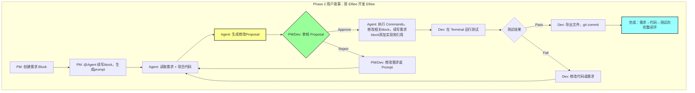

# Phase 2 二阶段目标与用户故事

## 一、Phase 1 回顾

### 1.1 阶段成果

Phase 1 聚焦"统一工作面"和"决策资产化"的基础能力验证，在**单人单机多角色协作**场景下完成了以下工作：

**研发成果**：
- ✅ Dashboard页面：.elf文件的创建、导入、重命名、删除和展示
- ✅ Editor页面核心模块：
  - Directory模块：内部/外部目录管理、文件导入导出
  - Markdown编辑：Myst语法支持、文字与代码块区分
  - 协作者与权限：CBAC权限模型、协作者增删和权限管理
  - Event记录与回溯：基于向量时钟的事件排序、Timeline可视化、状态回溯
- ✅ 核心架构：Event Sourcing、Block-based data structure、Capability-based Architecture

**产品成果**：
- ✅ 竞品分析：对比大厂工作流（飞书+Jira+GitHub）、Google工作流（Docs+Meet+Email）、Vibe Coding工作流（Cursor/Lovable + Linear/CodeStream）
- ✅ 用户实验：
  - 实验1：记录行为的 Effort vs Value（用户是否接受被打断来记录决策）
  - 实验2：不同记录形式的 Benefit 对比（记录决策是否有助于工作和协作）
- ✅ 核心发现：
   - 单纯的 Log 是无效的：信息密度太低，增加阅读负担
   - 结构化 Tag 不够：用户需要脑补，反而降低信心
   - Summary 是方向：主观体验最好，但在复杂决策中会产生**主观信心 ≠ 客观正确**的幻觉
   - 总结必须可追溯：Summary不能是黑盒，必须能回溯证据链

---

## 二、Phase 1 的 Gap 与 Phase 2 方向收束

### 2.1 Phase 1 的核心 Gap

从"让决策可学习"的产品命题出发，Phase 1 完成了**把各阶段决策记录下来**的基础验证，但距离**让记录的内容可学习且闭环验证**仍有显著差距：

| Gap | 描述 | 与理想状态的差距 |
| :--- | :--- | :--- |
| **AI 未接入** | 当前系统只有“人类角色”，没有 AI Agent 参与协作 | 无法验证**AI原生编辑器**的核心定位 |
| **验证闭环缺失** | 没有 Terminal 连接外部工具链（cargo, npm），无法在 Elfiee 内完成“需求→实现→测试→验证”的闭环 | 无法进行闭环验证，实现“决策记录下来”的价值 |
| **逻辑链条不可见** | Event 被记录了，但 Event 之间的因果关系（DAG）未被建模和可视化 | 无法追溯“这个决策依赖哪些前提，造成哪些影响” |
| **决策表达层薄弱** | 当前只有「纯文本 + Event Log」，缺少结构化的决策表达（Rule / Flow / Summary） | 无法追踪和验证**决策可学习**的价值 |

### 2.2 Phase 1 实验的关键洞察

**产品层面**：
- ❌ **不成立的假设**: "只要把决策记录下来效率就会提升"
- ✅ **成立的假设**: "用户接受在提高效率的前提下记录决策，并愿意进行提炼和总结"
- 🎯 **核心转向**: **决策资产化的价值不在于给人读，而在于让 AI 学**

**研发层面**：
- Event Sourcing 架构成熟：Actor 模型、Vector Clock、CBAC 均已稳定
- 系统支持多角色切换、权限控制，制定了开发SOP：为接入AI大侠基础
- Elfiee已支持外部路径注入：为闭环验证打下基础
- Relation 系统基础存在：`Block.children` 单向 DAG，支持证据链溯源

### 2.3 Phase 2 方向收束

基于上述 Gap 和洞察，Phase 2 聚焦以下三大方向：

| 方向 | 描述 | 对应模块 |
| :--- | :--- | :--- |
| **AI 接入协作** | 让AI Agent以“编辑者”身份参与协作，消费历史决策 | Agent Block Extension |
| **打通验证闭环** | 让Elfiee能连接外部工具链，完成“需求→实现→测试”闭环 | Terminal Extension |
| **建立因果索引** | 为Event之间建立因果关系，提升AI协作效率，支持更好的决策可视化 | Relation 增强 |

### 2.4 Elfiee 在 Phase 2 的核心优势

1. **AI 决策集成**：AI作为“一等公民”，与人类用户共同使用一个工作面
2. **闭环验证**：Terminal + Directory 打通外部工具链，AI 生成的代码可立即测试
3. **因果链记录**：记录"需求 → 代码 → 测试"的完整逻辑链条

---

## 三、Phase 2 阶段目标

### 3.1 大目标

**通过 Dogfooding（用 Elfiee 开发 Elfiee）验证 AI 辅助的闭环开发能力**

具体需要验证：
1. ✅ AI Agent 能作为协作者参与完整开发流程（需求理解 → 代码生成 → 测试运行）
2. ✅ 决策记录能被 AI 消费并产生价值（而非仅供人类阅读）
3. ✅ Elfiee 能成为团队的日常开发工具（替代 飞书 + Claude 的组合）

### 3.2 关键假设验证

| 假设 | 验证方式 | 成功标准 |
| :--- | :--- | :--- |
| **AI 能理解历史决策** | Agent 读取 Event + Relation，生成符合项目规范的代码 | Proposal 首次通过率 > 60% |
| **Terminal 闭环提效** | 在 Elfiee 内完成"需求→代码→测试"全流程 | 不离开 Elfiee 完成 1 个真实功能 |
| **因果链有助于理解** | 新成员通过 Relation Graph 快速理解项目背景 | 新成员理解时间 < 1 小时 |

### 3.3 成功标准与产出物

#### 3.3.1 研发目标

**功能完成率**：
- [ ] **核心功能**：F1-F8 全部完成（6 个 P0 + 2 个 P1）
  - Terminal 模块：F1 灵活执行 (P0), F2 Terminal-Block 交互 (P1)
  - Agent 模块：F3 创建配置 (P0), F4 LLM 集成 (P0), F5 Proposal 机制 (P0), F6 上下文感知 (P0)
  - Relation 模块：F7 数据结构索引 (P0), F8 Graph 可视化 (P1)

**量化指标**：

| 指标 | 目标值 | 验证方式 |
| :--- | :--- | :--- |
| **核心功能完成率** | 100% (F1-F8) | 功能清单 checklist |
| **Dogfooding 完成度** | 完成 1 个真实功能开发 | PR 合并 + Event 记录完整性 |
| **Proposal 首次通过率** | > 60% | 统计 Agent 生成的 Proposal 被 Approve 的比例 |
| **Terminal 闭环验证** | 不离开 Elfiee 完成"需求→代码→测试" | 完整流程演示 |

#### 3.3.2 产品目标

**需求与设计**：
- [ ] **交互规范**：Agent 交互规范、Terminal 交互规范、Relation 可视化规范
- [ ] **设计原型**：Proposal UI 原型、Agent 对话界面、Relation Graph 可视化方案

**用户研究**：
- [ ] **Dogfooding 记录**：至少 1 个真实功能的完整开发过程（需求 → Proposal → 代码 → 测试）
- [ ] **效果评估**：AI 效果评估报告（对比 Phase 1 纯人工协作的效率提升）
- [ ] **竞品分析**：AI 协作能力对比（Cursor Rules / Linear / LangSmith / RAG 型）

**量化指标**：

| 指标 | 目标值 | 验证方式 |
| :--- | :--- | :--- |
| **竞品分析完成** | 补充 AI 协作能力对比 | 竞品分析文档 |
| **Dogfooding 问题收集** | 至少 20 个改进点 | 问题清单 + 优先级排序 |
| **新成员理解效率** | < 1 小时理解项目背景 | 通过 Relation Graph 快速 onboarding |
| **需求澄清次数** | < 5 次/功能 | 统计 PM 与 Dev 的沟通轮次 |

#### 3.3.3 整体验收标准

Phase 2 成功的标志：
- ✅ **功能完整**：F1-F8 全部实现，P0 功能 100% 可用
- ✅ **闭环验证**：团队成员能用 Elfiee + Agent 完成日常开发任务
- ✅ **AI 效果**：Proposal 首次通过率 > 60%，需求澄清 < 5 次/功能
- ✅ **可追溯性**：至少 3 个关键决策能通过 Relation Graph 回溯到根源
- ✅ **持续改进**：Dogfooding 发现并整理至少 20 个核心改进方向

---

## 四、Phase 2 完整用户故事（串联产品与研发）

### 4.1 故事背景

**角色设定**：
- **PM（产品经理）**: 提出需求，定义验收标准
- **DevBot（AI Agent）**: 根据需求生成代码，关联测试
- **Developer（开发者）**: 审核 AI 代码，运行测试，提交 PR

**场景**: 团队需要为 Elfiee 开发"PDF 导出"功能，使用 Elfiee 自身完成这个开发任务（Dogfooding）。

### 4.2 完整工作流（串联产品价值与技术实现）



### 4.3 详细步骤

#### Step 1: 环境准备（验证 Terminal External Mode）
1. PM 创建 `.elf` 文件："Elfiee-PDF-Feature.elf"
2. PM 创建 `Directory Block (b1)`，导入 Elfiee 项目源码
   - *系统记录*: `b1.metadata.external_root_path = /path/to/elfiee`
3. PM 创建 `Agent Block (a1, "Agent")`
   - *配置*: Provider=Anthropic, Model=claude-sonnet-4-5, System Prompt="你是 Rust 后端专家"
   - *系统行为*: 自动创建 `editor_id = "agent-uuid-123"`

**产品价值验证**：用户能否快速挂载外部项目环境和AI Agent

#### Step 2: 需求定义（验证决策记录）
1. PM 创建 `Markdown Block (f1, "PDF 导出需求")`
   - 内容：
     ```markdown
     ## 需求
     用户希望将当前文档导出为 PDF 格式，保留 Markdown 格式和代码高亮。

     ## 验收标准
     - [ ] 支持tauri command `block.execute(markdown.exportpdf)`
     - [ ] 代码块有语法高亮
     ```
2. PM 关联 `f1` @ `a1`执行：'生成开发prompt'

**产品价值验证**：需求能否被结构化记录并关联到 Agent？

#### Step 3: Agent 思考与提案
1. `a1` 读取上下文：
   - 需求内容（f1）
   - 项目代码结构（b1 的文件列表）
2. `a1` 调用 LLM API，生成 Prompt，写入f1：
   ```
   用户需要支持将当前markdown文档导出为pdf格式

   - 请阅读开发规范xxx
   - 这是markdown extension的一项capability，请阅读elfiee-ext-gen/下文档，进行后端开发
   - 前端需要能够高亮代码，请选择xxx Rust 库进行实践
   - 支持导出到任意目录下
   ```
**产品价值验证**：需求能否被Agent理解？

#### Step 4: Agent 执行提案
1. `a1` 读取上下文：
   - 需求内容（f1）
   - 项目代码结构（b1 的文件列表）
   - b1中的相关文档
2. `a1` 调用 LLM API，生成 Prompt：
   ```json
   {
     "proposal_id": "prop-001",
     "reasoning": "根据需求，我建议创建 src/src-tauri/extensions/markdown/export.rs 模块...",
     "proposed_commands": [
       { "action": "block.create", "params": { "type": "code", "path": "src/src-tauri/extensions/markdown/export.rs" } },
       { "action": "code.write", "params": { "block_id": "...", "content": "..." } },
       { "action": "core.link", "params": { "source": "pdf.rs", "target": "f1", "relation": "implement" } }
     ]
   }
   ```

**产品价值验证**：AI 能否理解需求并生成可预览的方案？

#### Step 5: 人工审批
1. PM/Dev 看到 Proposal Card，展示：
   - Reasoning（AI 的解释）
   - Diff 预览（Monaco Editor 显示新增代码）
   - 关系图（f1 → pdf.rs 的 implement 关系）
2. Dev 点击 **Approve**

**产品价值验证**：用户能否理解 AI 意图并做出决策？

#### Step 6: 自动执行（验证 Relation Graph）
1. 系统以 `editor_id = "agent-uuid-123"` 身份执行 Commands：
   - `block.create` → 在 `b1` 下创建 `export.rs` Block
   - `code.write` → 写入代码内容
   - `core.link` → 建立 `pdf.rs (implement) -> f1` 关系
2. 系统自动更新 Relation Graph：
   - `outgoing[f1] = [(pdf.rs, implement)]`
   - `incoming[pdf.rs] = [(f1, implement)]`

**产品价值验证**：逻辑链条能否被自动记录？

#### Step 7: 验证闭环（验证 Terminal + Export 机制）
1. Dev将b1导出至系统目录 `~/elfiee`, 系统执行`directory.export(b1)` → 将 `export.rs` Block 覆盖到外部文件
2. Dev 创建Terminal t1.
3. Dev将t1嵌入f1, 在 Terminal `t1` 输入：`cd ~/elfiee`, `cargo test`
4. Terminal 显示测试结果：3 passed

**产品价值验证**：能否在 Elfiee 内完成完整的"需求→代码→测试"闭环？

#### Step 8: 提交与追溯（验证 Event + Relation 完整性）
1. Dev 在外部终端执行 `git commit -m "Add PDF export"`
2. 回到 Elfiee，查看 Relation Graph：
   - `f1 (需求)` → `pdf.rs (实现)` → `test_pdf.rs (测试)`
3. 新成员 Alice 加入项目，点击 Relation Graph，查看各个block的event记录：
   - 追溯到 `f1` 的需求描述
   - 看到 DevBot 的 Proposal reasoning
   - 理解整个决策过程

**产品价值验证**：决策能否被后续协作者学习？

---

## 五、Phase 2 拆分 User Stories

### 5.1 研发功能点拆分（8 个用户故事）

#### A. Terminal 模块（2 个）

| 编号 | 功能名称 | 用户故事 | 验收标准 | 优先级 |
| :--- | :--- | :--- | :--- | :--- |
| **F1** | Terminal 灵活执行 | 作为开发者，我希望 Terminal 可以 cd 到任何位置并运行命令，命令输出的文件自然保存在当前工作目录 | ✓ 支持 `cd` 到任意绝对/相对路径 <br> ✓ 支持运行任意 shell 命令（包括通过 pipe、重定向等生成文件） <br> ✓ 正确处理环境变量和工作目录 <br> ✓ 输出和错误信息正确捕获 <br> ✓ 命令生成的文件保存在当前 CWD | P0 |
| **F2** | Terminal-Block 交互能力 | 作为开发者，我希望Agent通过Terminal直接操作 Elfiee Block | ✓ Terminal Block 目录下workspace挂载dir block，并生成物理文件copy <br> ✓ 物理文件修改后，可以自动同步覆盖对应的block <br> ✓ 操作触发相应 Event（`block.write` 等） <br> ✓ 支持在配置中定义 Agent 的调用方式（API or Terminal） | P1 |

#### B. Agent 模块（4 个）

| 编号 | 功能名称 | 用户故事 | 验收标准 | 优先级 |
| :--- | :--- | :--- | :--- | :--- |
| **F3** | Agent Block 创建与配置 | 作为 PM，我希望创建一个 AI Agent 并配置其行为 | ✓ 创建 `ai_agent` Block 自动生成 `editor_id` <br> ✓ 配置 Provider（Anthropic/OpenAI） <br> ✓ 配置 Model（claude-sonnet-4-5 等） <br> ✓ 配置 System Prompt <br> ✓ 配置 API Key（环境变量引用） | P0 |
| **F4** | LLM API 集成 | 作为系统，我需要调用外部 LLM 服务获取 AI 响应 | ✓ 封装 Anthropic API Client <br> ✓ 支持流式和非流式输出 <br> ✓ 支持结构化输出解析（JSON/XML） <br> ✓ 错误处理和重试机制 <br> ✓ API 调用日志记录 | P0 |
| **F5** | Proposal 交互机制 | 作为用户，我希望预览 AI 的建议并决定是否执行 | ✓ Agent 生成 `ai_agent.propose` Event <br> ✓ Proposal 包含：reasoning（解释）+ proposed_commands（命令列表） <br> ✓ 前端展示 Proposal Card（Diff 预览 + Reasoning） <br> ✓ 支持 Approve/Reject 操作 <br> ✓ Approve 后依次执行 commands，传递 Agent 的 editor_id | P0 |
| **F6** | Agent 上下文感知与执行 | 作为 Agent，我需要读取项目上下文并生成可执行的任务 | ✓ Agent 能读取 `children` 关系中的所有 Blocks <br> ✓ Agent 能读取关联 Directory 的文件列表和内容 <br> ✓ Agent 能读取 Terminal 的历史输出 <br> ✓ 上下文截断策略（Token 限制） <br> ✓ 生成的 Commands 可被 Engine 执行 | P0 |

#### C. Relation 模块（2 个）

| 编号 | 功能名称 | 用户故事 | 验收标准 | 优先级 |
| :--- | :--- | :--- | :--- | :--- |
| **F7** | Relation 数据结构与索引 | 作为系统，我需要高效管理 Block 之间的关系并防止循环依赖 | ✓ 实现 `RelationGraph` 内存索引（outgoing/incoming） <br> ✓ 支持环检测（添加 relation 前检查） <br> ✓ 提供 `get_parents(block_id)` API <br> ✓ 提供 `get_children(block_id)` API <br> ✓ 提供 `add_relation(source, target, type)` API | P0 |
| **F8** | Relation Graph 可视化 | 作为用户，我希望看到 Block 之间的逻辑链条（需求→代码→测试） | ✓ 使用 React Flow 渲染关系图 <br> ✓ 节点显示 Block 类型和标题 <br> ✓ 边显示 Relation 类型（reference/implement） <br> ✓ DAG 层级布局算法 <br> ✓ 支持节点点击跳转 <br> ✓ 支持节点 Hover 显示详情 | P1 |

### 5.2 产品研究拆分（不超过 5 个）

| 编号 | 研究主题 | 研究问题 | 产出物 | 优先级 |
| :--- | :--- | :--- | :--- | :--- |
| **R1** | AI 协作竞品分析 | 现有工具（Cursor Rules / Linear / LangSmith）在 AI 协作场景下的能力边界是什么？ | 竞品能力对比表 + Elfiee 差异化分析 | P0 |
| **R2** | Proposal 交互设计 | 用户如何快速理解 AI 的 Proposal 并做出决策？需要展示哪些信息？ | Proposal UI 原型 + 交互流程图 | P0 |
| **R3** | Dogfooding 效果追踪 | 团队使用 Elfiee 开发 Elfiee 的过程中，哪些环节效率提升，哪些环节仍需优化？ | Dogfooding 问题清单 + 效率对比报告 | P0 |
| **R4** | Traceability 形式探索 | Summary + 证据链的最佳展示方式是什么？如何避免理解幻觉？ | Traceability UI 方案（Figma 原型） | P1 |
| **R5** | Agent System Prompt 模板 | 针对不同角色（后端/前端/测试），Agent 的 System Prompt 应该如何设计？ | Agent Prompt 模板库（至少 3 个角色） | P1 |

---

## 六、Phase 2 不做什么（边界清晰）

| 不做 | 原因 | 推迟到阶段 |
| :--- | :--- | :--- |
| ❌ **更细的 Log 系统** | Phase 1 实验证明：信息密度太低，对人无效 | - |
| ❌ **Event Timeline 增强** | Phase 1 已实现基础的 Event 展示、排序和回溯功能，满足当前需求 | Phase 3（如需要） |
| ❌ **复杂的 DAG 可视化算法** | 数据结构先行，可视化推迟。Phase 2 只做基础 Relation Graph | Phase 3 |
| ❌ **决策形式的深度优化 (Rule / Flow)** | 等 AI 接入后，再验证 AI 消费决策的效果 | Phase 4 |
| ❌ **CBAC 权限的细化** | 已具备基础能力，暂不深入 | Phase 5 |
| ❌ **Node ID 系统** | 为去中心化离线协作准备，Phase 2 聚焦中心化场景 | Phase 6 |
| ❌ **Vector Clock 扩展（node_id:editor_id）** | 为去中心化离线协作准备，当前 editor_id 格式足够 | Phase 6 |
| ❌ **离线协作的冲突解决 UI** | 去中心化场景的核心功能 | Phase 6 |
| ❌ **自动双向同步（Directory ↔ External）** | Phase 2 采用手动导出模式，自动同步需要文件监听和冲突检测 | Phase 3 |

---

## 七、与整体路线图的关系

| 阶段 | 核心验证 | Phase 2 的铺垫/依赖 |
| :--- | :--- | :--- |
| Phase 1 ✅ | 人类协作基础 | Phase 2 依赖 Event Sourcing 和 CBAC 基础 |
| **Phase 2** | **AI 辅助闭环开发** | **本阶段核心** |
| Phase 3 | 逻辑链条可视化 | Phase 2 的 Relation Graph 是基础 |
| Phase 4 | AI 多轮协作 + Benchmark | Phase 2 的 Agent + Proposal 机制是前提 |
| Phase 5 | 可复用模板 | Phase 2 的 CBAC 已实现，专注模板系统 |
| Phase 6 | 离线协作能力 | 基于 Phase 2 的 Agent 和 Relation 基础，实现 Node ID + Vector Clock 扩展 |
| Phase 7 | 外部验证与推广 | 依赖 Phase 2-6 的所有能力 |
