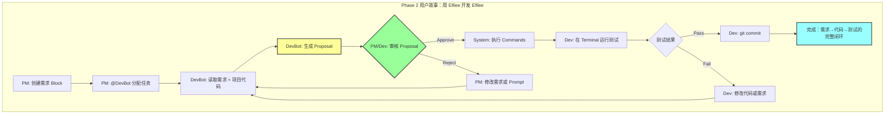

# Phase 2 目标与用户故事

**文档状态**: Draft
**创建日期**: 2026-01-13
**基于文档**: `product_summarize.md`, `user-story.md`, `agent&terminal-design-v2.md`

---

## 一、Phase 1 回顾

### 1.1 阶段成果

Phase 1 聚焦"统一工作面"和"决策资产化"的基础能力验证，在**单人单机多角色协作**场景下完成了以下工作：

**研发成果**：
- ✅ Dashboard页面：.elf文件的创建、导入、重命名、删除和展示
- ✅ Editor页面核心模块：
  - Directory模块：内部/外部目录管理、文件导入导出
  - Markdown编辑：Myst语法支持、文字与代码块区分
  - 协作者与权限：CBAC权限模型、协作者增删和权限管理
  - Event记录与回溯：基于向量时钟的事件排序、Timeline可视化、状态回溯
- ✅ 核心架构：Event Sourcing、Block-based Editing、Capability-based Architecture

**产品成果**：
- ✅ 竞品分析：对比大厂工作流（飞书+Jira+GitHub）、Google工作流（Docs+Meet+Email）、Vibe Coding工作流（Cursor/Lovable + Linear/CodeStream）
- ✅ 用户实验：
  - 实验1：记录行为的 Effort vs Value（用户是否接受被打断来记录决策）
  - 实验2：不同记录形式的 Benefit 对比（F1原始聊天 vs F2纯Log vs F3Log+Tag vs F4Log+Summary）
- ✅ 核心发现：
  - 用户接受"事前明确规则"的记录打断
  - 单纯Log无效（信息密度低）
  - Summary是方向，但需配合Traceability避免理解幻觉

---

## 二、Phase 1 的 Gap 与 Phase 2 方向收束

### 2.1 Phase 1 的核心 Gap

从"让决策可学习"的产品命题出发，Phase 1 完成了**第一层目标（把决策记录下来）**的基础验证，但距离**第二层目标（让记录的内容可学习）**仍有显著差距：

| Gap 类型 | 具体描述 | 与理想状态的差距 | Phase 1 为何未做 |
| :--- | :--- | :--- | :--- |
| **AI 未接入** | 当前系统只有人类角色，没有 AI Agent 参与协作 | 无法验证"AI 原生编辑器"的核心假设 | 主动取舍：优先验证人类协作基础 |
| **逻辑链条不可见** | Event 被记录，但 Event 之间的因果关系（DAG）未被建模和可视化 | 无法追溯"这个决策依赖哪些前提，造成哪些影响" | 主动取舍：DAG 需先完成 Event 基础 |
| **验证闭环缺失** | 没有 Terminal 连接外部工具链（cargo, npm），无法在 Elfiee 内完成"需求→实现→测试→验证"闭环 | 无法通过 Dogfooding 验证完整开发流程 | 主动取舍：优先验证编辑与记录能力 |
| **决策表达层薄弱** | 当前只有"纯文本 + Event Log"，缺少结构化的决策表达（Rule / Flow / Summary） | 无法验证"可学习"的第二层目标 | 被动遗留：实验发现需要 Traceability |

### 2.2 Phase 1 实验的关键洞察

**产品层面**：
- ❌ **不成立的假设**: "只要把决策记录下来效率就会提升"
- ✅ **成立的假设**: "用户接受在提高效率的前提下记录决策，并愿意进行提炼和总结"
- 🎯 **核心转向**: **决策资产化的价值不在于给人读，而在于让 AI 学**

**研发层面**：
- Event Sourcing 架构成熟：Actor 模型、Vector Clock、CBAC 均已稳定
- Directory Extension 已支持外部路径注入：为 Terminal 外部模式打下基础
- Relation 系统基础存在：`Block.children` 单向 DAG，需增强双向索引

### 2.3 Phase 2 方向收束

基于上述 Gap 和洞察，Phase 2 聚焦以下三大方向：

| 方向 | 产品价值 | 对应技术模块 | 优先级 |
| :--- | :--- | :--- | :--- |
| **AI 接入协作** | 验证 AI 能否消费历史决策并生成高质量代码 | Agent Block + Proposal 机制 | P0 |
| **打通验证闭环** | 让 Elfiee 能连接外部工具链，完成"需求→实现→测试"闭环 | Terminal Extension (External Mode) | P0 |
| **建立因果索引** | 为 Event 之间建立因果关系，支撑未来的 DAG 可视化和推理 | Relation Graph 增强 | P0 |
| **去中心化基础** | 为未来离线协作准备数据结构（Phase 6 目标） | Node ID + Vector Clock 扩展 | P1 |

### 2.4 Phase 2 竞品分析补充

Phase 1 已完成竞品的工作流分析，Phase 2 需补充**竞品在 AI 协作场景下的能力对比**：

| 竞品类型 | 代表产品 | AI 协作能力 | 决策可学习能力 | Elfiee 差异化 |
| :--- | :--- | :--- | :--- | :--- |
| **规则驱动型** | Cursor Rules / Claude Skills | 长期规则存储，缺乏反馈校准 | ❌ 静态规则，无法根据结果进化 | 基于 Event + Proposal 的动态学习 |
| **意图-执行连接型** | Linear / CodeStream | 记录"做/不做"，丢失 reasoning | ❌ 无法追溯决策理由 | Event + Relation 保留完整因果链 |
| **结果打分型** | LangSmith / Evals | 对工程师友好，对 PM 极不友好 | ⚠️ 只验证结果，不记录过程 | Proposal 机制记录 AI 思考过程 |
| **RAG 型** | 飞书 Bot / Notion AI | 聊天式检索，无法追溯和校验 | ❌ 信息检索，非决策辅助 | Traceability + Summary 结合 |

**Elfiee 在 Phase 2 的核心优势**：
1. **可追溯的 AI 决策**：Proposal 机制记录 AI 的建议过程，而非黑盒生成
2. **闭环验证**：Terminal + Directory 打通外部工具链，AI 生成的代码可立即测试
3. **因果链记录**：Relation Graph 记录"需求 → 代码 → 测试"的完整逻辑链条

---

## 三、Phase 2 阶段目标

### 3.1 大目标

**通过 Dogfooding（用 Elfiee 开发 Elfiee）验证 AI 辅助的闭环开发能力**

具体需要验证：
1. ✅ AI Agent 能作为协作者参与完整开发流程（需求理解 → 代码生成 → 测试运行）
2. ✅ 决策记录能被 AI 消费并产生价值（而非仅供人类阅读）
3. ✅ Elfiee 能成为团队日常开发的主力工具（替代 Notion + 飞书 + Cursor 的组合）

### 3.2 关键假设验证

| 假设 | 验证方式 | 成功标准 |
| :--- | :--- | :--- |
| **AI 能理解历史决策** | Agent 读取 Event + Relation，生成符合项目规范的代码 | Proposal 首次通过率 > 60% |
| **Proposal 机制有效** | 用户能通过 Proposal 预览理解 AI 意图，降低返工率 | 需求澄清次数 < 5 次/功能 |
| **Terminal 闭环提效** | 在 Elfiee 内完成"需求→代码→测试"全流程 | 不离开 Elfiee 完成 1 个真实功能 |
| **因果链有助于理解** | 新成员通过 Relation Graph 快速理解项目背景 | 新成员理解时间 < 1 小时 |

### 3.3 产出物目标

**研发产出**：
- [ ] Agent Block Extension（支持 Anthropic/OpenAI）
- [ ] Terminal External Mode（关联 Directory，运行外部工具链）
- [ ] Relation Graph 增强（双向索引 + 环检测）
- [ ] Node ID 系统（为 Phase 6 去中心化做准备）

**产品产出**：
- [ ] Dogfooding 完整记录（至少 1 个真实功能的开发过程）
- [ ] AI 效果评估报告（对比 Phase 1 纯人工协作的效率提升）
- [ ] Phase 2 竞品分析补充（AI 协作能力对比）

**验证目标**：
- [ ] 使用 Elfiee + Agent 完成"Terminal 功能增强"或"新 Extension 开发"
- [ ] 记录完整 Event 链条（需求讨论 → Agent Proposal → 代码实现 → 测试验证）
- [ ] 至少 3 个关键决策能通过 Relation Graph 追溯到根源

---

## 四、Phase 2 完整用户故事（串联产品与研发）

### 4.1 故事背景

**角色设定**：
- **PM（产品经理）**: 提出需求，定义验收标准
- **DevBot（AI Agent）**: 根据需求生成代码，关联测试
- **Developer（开发者）**: 审核 AI 代码，运行测试，提交 PR

**场景**: 团队需要为 Elfiee 开发"PDF 导出"功能，使用 Elfiee 自身完成这个开发任务（Dogfooding）。

### 4.2 完整工作流（串联产品价值与技术实现）



### 4.3 详细步骤

#### Step 1: 环境准备（验证 Terminal External Mode）
1. PM 创建 `.elf` 文件："Elfiee-PDF-Feature.elf"
2. PM 创建 `Directory Block (b1)`，导入 Elfiee 项目源码
   - *系统记录*: `b1.metadata.external_root_path = /path/to/elfiee`
3. PM 创建 `Terminal Block (t1)`，模式设为 External，关联 `b1`
   - *系统行为*: Terminal 的 CWD 自动设为 Elfiee 项目根目录
4. PM 创建 `Agent Block (a1, "DevBot")`
   - *配置*: Provider=Anthropic, Model=claude-sonnet-4-5, System Prompt="你是 Rust 后端专家"
   - *系统行为*: 自动创建 `editor_id = "agent-uuid-123"`

**产品价值验证**：用户能否快速挂载外部项目环境？

#### Step 2: 需求定义（验证决策记录）
1. PM 创建 `Markdown Block (f1, "PDF 导出需求")`
   - 内容：
     ```markdown
     ## 需求
     用户希望将当前文档导出为 PDF 格式，保留 Markdown 格式和代码高亮。

     ## 验收标准
     - [ ] 支持命令 `elfiee export --pdf output.pdf`
     - [ ] 代码块有语法高亮
     - [ ] 图片正确嵌入
     ```
2. PM 关联 `f1` 到 `a1`（通过 `reference` 关系）

**产品价值验证**：需求能否被结构化记录并关联到 Agent？

#### Step 3: Agent 思考与提案（验证 Proposal 机制）
1. PM 对 `a1` 发送消息："根据需求 f1 实现 PDF 导出功能"
2. `a1` 读取上下文：
   - 需求内容（f1）
   - 项目代码结构（b1 的文件列表）
   - Terminal 环境信息（t1 的配置）
3. `a1` 调用 LLM API，生成 Proposal：
   ```json
   {
     "proposal_id": "prop-001",
     "reasoning": "根据需求，我建议创建 src/export/pdf.rs 模块，使用 printpdf crate...",
     "proposed_commands": [
       { "action": "block.create", "params": { "type": "code", "path": "src/export/pdf.rs" } },
       { "action": "code.write", "params": { "block_id": "...", "content": "..." } },
       { "action": "core.link", "params": { "source": "pdf.rs", "target": "f1", "relation": "implement" } }
     ]
   }
   ```
4. 系统生成 `ai_agent.propose` Event（记录 AI 的思考过程）

**产品价值验证**：AI 能否理解需求并生成可预览的方案？

#### Step 4: 人工审批（验证 Traceability）
1. PM/Dev 看到 Proposal Card，展示：
   - Reasoning（AI 的解释）
   - Diff 预览（Monaco Editor 显示新增代码）
   - 关系图（f1 → pdf.rs 的 implement 关系）
2. Dev 点击 **Approve**

**产品价值验证**：用户能否理解 AI 意图并做出决策？

#### Step 5: 自动执行（验证 Relation Graph）
1. 系统以 `editor_id = "agent-uuid-123"` 身份执行 Commands：
   - `block.create` → 在 `b1` 下创建 `pdf.rs` Block
   - `code.write` → 写入代码内容
   - `core.link` → 建立 `pdf.rs (implement) -> f1` 关系
2. 系统自动更新 Relation Graph：
   - `outgoing[f1] = [(pdf.rs, implement)]`
   - `incoming[pdf.rs] = [(f1, implement)]`

**产品价值验证**：逻辑链条能否被自动记录？

#### Step 6: 验证闭环（验证 Terminal + Export 机制）
1. Dev 在 Terminal `t1` 输入：`cargo test pdf`
2. 系统检测到 `b1` 有新 Block 未导出，弹出对话框：
   - "导出并运行" / "直接运行" / "取消"
   - 选项："记住我的选择"
3. Dev 点击"导出并运行"
4. 系统执行：
   - `directory.export(b1)` → 将 `pdf.rs` Block 覆盖到外部文件
   - `terminal.execute(t1, "cargo test pdf")` → 在外部目录运行测试
5. Terminal 显示测试结果：3 passed

**产品价值验证**：能否在 Elfiee 内完成完整的"需求→代码→测试"闭环？

#### Step 7: 提交与追溯（验证 Event + Relation 完整性）
1. Dev 在外部终端执行 `git commit -m "Add PDF export"`
2. 回到 Elfiee，查看 Relation Graph：
   - `f1 (需求)` → `pdf.rs (实现)` → `test_pdf.rs (测试)`
3. 新成员 Alice 加入项目，点击 Relation Graph：
   - 追溯到 `f1` 的需求描述
   - 看到 DevBot 的 Proposal reasoning
   - 理解整个决策过程

**产品价值验证**：决策能否被后续协作者学习？

---

## 五、Phase 2 拆分 User Stories

### 5.1 研发功能点拆分（不超过 10 个）

| 编号 | 功能模块 | 用户故事 | 验收标准 | 优先级 |
| :--- | :--- | :--- | :--- | :--- |
| **F1** | Node ID 系统 | 作为系统，我需要为每台设备生成唯一标识 | `~/.elfiee/node_id` 被创建并持久化 | P1 |
| **F2** | Vector Clock 扩展 | 作为系统，我需要支持 `node_id:editor_id` 格式的 Vector Clock | Event 的 timestamp key 格式升级，CBAC 逻辑不受影响 | P1 |
| **F3** | Relation Graph | 作为开发者，我希望看到 Block 之间的因果关系 | 提供 `get_parents/get_children` API，支持环检测 | P0 |
| **F4** | Terminal External Mode | 作为开发者，我希望 Terminal 能在外部项目目录运行命令 | Terminal 可关联 Directory，CWD 自动设为外部路径 | P0 |
| **F5** | Export 提示机制 | 作为开发者，我希望在运行测试前被提醒导出最新代码 | Terminal 执行前弹出导出对话框，支持"记住选择" | P0 |
| **F6** | Agent Block | 作为 PM，我希望配置一个 AI Agent 参与协作 | 创建 Agent Block 时自动生成 editor_id，支持配置 Provider/Model/Prompt | P0 |
| **F7** | Proposal 机制 | 作为用户，我希望预览 AI 的计划再决定是否执行 | Agent 输出 Proposal Event，前端展示 Diff 和 Reasoning，支持 Approve/Reject | P0 |
| **F8** | LLM API 封装 | 作为 Agent，我需要调用外部 LLM 服务 | 封装 Anthropic/OpenAI API，支持结构化输出解析 | P0 |
| **F9** | Relation 可视化 | 作为用户，我希望看到决策的逻辑链条 | 前端展示 Relation Graph（React Flow），支持点击跳转 | P1 |
| **F10** | Agent 上下文感知 | 作为 Agent，我需要读取关联的 Directory 和 Terminal 信息 | Agent 能访问 `children` 关系中的 Block 内容 | P0 |

### 5.2 产品研究拆分（不超过 5 个）

| 编号 | 研究主题 | 研究问题 | 产出物 | 优先级 |
| :--- | :--- | :--- | :--- | :--- |
| **R1** | AI 协作竞品分析 | 现有工具（Cursor Rules / Linear / LangSmith）在 AI 协作场景下的能力边界是什么？ | 竞品能力对比表 + Elfiee 差异化分析 | P0 |
| **R2** | Proposal 交互设计 | 用户如何快速理解 AI 的 Proposal 并做出决策？需要展示哪些信息？ | Proposal UI 原型 + 交互流程图 | P0 |
| **R3** | Dogfooding 效果追踪 | 团队使用 Elfiee 开发 Elfiee 的过程中，哪些环节效率提升，哪些环节仍需优化？ | Dogfooding 问题清单 + 效率对比报告 | P0 |
| **R4** | Traceability 形式探索 | Summary + 证据链的最佳展示方式是什么？如何避免理解幻觉？ | Traceability UI 方案（Figma 原型） | P1 |
| **R5** | Agent System Prompt 模板 | 针对不同角色（后端/前端/测试），Agent 的 System Prompt 应该如何设计？ | Agent Prompt 模板库（至少 3 个角色） | P1 |

---

## 六、Phase 2 不做什么（边界清晰）

| 不做 | 原因 | 推迟到阶段 |
| :--- | :--- | :--- |
| ❌ **更细的 Log 系统** | Phase 1 实验证明：信息密度太低，对人无效 | - |
| ❌ **复杂的 DAG 可视化算法** | 数据结构先行，可视化推迟。Phase 2 只做基础 Relation Graph | Phase 3 |
| ❌ **决策形式的深度优化 (Rule / Flow)** | 等 AI 接入后，再验证 AI 消费决策的效果 | Phase 4 |
| ❌ **CBAC 权限的细化** | 已具备基础能力，暂不深入 | Phase 5 |
| ❌ **离线协作的冲突解决 UI** | Node ID 和 Vector Clock 扩展是准备工作，冲突解决是 Phase 6 目标 | Phase 6 |
| ❌ **自动双向同步（Directory ↔ External）** | Phase 2 采用手动导出模式，自动同步需要文件监听和冲突检测 | Phase 3 |

---

## 七、成功标准与量化指标

### 7.1 研发目标

| 指标 | 目标值 | 验证方式 |
| :--- | :--- | :--- |
| **核心功能完成率** | 100% (F1-F10) | 功能清单 checklist |
| **Dogfooding 完成度** | 完成 1 个真实功能开发 | PR 合并 + Event 记录完整性 |
| **Proposal 首次通过率** | > 60% | 统计 Agent 生成的 Proposal 被 Approve 的比例 |
| **Terminal 闭环验证** | 不离开 Elfiee 完成"需求→代码→测试" | 完整流程演示 |

### 7.2 产品目标

| 指标 | 目标值 | 验证方式 |
| :--- | :--- | :--- |
| **竞品分析完成** | 补充 AI 协作能力对比 | 竞品分析文档 |
| **Dogfooding 问题收集** | 至少 20 个改进点 | 问题清单 + 优先级排序 |
| **新成员理解效率** | < 1 小时理解项目背景 | 通过 Relation Graph 快速 onboarding |
| **需求澄清次数** | < 5 次/功能 | 统计 PM 与 Dev 的沟通轮次 |

### 7.3 整体验收标准

Phase 2 成功的标志：
- ✅ 团队成员能用 Elfiee + Agent 完成日常开发任务
- ✅ AI 生成的代码质量达到"首次通过率 > 60%"
- ✅ 决策逻辑链条可追溯（至少 3 个关键决策能回溯到根源）
- ✅ Dogfooding 发现并整理至少 20 个核心改进方向

---

## 八、与整体路线图的关系

| 阶段 | 核心验证 | Phase 2 的铺垫/依赖 |
| :--- | :--- | :--- |
| Phase 1 ✅ | 人类协作基础 | Phase 2 依赖 Event Sourcing 和 CBAC 基础 |
| **Phase 2** | **AI 辅助闭环开发** | **本阶段核心** |
| Phase 3 | 逻辑链条可视化 | Phase 2 的 Relation Graph 是基础 |
| Phase 4 | AI 多轮协作 + Benchmark | Phase 2 的 Agent + Proposal 机制是前提 |
| Phase 5 | 可复用模板 | Phase 2 的 CBAC 已实现，专注模板系统 |
| Phase 6 | 离线协作能力 | Phase 2 的 Node ID + Vector Clock 扩展是准备工作 |
| Phase 7 | 外部验证与推广 | 依赖 Phase 2-6 的所有能力 |

---

**文档维护者**: 产品团队
**最后更新**: 2026-01-13
