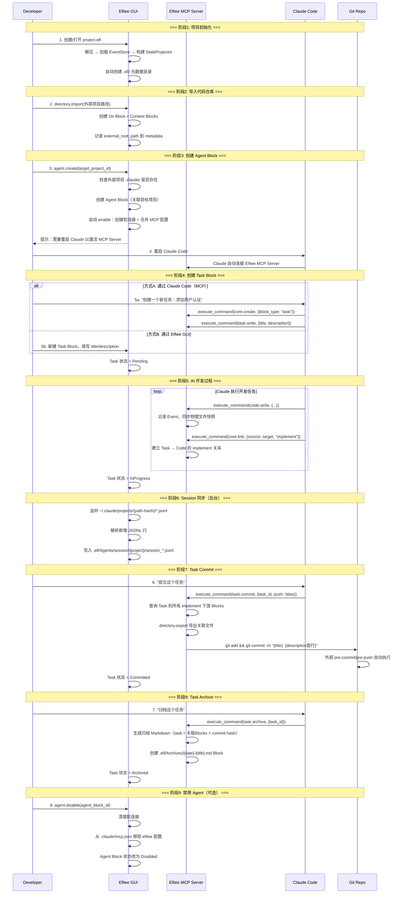
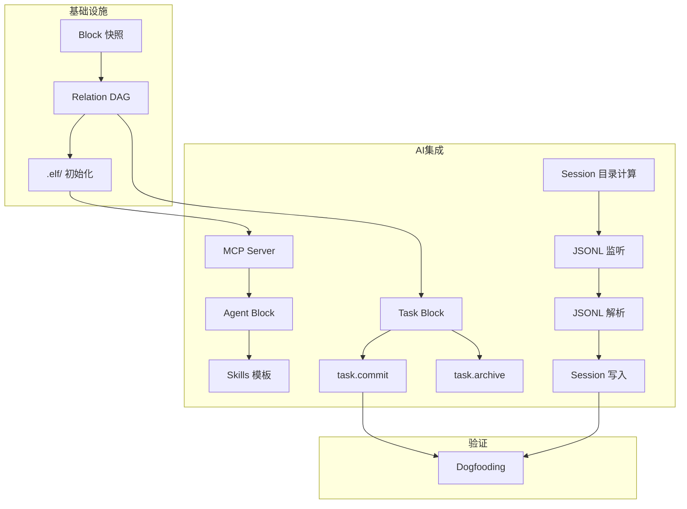

# Phase 2 二阶段目标与用户故事（v2）

## 一、Phase 1 回顾

### 1.1 阶段成果

Phase 1 聚焦"统一工作面"和"决策资产化"的基础能力验证，在**单人单机多角色协作**场景下完成了以下工作：

**研发成果**：
- ✅ Dashboard 页面：.elf 文件的创建、导入、重命名、删除和展示
- ✅ Editor 页面核心模块：
  - Directory 模块：内部/外部目录管理、文件导入导出
  - Markdown 编辑：Myst 语法支持、文字与代码块区分
  - 协作者与权限：CBAC 权限模型、协作者增删和权限管理
  - Event 记录与回溯：基于向量时钟的事件排序、Timeline 可视化、状态回溯
- ✅ 核心架构：Event Sourcing、Block-based data structure、Capability-based Architecture
- ✅ 25 个 Capability，84% API 化完成

**产品成果**：
- ✅ 竞品分析：对比大厂工作流、Google 工作流、Vibe Coding 工作流
- ✅ 用户实验：记录行为的 Effort vs Value、不同记录形式的 Benefit 对比

**核心发现**：
- 单纯的 Log 是无效的：信息密度太低，增加阅读负担
- Summary 是方向：但必须可追溯，不能是黑盒
- **决策资产化的价值不在于给人读，而在于让 AI 学**

---

## 二、Phase 1 的 Gap 与 Phase 2 方向收束

### 2.1 Phase 1 的核心 Gap

从"让决策可学习"的产品命题出发，Phase 1 完成了**把各阶段决策记录下来**的基础验证，但距离**让 AI 工具无缝接入**仍有显著差距：

| Gap | 描述 | 与理想状态的差距 |
| :--- | :--- | :--- |
| **AI 未接入** | 当前系统只有"人类角色"，没有 AI Agent 参与协作 | 无法验证 **AI 原生编辑器**的核心定位 |
| **工具割裂** | 如果内置 Agent，用户需要放弃成熟的 Claude Code/Cursor | 用户被迫选择：用弱工具但有记录 vs 用强工具但无记录 |
| **集成缺失** | AI 工具的操作不会自动同步到 Elfiee 的 Event Store | 决策记录不完整，无法追溯 AI 的思考过程 |
| **版本控制断层** | Elfiee 内部 Event 与 Git 外部 Commit 相互独立 | 无法建立"内部决策 → 外部变更"的映射 |

### 2.2 Phase 1 实验的关键洞察

**产品层面**：
- ❌ **不成立的假设**: "用户愿意放弃成熟工具来使用 Elfiee 内置 Agent"
- ✅ **成立的假设**: "用户愿意让 AI 工具通过 API 操作 Elfiee，只要不影响原有工作流"
- 🎯 **核心转向**: **Elfiee 不是 AI 工具的替代品，而是 AI 工具的"决策记忆层"**

**研发层面**：
- Event Sourcing 架构成熟：可作为 AI 操作的持久化层
- Capability 系统完善：可暴露为 Claude Skills
- Vector Clock 机制：可用于 AI 会话与代码变更的关联
- Directory 插件成熟：支持文件导入导出，可作为 AI 工具的文件网关

### 2.3 Phase 2 方向收束

基于上述 Gap 和洞察，Phase 2 聚焦以下三大方向：

| 方向 | 描述 | 对应模块 |
| :--- | :--- | :--- |
| **Skills 集成** | 将 Elfiee Capability 暴露为 Claude Code Skills | Skills Generator |
| **会话同步** | 自动同步 Claude/Cursor 会话到 Elfiee Event Store | Session Sync |
| **内外映射** | 建立 Elfiee 内部 Event 与 Git Commit 的双向映射 | Git Integration |

### 2.4 Elfiee 在 Phase 2 的核心定位

```
┌─────────────────────────────────────────────────────────────┐
│                    AI Native Editor                         │
│  ┌──────────────┐  ┌──────────────┐  ┌──────────────┐      │
│  │ Claude Code  │  │   Cursor     │  │    Codex     │      │
│  └──────┬───────┘  └──────┬───────┘  └──────┬───────┘      │
│         │                 │                 │               │
│         └────────────┬────┴────────────────┘               │
│                      ▼                                      │
│         ┌────────────────────────┐                         │
│         │   Elfiee CLI + Skills  │ ← 本地 CLI 调用         │
│         └────────────┬───────────┘                         │
│                      ▼                                      │
│  ┌──────────────────────────────────────────────────────┐  │
│  │              Elfiee Event Store                       │  │
│  │  ┌─────────┐  ┌─────────┐  ┌─────────┐  ┌─────────┐  │  │
│  │  │ Blocks  │  │ Events  │  │Relations│  │ Grants  │  │  │
│  │  └─────────┘  └─────────┘  └─────────┘  └─────────┘  │  │
│  └──────────────────────────────────────────────────────┘  │
│                      │                                      │
│                      ▼                                      │
│         ┌────────────────────────┐                         │
│         │    Git Integration     │ ← 内外映射              │
│         └────────────────────────┘                         │
└─────────────────────────────────────────────────────────────┘
```

**核心优势**：
1. **不替代，而是增强**：用户继续使用 Claude Code/Cursor，Elfiee 在后台记录
2. **权限网关**：AI 只能通过 Elfiee CLI 操作文件，CBAC 控制权限边界
3. **决策追溯**：AI 会话 + 代码变更 + 测试结果，完整因果链

---

## 三、Phase 2 阶段目标

### 3.1 大目标

**让 Elfiee 成为 AI 开发工具的"决策记忆层"，实现 AI 会话 → Event 记录 → Git Commit 的完整映射，完整实现dogfooding自举开发**

具体需要验证：
1. ✅ Claude Code 能通过 Skills 调用 Elfiee CLI（core.create, markdown.write 等）
2. ✅ AI 会话记录能自动同步到 Elfiee，并与任务文档、代码变更建立关联
3. ✅ Elfiee 内部 Task 能驱动外部 Git 分支和 Commit

### 3.2 关键假设验证

| 假设 | 验证方式 | 成功标准 |
| :--- | :--- | :--- |
| **Skills 可行性** | Claude Code 通过 SKILLS.md 调用 Elfiee CLI | 成功执行 `core.create` 等命令 |
| **会话同步有效** | AI 会话自动映射为 Elfiee Events | 会话-代码关联准确率 > 80% |
| **内外映射清晰** | Task → Branch, Task内容 → Commit Message | 用户无需手动维护映射 |

### 3.3 成功标准与产出物

#### 3.3.1 研发目标

**功能完成率**：
- [ ] **核心功能**：F1-F10 全部完成（7 个 P0 + 3 个 P1）
  - Skills 模块：F1 Skills 生成器 (P0), F2 Symlink 管理 (P0), F3 CLI 接口 (P0)
  - Session 模块：F4 会话解析 (P0), F5 Event 映射 (P0), F6 关系关联 (P1)
  - Git 模块：F7 内外映射 (P0), F8 Hooks 管理 (P1), F9 完成归档 (P1)
  - Agent 模块：F10 Agent 关联 (P0)

**量化指标**：

| 指标 | 目标值 | 验证方式 |
| :--- | :--- | :--- |
| **Skills 调用成功率** | > 95% | Claude Code → Elfiee CLI 调用统计 |
| **会话同步覆盖率** | > 90% | AI 操作被记录为 Event 的比例 |
| **内外映射准确率** | 100% | Task-Branch-Commit 对应关系 |
| **Dogfooding 完成度** | 用 Skills 完成 1 个真实功能 | PR 合并 + Event 完整性 |

#### 3.3.2 产品目标

**竞品分析**：

**Dogfooding 实验**：
- [ ] **实验计划**：设计 Dogfooding 流程和场景
- [ ] **评价指标**：定义效率、完整性、可追溯性等指标
- [ ] **归因分析**：分析哪些环节提效、哪些需要优化

---

## 四、Phase 2 完整用户故事（串联产品与研发）

### 4.1 故事背景

**角色设定**：
- **Developer**: 使用 Claude Code 进行开发
- **Elfiee GUI**: 桌面应用，管理 .elf 文件
- **Elfiee MCP Server**: 后台运行，接收 Claude 的 MCP 调用
- **Git**: 外部版本控制系统

**场景**: 开发者使用 Claude Code 为 Elfiee 项目添加新功能（Dogfooding），通过 Task Block 管理任务，自动记录决策过程。

### 4.2 完整工作流时序图



### 4.3 详细步骤说明

> **架构说明**：
> - 所有内容均 Block 化，物理文件存储在 `block-{uuid}/body.*`
> - Claude 通过 MCP Server 调用 Elfiee（不是 CLI）
> - Task、Agent 是独立的 block_type，与 Markdown 平级（枚举关系）
> - `.elf/Agents/elfiee-client/` 是内置共用工具目录（静态资源），所有 Agent Block 共享
> - Git 操作依赖外部项目已有的 pre-commit/pre-push hooks

---

#### Step 1: 创建/打开 .elf 项目

**操作**：用户创建或打开 `project.elf` 文件

**系统行为**：

1. **解压与初始化**：
   - 解压 `.elf` (ZIP) 到临时目录
   - 加载 `_eventstore.db`，重放 Events 构建 StateProjector

2. **自动创建 `.elf/` 元数据结构**（如果不存在）：
   ```
   .elf/                              # Dir Block
   └── Agents/
       ├── elfiee-client/             # 系统级 Skill
       │   ├── SKILL.md               # Skill 定义（通过软连接生效）
       │   ├── mcp.json               # MCP 配置模板
       │   └── references/
       │       └── capabilities.md    # Elfiee Capabilities 文档
       └── session/                   # 统一 Session 存储
           └── {project-name}/        # 按项目组织
   ```

3. **内置 SKILL.md 模板**：
   ```markdown
   ---
   name: elfiee-client
   description: Elfiee 决策记忆层客户端
   ---

   # Elfiee Client

   通过 MCP 调用 Elfiee 管理决策资产。

   ## 可用 Capabilities

   ### core.create
   创建新 Block
   - 参数: `{block_type: "markdown" | "code" | "task"}`

   ### task.write
   写入 Task 内容
   - 参数: `{block_id, title, description}`

   ### task.commit
   提交 Task 关联的代码
   - 参数: `{block_id, push?: boolean}`

   ### task.archive
   归档 Task
   - 参数: `{block_id}`
   ```

4. **内置 mcp.json 模板**：
   ```json
   {
     "mcpServers": {
       "elfiee": {
         "command": "elfiee",
         "args": ["mcp-server", "--elf", "{elf_path}"]
       }
     }
   }
   ```

**验证点**：
- 每个新建的 .elf 文件都自动包含 `.elf/Agents/elfiee-client/` 结构
- `{elf_path}` 在初始化时替换为实际路径

---

#### Step 2: 导入代码仓库

**操作**：用户执行 `directory.import(外部项目路径)`

**系统行为**：

1. **创建项目 Directory Block**：
   ```
   block-{project-uuid}/
   └── contents.entries: { "src/main.rs": {...}, ... }
   └── metadata.external_root_path: "/path/to/project"
   ```

2. **创建 Content Blocks**（每个文件）：
   - 写入时同步 `block-{uuid}/body.*` 物理快照

3. **Event 记录**：
   - Event 存储完整内容（保持 AI 可查看历史）
   - 物理文件作为快照（供软连接使用）

---

#### Step 3: 创建 Agent Block (agent.create)

**操作**：用户在 GUI 中点击"启用 Agent"或通过 MCP 创建

**前提条件**：外部项目必须已有 `.claude/` 目录（已初始化 Claude Code）

**Agent Block 数据结构**：
```rust
// block_type: "agent"
pub struct AgentContents {
    pub name: String,              // Agent 名称（默认 "elfiee"）
    pub target_project_id: String, // 关联的外部项目 Dir Block ID
    pub status: AgentStatus,       // Enabled | Disabled
}
```

**系统行为**（agent.create 自动执行 enable）：

1. **检查前提**：
   ```rust
   if !exists("{external_path}/.claude/") {
       return Err("请先在项目目录运行 claude 初始化");
   }
   ```

2. **创建 Agent Block**：
   - 创建 `block_type: "agent"` 的 Block
   - 设置 `target_project_id` 指向外部项目 Dir Block

3. **创建软连接**（自动 enable）：
   ```bash
   ln -s {elf_temp_dir}/.elf/Agents/elfiee-client/ \
         {external_path}/.claude/skills/elfiee-client
   ```

4. **合并 MCP 配置**（幂等）：
   ```rust
   // 读取现有配置
   let mut config = read_or_create("{external_path}/.claude/mcp.json");

   // 合并 elfiee server（按 agent.name 隔离）
   config.mcpServers.insert("elfiee", elfiee_mcp_config);

   // 写回
   write("{external_path}/.claude/mcp.json", config);
   ```

5. **更新 Agent 状态**：`status = Enabled`

6. **返回提示**：需要重启 Claude 以激活新的 MCP Server

**幂等性保证**：
- enable 已启用的 Agent → 更新配置（重新创建软连接和 MCP 配置）
- disable 已禁用的 Agent → 静默成功

---

#### Step 4: 创建 Task Block

**Task Block 数据结构**：
```rust
block_type: "task"

pub struct TaskContents {
    pub title: String,           // 任务标题（用于 commit message）
    pub description: String,     // 任务描述（Markdown 格式）
    pub status: TaskStatus,      // Pending | InProgress | Committed | Archived
}
```

**方式 A：通过 Claude Code（MCP）**

用户对 Claude 说：*"创建一个新任务：添加用户认证功能"*

Claude 通过 MCP 执行：
```json
// 1. 创建 Task Block
{"tool": "execute_command", "params": {
  "capability": "core.create",
  "payload": {"block_type": "task"}
}}
// 返回: {"block_id": "task-001"}

// 2. 写入 Task 内容
{"tool": "execute_command", "params": {
  "capability": "task.write",
  "payload": {
    "block_id": "task-001",
    "title": "添加用户认证功能",
    "description": "## 需求\n- 支持 JWT\n- 添加登录接口"
  }
}}
```

**方式 B：通过 Elfiee GUI**

1. 用户在 GUI 中新建 Task Block
2. 填写 title 和 description
3. Task 自动创建并显示在文件树中

---

#### Step 5: AI 开发过程

**Claude 通过 MCP 执行操作**：

```json
// 创建代码文件
{"tool": "execute_command", "params": {
  "capability": "core.create",
  "payload": {"block_type": "code", "name": "auth.rs"}
}}

// 写入代码（同时同步物理快照）
{"tool": "execute_command", "params": {
  "capability": "code.write",
  "payload": {"block_id": "auth-001", "content": "fn authenticate()..."}
}}

// 建立 implement 关系（Task → Code）
{"tool": "execute_command", "params": {
  "capability": "core.link",
  "payload": {
    "source_id": "task-001",
    "target_id": "auth-001",
    "relation": "implement"
  }
}}
```

**Relation 系统**：
- 仅使用 `implement` 关系（逻辑因果图）
- 严格 DAG，拒绝环
- 支持反向索引查询"谁定义了我"

---

#### Step 6: Session 同步（后台自动）

**Session 目录计算**：
```
external_path = /home/user/projects/elfiee
↓ 转换规则（/ → -）
session_dir = ~/.claude/projects/-home-user-projects-elfiee/
```

**同步流程**：
1. 监听 session 目录下 `*.jsonl` 文件变化
2. 增量解析新增行（记录文件偏移量）
3. 写入 `.elf/Agents/session/{project}/session_*.jsonl` Block

---

#### Step 7: Task Commit

**操作**：用户说 *"提交这个任务"* 或调用 `task.commit`

**系统行为**：

1. **查询关联 Blocks**：
   - 通过 Relation Graph 查询 Task 的所有 `implement` 下游

2. **导出关联文件**：
   - 调用 `directory.export` 导出这些 Blocks 到外部目录

3. **执行 Git 提交**：
   ```bash
   git add <exported_files>
   git commit -m "{title}: {description首行}"
   # 外部项目的 pre-commit/pre-push 自动执行
   ```

4. **更新 Task 状态**：
   - `status = Committed`

**不管理 Hooks**：依赖外部项目已有的 Git hooks，Elfiee 不复制或修改。

---

#### Step 8: Task Archive

**操作**：用户说 *"归档这个任务"* 或调用 `task.archive`

**系统行为**：

1. **生成归档 Markdown**：
   ```markdown
   # 任务归档：{title}

   ## 元信息
   - Task ID: task-001
   - 完成时间: 2026-01-28 15:00:00
   - Commit: abc123

   ## 任务描述
   {description}

   ## 关联代码
   - auth.rs (block-auth-001)
   - middleware.rs (block-mid-002)

   ## 时间线
   [Event 时间顺序汇总]
   ```

2. **创建归档 Block**：
   - 写入 `.elf/Archives/{date}-{title}.md` Markdown Block

3. **更新 Task 状态**：
   - `status = Archived`

---

#### Step 9: 禁用 Agent (agent.disable)

**操作**：用户在 GUI 中点击"禁用 Agent"

**系统行为**（幂等）：

1. **清理软连接**：
   ```bash
   rm {external_path}/.claude/skills/elfiee-client
   ```

2. **移除 MCP 配置**：
   ```rust
   config.mcpServers.remove("elfiee");  // 只移除 elfiee，不影响其他
   ```

3. **恢复原状**：
   - 外部项目的 `.claude/` 恢复为启用前状态

---

## 五、Phase 2 功能模块拆分

### 5.1 模块总览

| 类别 | 模块 | 人时 | 描述 |
|:---|:---|:---|:---|
| **基础设施** | Block 快照、Relation、.elf/ 初始化 | 24 | 支撑 AI 集成的底层改动 |
| **AI 集成** | Agent、MCP Server、Skills、Session、Task | 63 | Phase 2 核心功能 |
| **前端** | Task UI、Agent UI、基础 UI | 16 | 最小化 UI 覆盖接口 |
| **测试** | 核心路径测试 | 12 | 聚焦关键功能 |
| **产品** | Dogfooding + 指标 + 归因 | 55 | 验证与分析 |

---

### 5.2 基础设施模块（24 人时）

#### A. Block 快照功能（7 人时）

| 编号 | 功能名称 | 改动描述 | 验收标准 | 优先级 |
|:---|:---|:---|:---|:---|
| **I1** | write 时同步快照 | `code.write` / `markdown.write` 时同步写入 `block-{uuid}/body.*` 物理文件 | ✓ Event 保持完整内容 <br> ✓ 物理文件实时同步 <br> ✓ 供软连接使用 | P0 |

#### B. Relation 系统增强（12 人时）

| 编号 | 功能名称 | 改动描述 | 验收标准 | 优先级 |
|:---|:---|:---|:---|:---|
| **I2** | implement 关系 | 仅使用 `implement` 表示"上游定义下游"（Task → Code） | ✓ 定义常量 `RELATION_IMPLEMENT` <br> ✓ Dir Block 不污染逻辑图 | P0 |
| **I2** | DAG 环检测 | `core.link` 时执行严格环检测，拒绝形成环 | ✓ DFS 检测 <br> ✓ 发现环则拒绝操作 | P0 |
| **I2** | 反向索引 | StateProjector 维护 `parents` 索引，加速"谁定义了我"查询 | ✓ `get_parents(block_id)` 接口 | P0 |

#### C. .elf/ 元数据管理（5 人时）

| 编号 | 功能名称 | 改动描述 | 验收标准 | 优先级 |
|:---|:---|:---|:---|:---|
| **I10** | .elf/ 自动初始化 | 创建 .elf 时自动生成 `.elf/Agents/elfiee-client/` 结构 | ✓ SKILL.md + mcp.json 模板 <br> ✓ session/ 目录 <br> ✓ 替换 `{elf_path}` 占位符 | P0 |

---

### 5.3 AI 集成模块（63 人时）

#### A. Agent 模块（15 人时）

| 编号 | 功能名称 | 用户故事 | 验收标准 | 优先级 |
|:---|:---|:---|:---|:---|
| **F1** | Agent 数据结构 | Agent 是 Block 类型，定义 AgentContents（name, target_project_id, status） | ✓ block_type: "agent" <br> ✓ AgentStatus 枚举 | P0 |
| **F1** | agent.create | 创建 Agent Block + 自动执行 enable | ✓ 检查 .claude/ 存在 <br> ✓ 创建 Block + 软连接 + MCP 配置 <br> ✓ 提示重启 Claude | P0 |
| **F3** | agent.enable | 重新启用已禁用的 Agent | ✓ 幂等（已启用则更新）<br> ✓ 创建软连接 + 合并 MCP 配置 | P0 |
| **F3** | agent.disable | 禁用 Agent：清理软连接 → 移除 MCP 配置 | ✓ 幂等（未启用则静默）<br> ✓ 状态改为 Disabled | P0 |
| **F3** | MCP 配置合并器 | 按 server 名称合并/移除，保证多 Agent 隔离 | ✓ 幂等合并 | P0 |

#### B. MCP Server 模块（14 人时）

| 编号 | 功能名称 | 用户故事 | 验收标准 | 优先级 |
|:---|:---|:---|:---|:---|
| **F4** | MCP Server 入口 | `elfiee mcp-server --elf {path}` 启动独立 MCP Server | ✓ 解析命令行参数 <br> ✓ 加载 .elf 文件 | P0 |
| **F4** | MCP 协议实现 | 实现 JSON-RPC：`tools/list`、`tools/call` | ✓ stdin/stdout 通信 <br> ✓ 返回 execute_command tool | P0 |
| **F4** | execute_command tool | MCP 通用工具，执行任意 Elfiee capability | ✓ 解析 capability + payload <br> ✓ 返回 JSON 结果 | P0 |
| **F5** | 独立 Engine | 为 MCP Server 创建独立 Engine（无 GUI） | ✓ 加载 EventStore（WAL 模式）<br> ✓ 与 GUI 并发写入 | P0 |

#### C. Skills 模块（5 人时）

| 编号 | 功能名称 | 用户故事 | 验收标准 | 优先级 |
|:---|:---|:---|:---|:---|
| **F7** | elfiee-client SKILL 模板 | 系统级 SKILL.md（YAML Frontmatter） | ✓ 定义 MCP tool 使用方式 <br> ✓ 包含所有 capabilities | P0 |
| **F7** | elfiee-client MCP 配置模板 | mcp.json 模板（agent.enable 时合并） | ✓ `{elf_path}` 占位符 | P0 |
| **F7** | 模板复制工具 | 从 templates/ 复制到 .elf/Agents/ | ✓ 替换占位符 <br> ✓ 生成快照 | P0 |

#### D. Session 同步模块（14 人时）

| 编号 | 功能名称 | 用户故事 | 验收标准 | 优先级 |
|:---|:---|:---|:---|:---|
| **F10** | Session 目录计算器 | 根据 external_path 计算 `~/.claude/projects/{path-hash}/` | ✓ `/` → `-` 转换规则 | P0 |
| **F11** | JSONL 文件监听器 | 使用 `notify` 监听 session 目录 | ✓ 多项目同时监听 <br> ✓ start/stop 生命周期 | P0 |
| **F12** | JSONL 增量解析器 | 解析 Claude JSONL 格式，记录偏移量 | ✓ 只解析新增行 <br> ✓ 提取 user/assistant/tool_use | P0 |
| **F13** | Session Block 写入器 | 写入 `.elf/Agents/session/{project}/session_*.jsonl` | ✓ 不存在则创建 <br> ✓ 追加内容 | P0 |

#### E. Task Block 模块（15 人时）

| 编号 | 功能名称 | 用户故事 | 验收标准 | 优先级 |
|:---|:---|:---|:---|:---|
| **F16** | Task 数据结构 | 定义 TaskContents、TaskStatus、Payload 类型 | ✓ title, description, status 字段 <br> ✓ Pending/InProgress/Committed/Archived | P0 |
| **F16** | task.write / task.read | Task Block 读写能力 | ✓ 同步快照到 body.md <br> ✓ `# {title}\n\n{description}` 格式 | P0 |
| **F16** | task.commit | 提交 Task 关联代码 | ✓ 查询 implement 下游 <br> ✓ directory.export + git commit <br> ✓ 状态 → Committed | P0 |
| **F16** | task.archive | 归档 Task | ✓ 生成归档 Markdown <br> ✓ 创建 Archives Block <br> ✓ 状态 → Archived | P0 |

---

### 5.4 产品研究拆分

| 编号 | 研究主题 | 研究问题 | 产出物 | 优先级 |
|:---|:---|:---|:---|:---|
| **R1** | Dogfooding 实验设计 | 如何设计有效的 Dogfooding 流程？ | 实验计划 + 场景清单 | P0 |
| **R2** | 评价指标定义 | 效率、完整性、可追溯性如何衡量？ | 指标体系 + 数据采集方案 | P0 |
| **R3** | 归因分析方法 | 哪些环节提效？哪些是瓶颈？ | 分析框架 + 归因报告 | P0 |

---

### 5.5 功能依赖关系



---

## 六、Phase 2 不做什么（边界清晰）

| 不做 | 原因 | 推迟到阶段 |
| :--- | :--- | :--- |
| ❌ **HTTP 网关** | 本地应用使用 CLI + IPC 更轻量 | - |
| ❌ **完全自动同步** | 手动/触发式同步更可控，避免性能问题 | Phase 3 |
| ❌ **自定义 Skills 语法** | 遵循 Claude Code 原生规范，减少学习成本 | - |
| ❌ **多 AI 工具同时写入** | 并发控制复杂，Phase 2 聚焦单工具场景 | Phase 4 |
| ❌ **Git 冲突自动解决** | 复杂场景留给用户手动处理 | Phase 4 |
| ❌ **Elfiee 内置 Agent 对话 UI** | 本阶段通过外部工具（Claude Code）交互 | Phase 3 |
| ❌ **会话内容摘要** | 原始记录优先，摘要功能推迟 | Phase 3 |

---

## 七、与整体路线图的关系

| 阶段 | 核心验证 | 依赖/铺垫 |
| :--- | :--- | :--- |
| Phase 1 ✅ | 人类协作基础 | Event Sourcing、CBAC、Directory、Relation |
| **Phase 2** | **AI 工具集成（Skills + Session + Git）** | **本阶段核心** |
| Phase 3 | Agent 模块 + Relation 增强 | Phase 2 的 CLI + 会话同步基础 |
| Phase 4 | 多工具协作 + 权限 UI | Phase 3 的 Agent 模块 |
| Phase 5 | 团队协作 | Phase 2 的 Git 集成 |
| Phase 6 | 服务端部署 | 基于 Phase 2-5 的所有能力 |
