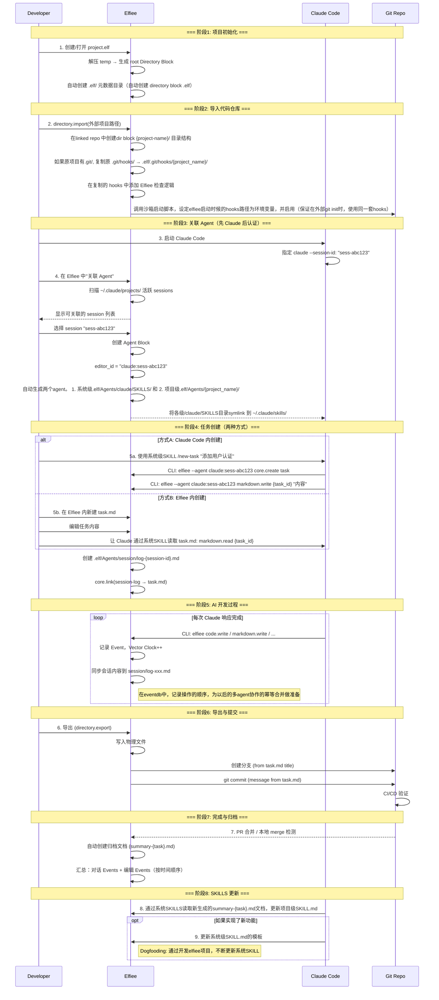
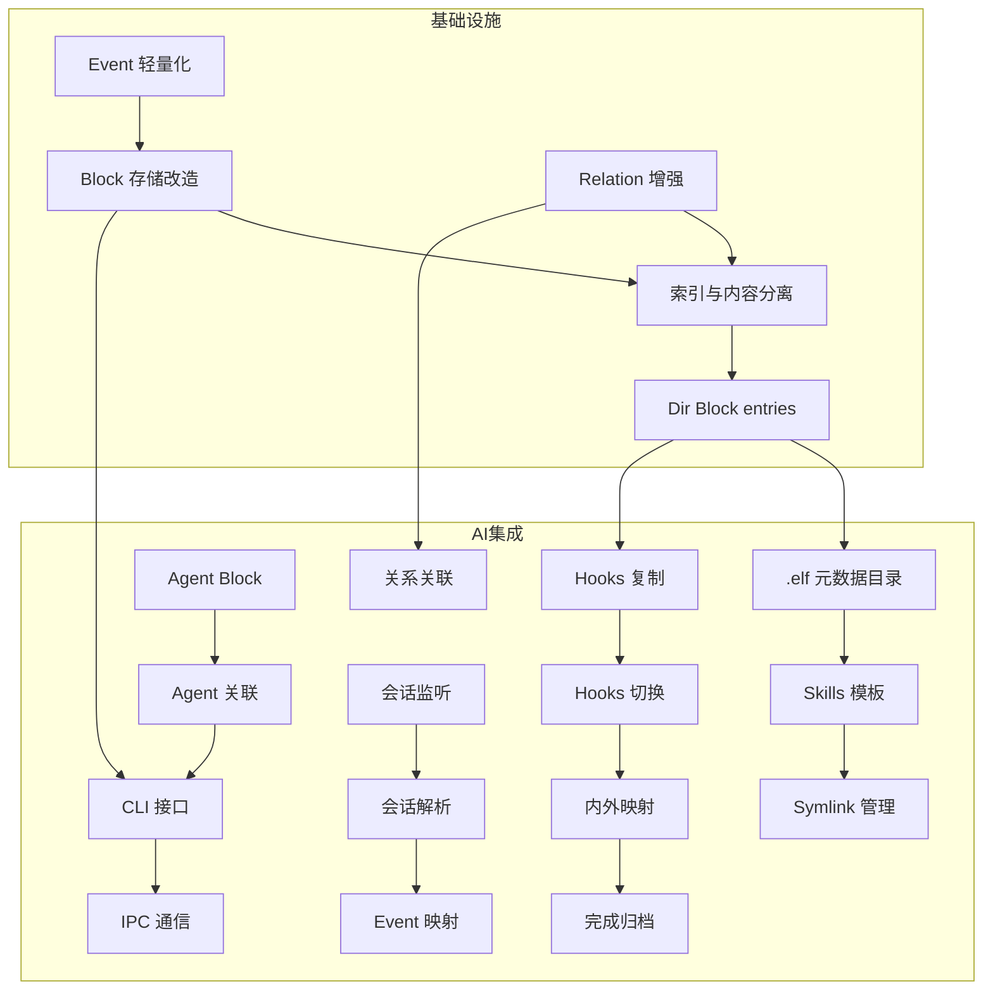

# Phase 2 二阶段目标与用户故事（v2）

## 一、Phase 1 回顾

### 1.1 阶段成果

Phase 1 聚焦"统一工作面"和"决策资产化"的基础能力验证，在**单人单机多角色协作**场景下完成了以下工作：

**研发成果**：
- ✅ Dashboard 页面：.elf 文件的创建、导入、重命名、删除和展示
- ✅ Editor 页面核心模块：
  - Directory 模块：内部/外部目录管理、文件导入导出
  - Markdown 编辑：Myst 语法支持、文字与代码块区分
  - 协作者与权限：CBAC 权限模型、协作者增删和权限管理
  - Event 记录与回溯：基于向量时钟的事件排序、Timeline 可视化、状态回溯
- ✅ 核心架构：Event Sourcing、Block-based data structure、Capability-based Architecture
- ✅ 25 个 Capability，84% API 化完成

**产品成果**：
- ✅ 竞品分析：对比大厂工作流、Google 工作流、Vibe Coding 工作流
- ✅ 用户实验：记录行为的 Effort vs Value、不同记录形式的 Benefit 对比

**核心发现**：
- 单纯的 Log 是无效的：信息密度太低，增加阅读负担
- Summary 是方向：但必须可追溯，不能是黑盒
- **决策资产化的价值不在于给人读，而在于让 AI 学**

---

## 二、Phase 1 的 Gap 与 Phase 2 方向收束

### 2.1 Phase 1 的核心 Gap

从"让决策可学习"的产品命题出发，Phase 1 完成了**把各阶段决策记录下来**的基础验证，但距离**让 AI 工具无缝接入**仍有显著差距：

| Gap | 描述 | 与理想状态的差距 |
| :--- | :--- | :--- |
| **AI 未接入** | 当前系统只有"人类角色"，没有 AI Agent 参与协作 | 无法验证 **AI 原生编辑器**的核心定位 |
| **工具割裂** | 如果内置 Agent，用户需要放弃成熟的 Claude Code/Cursor | 用户被迫选择：用弱工具但有记录 vs 用强工具但无记录 |
| **集成缺失** | AI 工具的操作不会自动同步到 Elfiee 的 Event Store | 决策记录不完整，无法追溯 AI 的思考过程 |
| **版本控制断层** | Elfiee 内部 Event 与 Git 外部 Commit 相互独立 | 无法建立"内部决策 → 外部变更"的映射 |

### 2.2 Phase 1 实验的关键洞察

**产品层面**：
- ❌ **不成立的假设**: "用户愿意放弃成熟工具来使用 Elfiee 内置 Agent"
- ✅ **成立的假设**: "用户愿意让 AI 工具通过 API 操作 Elfiee，只要不影响原有工作流"
- 🎯 **核心转向**: **Elfiee 不是 AI 工具的替代品，而是 AI 工具的"决策记忆层"**

**研发层面**：
- Event Sourcing 架构成熟：可作为 AI 操作的持久化层
- Capability 系统完善：可暴露为 Claude Skills
- Vector Clock 机制：可用于 AI 会话与代码变更的关联
- Directory 插件成熟：支持文件导入导出，可作为 AI 工具的文件网关

### 2.3 Phase 2 方向收束

基于上述 Gap 和洞察，Phase 2 聚焦以下三大方向：

| 方向 | 描述 | 对应模块 |
| :--- | :--- | :--- |
| **Skills 集成** | 将 Elfiee Capability 暴露为 Claude Code Skills | Skills Generator |
| **会话同步** | 自动同步 Claude/Cursor 会话到 Elfiee Event Store | Session Sync |
| **内外映射** | 建立 Elfiee 内部 Event 与 Git Commit 的双向映射 | Git Integration |

### 2.4 Elfiee 在 Phase 2 的核心定位

```
┌─────────────────────────────────────────────────────────────┐
│                    AI Native Editor                         │
│  ┌──────────────┐  ┌──────────────┐  ┌──────────────┐      │
│  │ Claude Code  │  │   Cursor     │  │    Codex     │      │
│  └──────┬───────┘  └──────┬───────┘  └──────┬───────┘      │
│         │                 │                 │               │
│         └────────────┬────┴────────────────┘               │
│                      ▼                                      │
│         ┌────────────────────────┐                         │
│         │   Elfiee CLI + Skills  │ ← 本地 CLI 调用         │
│         └────────────┬───────────┘                         │
│                      ▼                                      │
│  ┌──────────────────────────────────────────────────────┐  │
│  │              Elfiee Event Store                       │  │
│  │  ┌─────────┐  ┌─────────┐  ┌─────────┐  ┌─────────┐  │  │
│  │  │ Blocks  │  │ Events  │  │Relations│  │ Grants  │  │  │
│  │  └─────────┘  └─────────┘  └─────────┘  └─────────┘  │  │
│  └──────────────────────────────────────────────────────┘  │
│                      │                                      │
│                      ▼                                      │
│         ┌────────────────────────┐                         │
│         │    Git Integration     │ ← 内外映射              │
│         └────────────────────────┘                         │
└─────────────────────────────────────────────────────────────┘
```

**核心优势**：
1. **不替代，而是增强**：用户继续使用 Claude Code/Cursor，Elfiee 在后台记录
2. **权限网关**：AI 只能通过 Elfiee CLI 操作文件，CBAC 控制权限边界
3. **决策追溯**：AI 会话 + 代码变更 + 测试结果，完整因果链

---

## 三、Phase 2 阶段目标

### 3.1 大目标

**让 Elfiee 成为 AI 开发工具的"决策记忆层"，实现 AI 会话 → Event 记录 → Git Commit 的完整映射，完整实现dogfooding自举开发**

具体需要验证：
1. ✅ Claude Code 能通过 Skills 调用 Elfiee CLI（core.create, markdown.write 等）
2. ✅ AI 会话记录能自动同步到 Elfiee，并与任务文档、代码变更建立关联
3. ✅ Elfiee 内部 Task 能驱动外部 Git 分支和 Commit

### 3.2 关键假设验证

| 假设 | 验证方式 | 成功标准 |
| :--- | :--- | :--- |
| **Skills 可行性** | Claude Code 通过 SKILLS.md 调用 Elfiee CLI | 成功执行 `core.create` 等命令 |
| **会话同步有效** | AI 会话自动映射为 Elfiee Events | 会话-代码关联准确率 > 80% |
| **内外映射清晰** | Task → Branch, Task内容 → Commit Message | 用户无需手动维护映射 |

### 3.3 成功标准与产出物

#### 3.3.1 研发目标

**功能完成率**：
- [ ] **核心功能**：F1-F10 全部完成（7 个 P0 + 3 个 P1）
  - Skills 模块：F1 Skills 生成器 (P0), F2 Symlink 管理 (P0), F3 CLI 接口 (P0)
  - Session 模块：F4 会话解析 (P0), F5 Event 映射 (P0), F6 关系关联 (P1)
  - Git 模块：F7 内外映射 (P0), F8 Hooks 管理 (P1), F9 完成归档 (P1)
  - Agent 模块：F10 Agent 关联 (P0)

**量化指标**：

| 指标 | 目标值 | 验证方式 |
| :--- | :--- | :--- |
| **Skills 调用成功率** | > 95% | Claude Code → Elfiee CLI 调用统计 |
| **会话同步覆盖率** | > 90% | AI 操作被记录为 Event 的比例 |
| **内外映射准确率** | 100% | Task-Branch-Commit 对应关系 |
| **Dogfooding 完成度** | 用 Skills 完成 1 个真实功能 | PR 合并 + Event 完整性 |

#### 3.3.2 产品目标

**竞品分析**：

**Dogfooding 实验**：
- [ ] **实验计划**：设计 Dogfooding 流程和场景
- [ ] **评价指标**：定义效率、完整性、可追溯性等指标
- [ ] **归因分析**：分析哪些环节提效、哪些需要优化

---

## 四、Phase 2 完整用户故事（串联产品与研发）

### 4.1 故事背景

**角色设定**：
- **Developer**: 使用 Claude Code 进行开发
- **Elfiee**: 后台运行，记录决策，管理权限
- **Git**: 外部版本控制系统

**场景**: 开发者使用 Claude Code 为项目添加"用户认证"功能，Elfiee 在后台记录整个过程。

### 4.2 完整工作流时序图



### 4.3 详细步骤说明

> **架构说明**：所有内容均 Block 化。Directory Block 存储索引（entries），Content Block 存储实际内容（`block-{uuid}/body.*`）。索引与内容通过 Relation 关联，权限独立管理。

---

#### Step 1: 创建/打开 .elf 项目

**操作**：用户创建或打开 `project.elf` 文件

**系统行为**：

1. **解压与初始化**：
   - 解压 `.elf` (ZIP) 到临时目录
   - 加载 `_eventstore.db`，重放 Events 构建 StateProjector

2. **生成根 Directory Block**：
   - 创建 Root Dir Block，索引临时目录下所有 `block-{uuid}/` 内容
   - Dir Block 的 `contents.entries` 存储索引映射

3. **自动创建 `.elf/` 元数据 Block 结构**（如果不存在）：

   ```
   block-{elf-meta-uuid}/          # .elf/ → Directory Block（索引）
   ├── entries: {
   │     "SKILLS.md": {id: "skills-sys", type: "file"},
   │     "Agents/": {id: "agents-dir", type: "directory"},
   │     "git/": {id: "git-dir", type: "directory"}
   │   }

   block-{skills-sys-uuid}/        # .elf/SKILLS.md → Markdown Block
   └── body.md                     # 内置通用 Skills 模板

   block-{agents-dir-uuid}/        # .elf/Agents/ → Directory Block
   └── entries: {}                 # 初始为空

   block-{git-dir-uuid}/           # .elf/git/ → Directory Block
   └── entries: {"hooks/": {...}}

   block-{hooks-dir-uuid}/         # .elf/git/hooks/ → Directory Block
   └── entries: {}                 # 初始为空
   ```

4. **Event 记录**：
   - 每个 Block 创建生成 `core.create` Event
   - Event 只记录元数据（name, type, owner），不存储完整内容
   - 实际内容存储在 `block-{uuid}/body.*` 物理文件中

5. **前端展示**：
   - 不显示完整的 `.elf/` Directory Block
   - 只显示关键文件夹：**SKILLS** / **Agents** / **Hooks**
   - 置顶展示，与普通内容区分

6. **内置通用 SKILLS.md 模板**（存储在 `block-{skills-sys}/body.md`）：
   ```markdown
   # Elfiee 通用 Skills

   使用 Elfiee CLI 执行以下命令。

   ## core.create
   创建新 Block
   - 命令: `elfiee --agent {agent_id} core.create {block_type}`
   - 示例: `elfiee --agent claude:sess-abc core.create markdown`

   ## markdown.write
   写入 Markdown 内容
   - 命令: `elfiee --agent {agent_id} markdown.write {block_id} "内容"`

   ## code.write
   写入代码内容
   - 命令: `elfiee --agent {agent_id} code.write {block_id} "内容"`

   ## core.link
   建立 Block 关系
   - 命令: `elfiee --agent {agent_id} core.link {source_id} {target_id} {relation}`
   ```

**验证点**：
- 每个新建的 .elf 文件都自动包含 `.elf/` 元数据 Block 结构
- 通用 SKILLS.md 是可编辑的 Markdown Block

---

#### Step 2: 导入代码仓库

**操作**：用户执行 `directory.import(外部项目路径)`

**系统行为**：

1. **扫描源目录**：
   - 遍历外部项目，过滤二进制文件和 `.git/` 目录
   - 按文件类型推断 Block 类型（markdown, code 等）

2. **创建项目 Directory Block**：
   ```
   block-{project-dir-uuid}/       # {project-name}/ → Directory Block
   └── entries: {
         "src/main.rs": {id: "main-rs", type: "file"},
         "README.md": {id: "readme", type: "file"},
         ...
       }
   └── metadata: {
         external_root_path: "/path/to/project"
       }
   ```

3. **创建内容 Block**（每个导入的文件）：
   ```
   block-{main-rs-uuid}/           # src/main.rs → Code Block
   └── body.rs                     # 复制文件内容到此

   block-{readme-uuid}/            # README.md → Markdown Block
   └── body.md                     # 复制文件内容到此
   ```

4. **建立 Relation**：
   - Dir Block → Content Block（`contains` 关系）
   - 通过 `children` 字段或后续 Relation 模块管理

5. **更新 `.elf/` 元数据**：
   ```
   .elf/projects/{project-name}/   # 新增项目级目录
   ├── SKILLS.md                   # 项目级 Skills（工作流、规范）
   └── CLAUDE.md                   # 项目级 Claude 配置
   ```

6. **Git Hooks 处理**：
   - 检测外部项目是否有 `.git/hooks/`
   - 复制原 hooks 到 `.elf/git/hooks/{project-name}/`（作为 Code Block）
   - 在复制的 hooks 中**追加** Elfiee 检查逻辑
   - 设置环境变量，供沙箱启动脚本使用

**复制后的 pre-commit 示例**（存储在 `block-{hook-uuid}/body.sh`）：
```bash
#!/bin/bash
# === 原有 hooks 内容（复制自 .git/hooks/pre-commit）===
# ... 原有逻辑 ...

# === Elfiee 追加的检查逻辑 ===
if command -v elfiee &> /dev/null; then
    elfiee check-commit "$@"
fi
```

7. **Event 记录**：
   - `core.create` × N（每个 Block）
   - `directory.import` 记录导入操作元数据
   - Event 不存储文件内容，只存索引和引用

**SKILLS 层级设计**：
- **通用 SKILLS**（`.elf/SKILLS.md`）：Elfiee 编辑指令
- **项目级 SKILLS**（`.elf/projects/{name}/SKILLS.md`）：项目代码工作流、开发规范

---

#### Step 3: 关联 Agent（先发起 Claude，再认证）

**操作**：用户启动 Claude Code，然后在 Elfiee 中关联

**工作流**：

1. **用户启动 Claude Code**：
   ```bash
   claude --session-id sess-abc123
   ```
   - Claude 生成唯一的 session_id

2. **用户在 Elfiee 中点击"关联 Agent"**

3. **Elfiee 扫描活跃 sessions**：
   - 读取 `~/.claude/projects/` 下的 `.jsonl` 文件
   - 解析活跃的 session 列表
   - 显示可关联的 session

4. **用户选择要关联的 session**

5. **创建 Agent Block 结构**：
   ```
   block-{agent-uuid}/             # Agent Block
   └── body.json                   # Agent 配置
       {
         "provider": "claude",
         "session_id": "sess-abc123",
         "editor_id": "claude:sess-abc123",
         "linked_projects": ["project-name"]
       }

   .elf/Agents/claude/             # 系统级 Agent 目录
   └── SKILLS.md                   # 系统级 Skills

   .elf/Agents/{project-name}/     # 项目级 Agent 目录
   └── SKILLS.md                   # 合并后的 Skills（通用 + 项目级）
   ```

6. **创建 Symlink**：
   ```
   ~/.claude/skills/elfiee-{project} → block-{agent-skills}/body.md
   ```
   - Symlink 指向临时目录中的物理文件
   - 关闭 .elf 时自动清理

7. **注册 Editor**：
   - 创建 Editor，`editor_id = "claude:sess-abc123"`
   - 授予默认权限（core.create, markdown.write, code.write 等）

**身份唯一性保证**：
- `editor_id = {provider}:{session_id}`
- Claude `sess-abc123` → `claude:sess-abc123`
- Cursor `cursor-xyz789` → `cursor:cursor-xyz789`
- 不同 AI 工具、不同会话的 editor_id 完全不同

**验证点**：必须先启动 AI 工具获取 session_id，再在 Elfiee 中关联

---

#### Step 4: 任务创建（两种方式）

**方式 A：在 Claude Code 中创建**

用户输入：`/new-task "添加用户认证功能"`

Claude 通过 SKILLS 执行命令序列：
```bash
# 1. 创建任务 Block
elfiee --agent claude:sess-abc123 core.create task
# 返回: {"block_id": "task-001", "block_dir": "/tmp/xxx/block-task-001"}

# 2. 写入任务内容（写入 block-task-001/body.md）
elfiee --agent claude:sess-abc123 markdown.write task-001 "# 添加用户认证功能\n\n## 需求\n..."

# 3. 创建 session log Block
elfiee --agent claude:sess-abc123 core.create markdown --name "session-log-001"

# 4. 建立关联
elfiee --agent claude:sess-abc123 core.link session-log-001 task-001 tracks
```

**方式 B：在 Elfiee 中创建**

1. 用户在 Elfiee 内新建 `task.md`（创建 Markdown Block）
2. 编辑任务内容（需求、验收标准等）
3. 在 Claude Code 中：`请读取并执行 task.md`
4. Claude 通过 CLI 读取任务：
   ```bash
   elfiee --agent claude:sess-abc123 markdown.read task-001
   ```

**会话关联**：
- 任务创建时，系统自动创建 `session/log-{session-id}.md` Block
- 建立 Relation：`session-log → task.md (tracks)`
- Event 记录完整的关联链

---

#### Step 5: AI 开发过程与会话同步

**开发过程**：Claude 通过 CLI 执行操作

```bash
[14:32:01] elfiee --agent claude:sess-abc123 core.create code --name "auth.rs"
           → 创建 block-{auth-uuid}/body.rs
           → Event{entity: "auth-uuid", attr: "claude:sess-abc123/core.create", vc: {1}}

[14:32:15] elfiee --agent claude:sess-abc123 code.write auth-uuid "fn authenticate()..."
           → 写入 block-{auth-uuid}/body.rs
           → Event{entity: "auth-uuid", attr: "claude:sess-abc123/code.write", vc: {2}}

[14:33:42] elfiee --agent claude:sess-abc123 core.link auth-uuid task-001 implements
           → 建立 Relation
           → Event{entity: "auth-uuid", attr: "claude:sess-abc123/core.link", vc: {3}}
```

**会话同步机制**：

每次 Claude 响应完成，触发同步：

1. **监听会话文件**：
   - Elfiee 监听 `~/.claude/projects/{path}/{session}.jsonl`
   - 检测文件变化（inotify/FSEvents）

2. **解析新增内容**：
   - 提取用户输入和 Claude 响应
   - 格式化为 Markdown

3. **写入 session log Block**：
   - 追加内容到 `block-{session-log}/body.md`
   - 生成 `markdown.write` Event

4. **保持时序**：
   ```
   Event 顺序（按 Vector Clock）：
   vc: {1} → markdown.write(session-log, "用户: 添加认证...")
   vc: {2} → code.write(auth.rs, "fn authenticate()...")
   vc: {3} → core.link(auth.rs → task.md)
   ```

5. **关联匹配**：
   - 通过 Vector Clock 值建立会话-代码的精确关联
   - 为后续多 Agent 协作的幂等合并做准备

---

#### Step 6: 导出与 Git 提交

**操作**：用户执行导出

**系统行为**：

1. **directory.export**：
   - 遍历项目 Dir Block 的 entries
   - 将每个 Content Block 的 `body.*` 写入外部目录
   - 保持原有目录结构

2. **从 task.md 提取信息**：
   - 读取 task Block 的 `body.md`
   - 解析 `title` → 分支名（如 `feat/user-auth`）
   - 解析 `content` → commit message

3. **执行 Git 操作**：
   ```bash
   # 切换 hooks 路径
   git config core.hooksPath .elf/git/hooks/{project-name}

   # 创建分支并提交
   git checkout -b feat/user-auth
   git add <exported_files>
   git commit -m "添加用户认证功能

   - 实现 JWT 认证
   - 添加用户登录接口

   Task: task-001
   Session: sess-abc123"

   git push origin feat/user-auth  # 可选
   ```

4. **Hooks 自动生效**：
   - 因为 `core.hooksPath` 已设置，Elfiee hooks 被调用
   - `elfiee check-commit` 记录 commit 与 task 的关联

---

#### Step 7: 完成归档（自动触发）

**触发条件**：
- 本地检测到 merge（监听 git reflog）
- 或远程 PR 合并（GitHub webhook / 定期轮询）

**系统行为**：

1. **创建归档 Block**：
   ```
   block-{summary-uuid}/           # archive/summary-{task}.md
   └── body.md                     # 归档内容
   ```

2. **汇总内容**（按 Event 时间顺序）：
   ```markdown
   # 任务归档：添加用户认证功能

   ## 元信息
   - 任务 ID: task-001
   - 会话 ID: sess-abc123
   - 完成时间: 2026-01-23 15:00:00
   - 提交: feat/user-auth → main

   ## 时间线

   ### 14:32:01 - 会话开始
   ::::{note} 对话记录
   用户：添加用户认证功能，要求支持 JWT...
   Claude：好的，我来分析需求...
   ::::

   ### 14:32:15 - 代码创建
   ::::{code-block} rust
   :caption: auth.rs
   fn authenticate() { ... }
   ::::

   ### 14:33:42 - 关系建立
   - auth.rs → task.md (implements)

   ## 相关资源
   - 原始任务：[[task-001]]
   - 代码文件：[[auth-uuid]]
   - 会话记录：[[session-log-001]]
   ```

3. **建立 Relation**：
   - `summary → task (archives)`
   - `summary → session-log (summarizes)`

---

#### Step 8: 项目关闭与 Hooks 恢复

**操作**：用户关闭 Elfiee 或关闭项目

**系统行为**：

1. **恢复 Git 配置**：
   ```bash
   git config --unset core.hooksPath
   ```

2. **清理 Symlink**：
   - 删除 `~/.claude/skills/elfiee-{project}`

3. **保存 .elf**：
   - 将临时目录重新打包为 `.elf` (ZIP)
   - 包含所有 `block-{uuid}/` 目录和 `_eventstore.db`

4. **原项目不受影响**：
   - `.git/hooks/` 完全不变
   - 正常提交不受影响

---

#### Step 9: SKILLS 更新（可选）

**触发条件**：任务涉及新功能/新规范

**更新流程**：

1. **项目级 SKILLS 自动更新**：
   - Claude 读取归档文档
   - 提取新增的能力/规范
   - 追加到 `.elf/projects/{project}/SKILLS.md`

2. **系统级 SKILLS 手动更新**：
   - 需要人工审核
   - 通过 Claude 辅助编辑 `.elf/SKILLS.md`

**Dogfooding 场景**：
```markdown
## 新增能力（自动生成）

### auth.validate
验证用户身份
- 命令: `elfiee --agent {agent_id} auth.validate {token}`
- 示例: `elfiee --agent claude:sess-abc auth.validate "eyJhbG..."`
- 来源: [[summary-task-001]]
```

---

## 五、Phase 2 功能模块拆分

### 5.1 模块总览

Phase 2 包含两大类改动：

| 类别 | 模块 | 描述 |
|:---|:---|:---|
| **基础设施** | Block 存储、Event 优化、Relation 增强、Dir Block 改造 | 支撑 AI 集成的底层改动 |
| **AI 集成** | Agent、CLI、Skills、Session 同步、Git 集成 | Phase 2 核心功能 |

---

### 5.2 基础设施模块（4 个）

#### A. Block 存储改造

| 编号 | 功能名称 | 改动描述 | 验收标准 | 优先级 |
|:---|:---|:---|:---|:---|
| **I1** | 内容物理存储 | Content Block 内容存储到 `block-{uuid}/body.*` 物理文件，而非 Event.value | ✓ `code.write` 写入物理文件 <br> ✓ `markdown.write` 写入物理文件 <br> ✓ 读取时从物理文件加载 | P0 |
| **I2** | 索引与内容分离 | Dir Block 只存索引（entries），通过引用指向 Content Block | ✓ `directory.import` 创建索引 + 内容 Block <br> ✓ 索引权限与内容权限独立 | P0 |
| **I3** | Block 目录结构 | 每个 Block 对应 `block-{uuid}/` 目录，支持 `body.*` + `assets/` | ✓ `core.create` 自动创建目录 <br> ✓ 支持多文件资产 | P0 |

#### B. Event 存储优化

| 编号 | 功能名称 | 改动描述 | 验收标准 | 优先级 |
|:---|:---|:---|:---|:---|
| **I4** | Event 轻量化 | Event.value 只存操作元数据，不存完整内容 | ✓ `code.write` Event 不含文件内容 <br> ✓ EventDB 体积显著减小 | P0 |
| **I5** | 操作审计 | Event 记录操作类型、时间、操作者，可选存 diff | ✓ 支持历史操作回溯 <br> ✓ 可选开启 diff 存储 | P1 |

#### C. Relation 增强

| 编号 | 功能名称 | 改动描述 | 验收标准 | 优先级 |
|:---|:---|:---|:---|:---|
| **I6** | 索引关系类型 | 新增 `contains` 关系类型，表示 Dir Block 包含 Content Block | ✓ `directory.import` 自动建立 <br> ✓ 支持查询"目录包含哪些文件" | P0 |
| **I7** | 反向索引 | StateProjector 维护反向索引，支持"谁引用了我"查询 | ✓ `get_parents(block_id)` 接口 <br> ✓ 实时更新 | P1 |
| **I8** | 关系类型扩展 | 支持 `tracks`, `implements`, `archives`, `generated_by` 等 | ✓ 任务-代码关联 <br> ✓ 会话-代码关联 | P0 |

#### D. Dir Block 改造

| 编号 | 功能名称 | 改动描述 | 验收标准 | 优先级 |
|:---|:---|:---|:---|:---|
| **I9** | entries 索引结构 | `contents.entries` 只存 `{path: {id, type}}`，不存文件内容 | ✓ 与现有结构兼容 <br> ✓ 支持嵌套目录 | P0 |
| **I10** | .elf/ 元数据目录 | 自动创建 `.elf/` Dir Block 结构（SKILLS, Agents, git/hooks） | ✓ 新建 .elf 自动创建 <br> ✓ 前端只显示关键文件夹 | P0 |
| **I11** | directory.import 改造 | 导入时复制文件到 `block-{uuid}/body.*`，创建索引 | ✓ 支持增量导入 <br> ✓ 支持过滤规则 | P0 |
| **I12** | directory.export 改造 | 导出时从 Content Block 读取内容写入外部 | ✓ 保持目录结构 <br> ✓ 支持部分导出 | P0 |

---

### 5.3 AI 集成模块（5 个）

#### A. Agent 模块

| 编号 | 功能名称 | 用户故事 | 验收标准 | 优先级 |
|:---|:---|:---|:---|:---|
| **F1** | Agent Block | 作为系统，我需要创建 Agent Block 存储 AI 会话配置 | ✓ 存储 provider, session_id, editor_id <br> ✓ 关联项目和 SKILLS | P0 |
| **F2** | Session 扫描 | 作为用户，我希望 Elfiee 自动发现可关联的 AI sessions | ✓ 扫描 ~/.claude/projects/ <br> ✓ 显示活跃 session 列表 | P0 |
| **F3** | Agent 关联 | 作为用户，我希望将 Claude session 关联为 Elfiee Agent | ✓ 用户选择 session 进行关联 <br> ✓ 创建 Editor，editor_id = {provider}:{session_id} | P0 |

#### B. CLI 模块

| 编号 | 功能名称 | 用户故事 | 验收标准 | 优先级 |
|:---|:---|:---|:---|:---|
| **F4** | CLI 接口 | 作为系统，我需要提供 CLI 供 AI 工具调用 | ✓ `elfiee --agent {id} {capability} {args}` <br> ✓ 支持 JSON 输出 | P0 |
| **F5** | IPC 通信 | 作为 CLI，我需要与运行中的 Elfiee 通信 | ✓ Unix Socket / Named Pipe <br> ✓ 命令转发和结果返回 | P0 |
| **F6** | elfiee-ext-gen 改造 | 作为 CLI，我需要通过 Elfiee 命令生成代码 | ✓ 原有直接生成改为调用 CLI <br> ✓ 生成后自动 directory.export | P1 |

#### C. Skills 模块

| 编号 | 功能名称 | 用户故事 | 验收标准 | 优先级 |
|:---|:---|:---|:---|:---|
| **F7** | Skills 模板 | 作为系统，我需要内置通用 SKILLS.md 模板 | ✓ 包含 core.create, markdown.write 等 <br> ✓ 可编辑（Markdown Block） | P0 |
| **F8** | 项目级 Skills | 作为用户，我希望每个项目有独立的 SKILLS | ✓ 导入项目时自动创建 <br> ✓ 存储项目工作流规范 | P0 |
| **F9** | Symlink 管理 | 作为用户，我希望 Elfiee 自动将 Skills 链接到 Claude 目录 | ✓ 创建 symlink 到 ~/.claude/skills/ <br> ✓ 关闭时清理 symlink | P0 |

#### D. Session 同步模块

| 编号 | 功能名称 | 用户故事 | 验收标准 | 优先级 |
|:---|:---|:---|:---|:---|
| **F10** | 会话监听 | 作为系统，我需要监听 Claude 会话文件变化 | ✓ 监听 ~/.claude/projects/{path}/*.jsonl <br> ✓ 实时检测新增内容 | P0 |
| **F11** | 会话解析 | 作为系统，我需要解析 Claude JSONL 格式 | ✓ 提取用户输入和 AI 响应 <br> ✓ 格式化为 Markdown | P0 |
| **F12** | Event 映射 | 作为系统，我需要将会话内容映射为 Events | ✓ 写入 session-log Block <br> ✓ 保持时序（会话 Event 在代码 Event 之前） | P0 |
| **F13** | 关系关联 | 作为用户，我希望看到会话与代码的关联 | ✓ 通过 Vector Clock 匹配 <br> ✓ 建立 generated_by 关系 | P1 |

#### E. Git 集成模块

| 编号 | 功能名称 | 用户故事 | 验收标准 | 优先级 |
|:---|:---|:---|:---|:---|
| **F14** | Hooks 复制 | 作为用户，我希望 Elfiee 不污染原项目 hooks | ✓ 复制原 hooks 到 .elf/git/hooks/ <br> ✓ 追加 Elfiee 检查逻辑 | P0 |
| **F15** | Hooks 切换 | 作为用户，我希望 Elfiee 管理 hooks 生命周期 | ✓ 打开时设置 core.hooksPath <br> ✓ 关闭时恢复原配置 | P0 |
| **F16** | 内外映射 | 作为用户，我希望 task.md 驱动 Git 操作 | ✓ task title → 分支名 <br> ✓ task content → commit message | P0 |
| **F17** | 完成归档 | 作为用户，我希望任务完成后自动生成归档 | ✓ 检测 merge <br> ✓ 生成 summary Block <br> ✓ 汇总对话 + 编辑 Events | P1 |

---

### 5.4 产品研究拆分

| 编号 | 研究主题 | 研究问题 | 产出物 | 优先级 |
|:---|:---|:---|:---|:---|
| **R1** | Dogfooding 实验设计 | 如何设计有效的 Dogfooding 流程？需要哪些场景覆盖？ | 实验计划文档 + 场景清单 | P0 |
| **R2** | 评价指标定义 | 如何量化 Skills 集成的效果？效率、完整性、可追溯性如何衡量？ | 指标体系 + 数据采集方案 | P0 |
| **R3** | 归因分析方法 | 哪些环节提效了？哪些是瓶颈？如何归因？ | 分析框架 + 归因报告模板 | P0 |

---

### 5.5 功能依赖关系



---

## 六、Phase 2 不做什么（边界清晰）

| 不做 | 原因 | 推迟到阶段 |
| :--- | :--- | :--- |
| ❌ **HTTP 网关** | 本地应用使用 CLI + IPC 更轻量 | - |
| ❌ **完全自动同步** | 手动/触发式同步更可控，避免性能问题 | Phase 3 |
| ❌ **自定义 Skills 语法** | 遵循 Claude Code 原生规范，减少学习成本 | - |
| ❌ **多 AI 工具同时写入** | 并发控制复杂，Phase 2 聚焦单工具场景 | Phase 4 |
| ❌ **Git 冲突自动解决** | 复杂场景留给用户手动处理 | Phase 4 |
| ❌ **Elfiee 内置 Agent 对话 UI** | 本阶段通过外部工具（Claude Code）交互 | Phase 3 |
| ❌ **会话内容摘要** | 原始记录优先，摘要功能推迟 | Phase 3 |

---

## 七、与整体路线图的关系

| 阶段 | 核心验证 | 依赖/铺垫 |
| :--- | :--- | :--- |
| Phase 1 ✅ | 人类协作基础 | Event Sourcing、CBAC、Directory、Relation |
| **Phase 2** | **AI 工具集成（Skills + Session + Git）** | **本阶段核心** |
| Phase 3 | Agent 模块 + Relation 增强 | Phase 2 的 CLI + 会话同步基础 |
| Phase 4 | 多工具协作 + 权限 UI | Phase 3 的 Agent 模块 |
| Phase 5 | 团队协作 | Phase 2 的 Git 集成 |
| Phase 6 | 服务端部署 | 基于 Phase 2-5 的所有能力 |
