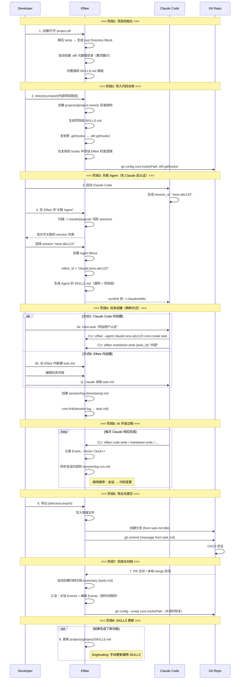

# Phase 2 二阶段目标与用户故事（v2）

## 一、Phase 1 回顾

### 1.1 阶段成果

Phase 1 聚焦"统一工作面"和"决策资产化"的基础能力验证，在**单人单机多角色协作**场景下完成了以下工作：

**研发成果**：
- ✅ Dashboard 页面：.elf 文件的创建、导入、重命名、删除和展示
- ✅ Editor 页面核心模块：
  - Directory 模块：内部/外部目录管理、文件导入导出
  - Markdown 编辑：Myst 语法支持、文字与代码块区分
  - 协作者与权限：CBAC 权限模型、协作者增删和权限管理
  - Event 记录与回溯：基于向量时钟的事件排序、Timeline 可视化、状态回溯
- ✅ 核心架构：Event Sourcing、Block-based data structure、Capability-based Architecture
- ✅ 25 个 Capability，84% API 化完成

**产品成果**：
- ✅ 竞品分析：对比大厂工作流、Google 工作流、Vibe Coding 工作流
- ✅ 用户实验：记录行为的 Effort vs Value、不同记录形式的 Benefit 对比

**核心发现**：
- 单纯的 Log 是无效的：信息密度太低，增加阅读负担
- Summary 是方向：但必须可追溯，不能是黑盒
- **决策资产化的价值不在于给人读，而在于让 AI 学**

---

## 二、Phase 1 的 Gap 与 Phase 2 方向收束

### 2.1 Phase 1 的核心 Gap

从"让决策可学习"的产品命题出发，Phase 1 完成了**把各阶段决策记录下来**的基础验证，但距离**让 AI 工具无缝接入**仍有显著差距：

| Gap | 描述 | 与理想状态的差距 |
| :--- | :--- | :--- |
| **AI 未接入** | 当前系统只有"人类角色"，没有 AI Agent 参与协作 | 无法验证 **AI 原生编辑器**的核心定位 |
| **工具割裂** | 如果内置 Agent，用户需要放弃成熟的 Claude Code/Cursor | 用户被迫选择：用弱工具但有记录 vs 用强工具但无记录 |
| **集成缺失** | AI 工具的操作不会自动同步到 Elfiee 的 Event Store | 决策记录不完整，无法追溯 AI 的思考过程 |
| **版本控制断层** | Elfiee 内部 Event 与 Git 外部 Commit 相互独立 | 无法建立"内部决策 → 外部变更"的映射 |

### 2.2 Phase 1 实验的关键洞察

**产品层面**：
- ❌ **不成立的假设**: "用户愿意放弃成熟工具来使用 Elfiee 内置 Agent"
- ✅ **成立的假设**: "用户愿意让 AI 工具通过 API 操作 Elfiee，只要不影响原有工作流"
- 🎯 **核心转向**: **Elfiee 不是 AI 工具的替代品，而是 AI 工具的"决策记忆层"**

**研发层面**：
- Event Sourcing 架构成熟：可作为 AI 操作的持久化层
- Capability 系统完善：可暴露为 Claude Skills
- Vector Clock 机制：可用于 AI 会话与代码变更的关联
- Directory 插件成熟：支持文件导入导出，可作为 AI 工具的文件网关

### 2.3 Phase 2 方向收束

基于上述 Gap 和洞察，Phase 2 聚焦以下三大方向：

| 方向 | 描述 | 对应模块 |
| :--- | :--- | :--- |
| **Skills 集成** | 将 Elfiee Capability 暴露为 Claude Code Skills | Skills Generator |
| **会话同步** | 自动同步 Claude/Cursor 会话到 Elfiee Event Store | Session Sync |
| **内外映射** | 建立 Elfiee 内部 Event 与 Git Commit 的双向映射 | Git Integration |

### 2.4 Elfiee 在 Phase 2 的核心定位

```
┌─────────────────────────────────────────────────────────────┐
│                    AI Native Editor                         │
│  ┌──────────────┐  ┌──────────────┐  ┌──────────────┐      │
│  │ Claude Code  │  │   Cursor     │  │    Codex     │      │
│  └──────┬───────┘  └──────┬───────┘  └──────┬───────┘      │
│         │                 │                 │               │
│         └────────────┬────┴────────────────┘               │
│                      ▼                                      │
│         ┌────────────────────────┐                         │
│         │   Elfiee CLI + Skills  │ ← 本地 CLI 调用         │
│         └────────────┬───────────┘                         │
│                      ▼                                      │
│  ┌──────────────────────────────────────────────────────┐  │
│  │              Elfiee Event Store                       │  │
│  │  ┌─────────┐  ┌─────────┐  ┌─────────┐  ┌─────────┐  │  │
│  │  │ Blocks  │  │ Events  │  │Relations│  │ Grants  │  │  │
│  │  └─────────┘  └─────────┘  └─────────┘  └─────────┘  │  │
│  └──────────────────────────────────────────────────────┘  │
│                      │                                      │
│                      ▼                                      │
│         ┌────────────────────────┐                         │
│         │    Git Integration     │ ← 内外映射              │
│         └────────────────────────┘                         │
└─────────────────────────────────────────────────────────────┘
```

**核心优势**：
1. **不替代，而是增强**：用户继续使用 Claude Code/Cursor，Elfiee 在后台记录
2. **权限网关**：AI 只能通过 Elfiee CLI 操作文件，CBAC 控制权限边界
3. **决策追溯**：AI 会话 + 代码变更 + 测试结果，完整因果链

---

## 三、Phase 2 阶段目标

### 3.1 大目标

**让 Elfiee 成为 AI 开发工具的"决策记忆层"，实现 AI 会话 → Event 记录 → Git Commit 的完整映射**

具体需要验证：
1. ✅ Claude Code 能通过 Skills 调用 Elfiee CLI（core.create, markdown.write 等）
2. ✅ AI 会话记录能自动同步到 Elfiee，并与代码变更建立关联
3. ✅ Elfiee 内部 Task 能驱动外部 Git 分支和 Commit

### 3.2 关键假设验证

| 假设 | 验证方式 | 成功标准 |
| :--- | :--- | :--- |
| **Skills 可行性** | Claude Code 通过 SKILLS.md 调用 Elfiee CLI | 成功执行 `core.create` 等命令 |
| **会话同步有效** | AI 会话自动映射为 Elfiee Events | 会话-代码关联准确率 > 80% |
| **内外映射清晰** | Task → Branch, Task内容 → Commit Message | 用户无需手动维护映射 |

### 3.3 成功标准与产出物

#### 3.3.1 研发目标

**功能完成率**：
- [ ] **核心功能**：F1-F10 全部完成（7 个 P0 + 3 个 P1）
  - Skills 模块：F1 Skills 生成器 (P0), F2 Symlink 管理 (P0), F3 CLI 接口 (P0)
  - Session 模块：F4 会话解析 (P0), F5 Event 映射 (P0), F6 关系关联 (P1)
  - Git 模块：F7 内外映射 (P0), F8 Hooks 管理 (P1), F9 完成归档 (P1)
  - Agent 模块：F10 Agent 关联 (P0)

**量化指标**：

| 指标 | 目标值 | 验证方式 |
| :--- | :--- | :--- |
| **Skills 调用成功率** | > 95% | Claude Code → Elfiee CLI 调用统计 |
| **会话同步覆盖率** | > 90% | AI 操作被记录为 Event 的比例 |
| **内外映射准确率** | 100% | Task-Branch-Commit 对应关系 |
| **Dogfooding 完成度** | 用 Skills 完成 1 个真实功能 | PR 合并 + Event 完整性 |

#### 3.3.2 产品目标

**Dogfooding 实验**：
- [ ] **实验计划**：设计 Dogfooding 流程和场景
- [ ] **评价指标**：定义效率、完整性、可追溯性等指标
- [ ] **归因分析**：分析哪些环节提效、哪些需要优化

---

## 四、Phase 2 完整用户故事（串联产品与研发）

### 4.1 故事背景

**角色设定**：
- **Developer**: 使用 Claude Code 进行开发
- **Elfiee**: 后台运行，记录决策，管理权限
- **Git**: 外部版本控制系统

**场景**: 开发者使用 Claude Code 为项目添加"用户认证"功能，Elfiee 在后台记录整个过程。

### 4.2 完整工作流时序图



### 4.3 详细步骤

#### Step 1: 创建/打开 .elf 项目

**操作**：用户创建或打开 `project.elf` 文件

**系统行为**：
1. 解压 .elf 到临时目录
2. 生成根 Directory Block，展示解压内容
3. 自动创建 `.elf/` 元数据目录（如果不存在）：
   ```
   .elf/
   ├── SKILLS.md            # 通用 Skills（内置模板）
   ├── projects/            # 项目级配置
   └── git/                 # Git 集成配置
       └── hooks/           # Hooks 目录
   ```
4. `.elf/` 目录在 UI 中置顶展示，与普通内容区分
5. 内置通用 SKILLS.md 模板：
   ```markdown
   # Elfiee 通用 Skills

   使用 Elfiee CLI 执行以下命令。

   ## core.create
   创建新 Block
   - 命令: `elfiee --agent {agent_id} core.create {block_type}`
   - 示例: `elfiee --agent claude:sess-abc core.create markdown`

   ## markdown.write
   写入 Markdown 内容
   - 命令: `elfiee --agent {agent_id} markdown.write {block_id} "内容"`

   ## code.write
   写入代码内容
   - 命令: `elfiee --agent {agent_id} code.write {block_id} "内容"`

   ## core.link
   建立 Block 关系
   - 命令: `elfiee --agent {agent_id} core.link {source_id} {target_id} {relation}`
   ```

**验证点**：每个新建的 .elf 文件都自动包含通用 SKILLS.md

---

#### Step 2: 导入代码仓库

**操作**：用户执行 `directory.import` 导入外部项目

**系统行为**：
1. 扫描源目录，过滤二进制文件
2. 创建 Directory Block，记录 `external_root_path`
3. 在 `.elf/projects/` 下创建项目级目录：
   ```
   .elf/projects/{project-name}/
   ├── SKILLS.md      # 项目级 Skills（工作流、规范）
   └── CLAUDE.md      # 项目级 Claude 配置
   ```
4. **Git Hooks 处理**：
   - 复制原项目 `.git/hooks/` 的所有文件到 `.elf/git/hooks/`
   - 在复制的 hooks 中**追加** Elfiee 的检查逻辑
   - 设置 `git config core.hooksPath .elf/git/hooks/`

**复制后的 pre-commit 示例**：
```bash
#!/bin/bash
# === 原有 hooks 内容（复制自 .git/hooks/pre-commit）===
# ... 原有逻辑 ...

# === Elfiee 追加的检查逻辑 ===
if command -v elfiee &> /dev/null; then
    elfiee check-commit "$@"
fi
```

**SKILLS 层级设计**：
- **通用 SKILLS**（`.elf/SKILLS.md`）：Elfiee 编辑指令（core.create, markdown.write 等）
- **项目级 SKILLS**（`.elf/projects/{name}/SKILLS.md`）：该项目的代码工作流、开发规范等

---

#### Step 3: 关联 Agent（先发起 Claude，再认证）

**操作**：用户启动 Claude Code，然后在 Elfiee 中关联

**工作流**：
1. 用户启动 Claude Code
2. Claude 生成 session_id（如 `sess-abc123`）
3. 用户在 Elfiee 中点击"关联 Agent"
4. Elfiee 扫描 `~/.claude/projects/` 下的活跃 sessions
5. 用户选择要关联的 session
6. Elfiee 创建 Agent Block：
   ```
   blocks/agent-{uuid}/
   ├── config.json
   │   {
   │     "provider": "claude",
   │     "session_id": "sess-abc123",
   │     "editor_id": "claude:sess-abc123"
   │   }
   ├── SKILLS.md         # 合并后的 Skills（通用 + 项目级）
   └── hooks/            # Agent 特定的 hooks
   ```
7. 创建 symlink：`~/.claude/skills/elfiee-{project} → agent-{uuid}/SKILLS.md`

**身份唯一性保证**：
- 每个 Claude session 有唯一的 session_id
- editor_id = `{provider}:{session_id}`
- 不同 AI 工具、不同会话的 editor_id 完全不同
- Claude `sess-abc123` → `claude:sess-abc123`
- Codex `codex-xyz789` → `codex:codex-xyz789`

**验证点**：必须先启动 AI 工具获取 session_id，再在 Elfiee 中关联

---

#### Step 4: 任务创建（两种方式）

**方式 A：在 Claude Code 中创建**

用户输入：`/new-task "添加用户认证功能"`

Claude 执行的命令序列（通过 Bash 调用 Elfiee CLI）：
```bash
# 1. 创建任务 Block
elfiee --agent claude:sess-abc123 core.create task
# 返回: {"block_id": "task-001"}

# 2. 写入任务内容
elfiee --agent claude:sess-abc123 markdown.write task-001 "# 添加用户认证功能\n\n## 需求\n..."

# 3. 关联到 session log
elfiee --agent claude:sess-abc123 core.link task-001 session-log-001 tracks
```

**方式 B：在 Elfiee 中创建**

1. 用户在 Elfiee 内新建 `task.md`
2. 编辑任务内容（需求、验收标准等）
3. 在 Claude Code 中输入：`请读取并执行 task.md` 或通过 @ 引用
4. Claude 读取任务内容，开始执行

**会话关联**：
- 任务创建时，系统自动创建 `session/log-{timestamp}.md`
- 建立 relation：`session-log → task.md (tracks)`
- 双重校验：
  1. task.md 是否为新任务（无关联的 session）
  2. Claude 是否为新 session（无关联的 task）

---

#### Step 5: AI 开发过程与会话同步

**开发过程**：Claude 通过 CLI 执行操作

```bash
[14:32:01] elfiee --agent claude:sess-abc123 markdown.write design-doc "设计文档..."
           → Event{editor_id: "claude:sess-abc123", vc: {"claude:sess-abc123": 1}}

[14:32:15] elfiee --agent claude:sess-abc123 code.write auth-rs "fn authenticate()..."
           → Event{editor_id: "claude:sess-abc123", vc: {"claude:sess-abc123": 2}}

[14:33:42] elfiee --agent claude:sess-abc123 core.link auth-rs task-001 implements
           → Event{editor_id: "claude:sess-abc123", vc: {"claude:sess-abc123": 3}}
```

**会话同步机制**：

每次 Claude 响应完成（用户停止输入，Claude 完整回复），触发同步：

1. Elfiee 监听 `~/.claude/projects/{path}/{session}.jsonl` 文件变化
2. 解析新增的会话内容
3. 写入 `session/log-xxx.md`
4. **保持时序**：会话内容的 Event 在代码变更的 Event 之前
   ```
   Event 顺序：
   1. markdown.write(session/log-xxx.md, "用户: 添加认证...")  vc: {1}
   2. code.write(auth.rs, "fn authenticate()...")              vc: {2}
   3. core.link(auth.rs → task.md)                             vc: {3}
   ```

**Vector Clock 匹配**：通过 vc 值建立会话-代码的精确关联

---

#### Step 6: 导出与 Git 提交

**操作**：用户执行导出

**系统行为**：
1. `directory.export` → 将 Blocks 写入物理文件
2. 从 task.md 提取信息：
   - `title` → 分支名（如 `feat/user-auth`）
   - `content` → commit message
3. 执行 Git 操作：
   ```bash
   git checkout -b feat/user-auth
   git add <exported_files>
   git commit -m "添加用户认证功能\n\n..."
   git push origin feat/user-auth  # 可选
   ```
4. Git Hooks 自动生效（因为 `core.hooksPath` 已设置）

---

#### Step 7: 完成归档（自动触发）

**触发条件**：
- 本地检测到 merge（git reflog 监听）
- 或远程 PR 合并（GitHub webhook / 定期轮询）

**系统行为**：
1. 自动创建归档文档：`archive/summary-{task-name}-{date}.md`
2. 汇总内容（按 Event 时间顺序）：
   ```markdown
   # 任务归档：添加用户认证功能

   ## 时间线

   ### 14:32:01 - 会话开始
   ::::{note} 对话记录
   用户：添加用户认证功能，要求支持 JWT...
   Claude：好的，我来分析需求...
   ::::

   ### 14:32:15 - 代码创建
   ::::{code-block} rust
   :caption: auth.rs
   fn authenticate() { ... }
   ::::

   ### 14:33:42 - 关系建立
   - auth.rs → task.md (implements)

   ## 相关资源
   - 原始任务：[[task.md]]
   - 代码文件：[[auth.rs]]
   - 会话记录：[[session/log-xxx.md]]
   ```
3. 使用 Myst 语法，支持 Elfiee 内渲染

---

#### Step 8: 项目关闭与 Hooks 恢复

**操作**：用户关闭 Elfiee 或关闭项目

**系统行为**：
1. 执行 `git config --unset core.hooksPath`
2. Git 恢复使用原始的 `.git/hooks/` 目录
3. 原项目的 `.git/hooks/` 完全不变，正常提交不受影响

---

#### Step 9: SKILLS 更新（可选）

**触发条件**：任务涉及新功能/新规范

**Dogfooding 场景**：
- 自动更新：`.elf/projects/{project}/SKILLS.md`（项目级）
- 手动更新：通用 SKILLS（需要人工审核）

**更新内容示例**：
```markdown
## 新增能力

### auth.validate
验证用户身份
- 命令: `elfiee --agent {agent_id} auth.validate {token}`
- 示例: `elfiee --agent claude:sess-abc auth.validate "eyJhbG..."`
```

---

## 五、Phase 2 拆分 User Stories

### 5.1 研发功能点拆分（10 个用户故事）

#### A. Skills 模块（3 个）

| 编号 | 功能名称 | 用户故事 | 验收标准 | 优先级 |
| :--- | :--- | :--- | :--- | :--- |
| **F1** | Skills 生成器 | 作为系统，我需要将 Elfiee Capabilities 导出为 Claude Code Skills 格式 | ✓ 内置通用 SKILLS.md 模板 <br> ✓ 生成项目级 SKILLS.md（工作流规范） <br> ✓ 支持合并输出到 Agent Block | P0 |
| **F2** | Symlink 管理 | 作为用户，我希望 Elfiee 自动将 Skills 链接到 Claude Code 目录 | ✓ 创建 symlink 到 Agent 的 SKILLS.md <br> ✓ 支持多项目切换 <br> ✓ 关闭时清理 symlink | P0 |
| **F3** | CLI 接口 | 作为系统，我需要提供 CLI 供 Claude Code 调用 | ✓ `elfiee --agent {id} {capability} {args}` <br> ✓ CLI 通过 IPC 与运行中的 Elfiee 通信 <br> ✓ 支持 JSON 输出 | P0 |

#### B. Session 模块（3 个）

| 编号 | 功能名称 | 用户故事 | 验收标准 | 优先级 |
| :--- | :--- | :--- | :--- | :--- |
| **F4** | 会话解析器 | 作为系统，我需要解析 Claude Code 的会话历史文件 | ✓ 监听 Claude JSONL 文件变化 <br> ✓ 提取新增会话内容 <br> ✓ 每次响应完成时触发同步 | P0 |
| **F5** | Event 映射 | 作为系统，我需要将会话内容映射为 Elfiee Events | ✓ 会话内容写入 session/log-xxx.md <br> ✓ 保持时序：会话 Event 在代码 Event 之前 <br> ✓ Vector Clock 正确递增 | P0 |
| **F6** | 关系关联 | 作为用户，我希望看到 AI 会话与代码变更的关联 | ✓ session-log 自动关联 task.md <br> ✓ 通过 Vector Clock 匹配会话和代码 <br> ✓ 建立 relation (generated_by) | P1 |

#### C. Git 模块（3 个）

| 编号 | 功能名称 | 用户故事 | 验收标准 | 优先级 |
| :--- | :--- | :--- | :--- | :--- |
| **F7** | 内外映射 | 作为用户，我希望 task.md 驱动 Git 分支和 Commit | ✓ task title → 分支名 <br> ✓ task content → commit message <br> ✓ 一键"导出 + Commit" | P0 |
| **F8** | Hooks 管理 | 作为用户，我希望 Elfiee 管理 Git Hooks 但不污染原项目 | ✓ 导入时复制原 hooks 到 .elf/git/hooks/ <br> ✓ 在复制的 hooks 中追加 Elfiee 逻辑 <br> ✓ 通过 core.hooksPath 切换 <br> ✓ 关闭时恢复原配置 | P1 |
| **F9** | 完成归档 | 作为用户，我希望任务完成后自动生成归档文档 | ✓ 检测 merge（本地/远程 PR） <br> ✓ 自动创建 summary markdown <br> ✓ 按时间顺序汇总对话+编辑 Events <br> ✓ 使用 Myst 语法 | P1 |

#### D. Agent 模块（1 个）

| 编号 | 功能名称 | 用户故事 | 验收标准 | 优先级 |
| :--- | :--- | :--- | :--- | :--- |
| **F10** | Agent 关联 | 作为用户，我希望将 Claude session 关联为 Elfiee Agent | ✓ 扫描 ~/.claude/projects/ 活跃 sessions <br> ✓ 用户选择 session 进行关联 <br> ✓ 创建 Agent Block，editor_id = {provider}:{session_id} <br> ✓ 合并生成 Agent 的 SKILLS.md | P0 |

### 5.2 产品研究拆分

| 编号 | 研究主题 | 研究问题 | 产出物 | 优先级 |
| :--- | :--- | :--- | :--- | :--- |
| **R1** | Dogfooding 实验设计 | 如何设计有效的 Dogfooding 流程？需要哪些场景覆盖？ | 实验计划文档 + 场景清单 | P0 |
| **R2** | 评价指标定义 | 如何量化 Skills 集成的效果？效率、完整性、可追溯性如何衡量？ | 指标体系 + 数据采集方案 | P0 |
| **R3** | 归因分析方法 | 哪些环节提效了？哪些是瓶颈？如何归因？ | 分析框架 + 归因报告模板 | P0 |

---

## 六、Phase 2 不做什么（边界清晰）

| 不做 | 原因 | 推迟到阶段 |
| :--- | :--- | :--- |
| ❌ **HTTP 网关** | 本地应用使用 CLI + IPC 更轻量 | - |
| ❌ **完全自动同步** | 手动/触发式同步更可控，避免性能问题 | Phase 3 |
| ❌ **自定义 Skills 语法** | 遵循 Claude Code 原生规范，减少学习成本 | - |
| ❌ **多 AI 工具同时写入** | 并发控制复杂，Phase 2 聚焦单工具场景 | Phase 4 |
| ❌ **Git 冲突自动解决** | 复杂场景留给用户手动处理 | Phase 4 |
| ❌ **Elfiee 内置 Agent 对话 UI** | 本阶段通过外部工具（Claude Code）交互 | Phase 3 |
| ❌ **会话内容摘要** | 原始记录优先，摘要功能推迟 | Phase 3 |

---

## 七、与整体路线图的关系

| 阶段 | 核心验证 | 依赖/铺垫 |
| :--- | :--- | :--- |
| Phase 1 ✅ | 人类协作基础 | Event Sourcing、CBAC、Directory、Relation |
| **Phase 2** | **AI 工具集成（Skills + Session + Git）** | **本阶段核心** |
| Phase 3 | Agent 模块 + Relation 增强 | Phase 2 的 CLI + 会话同步基础 |
| Phase 4 | 多工具协作 + 权限 UI | Phase 3 的 Agent 模块 |
| Phase 5 | 团队协作 | Phase 2 的 Git 集成 |
| Phase 6 | 服务端部署 | 基于 Phase 2-5 的所有能力 |
