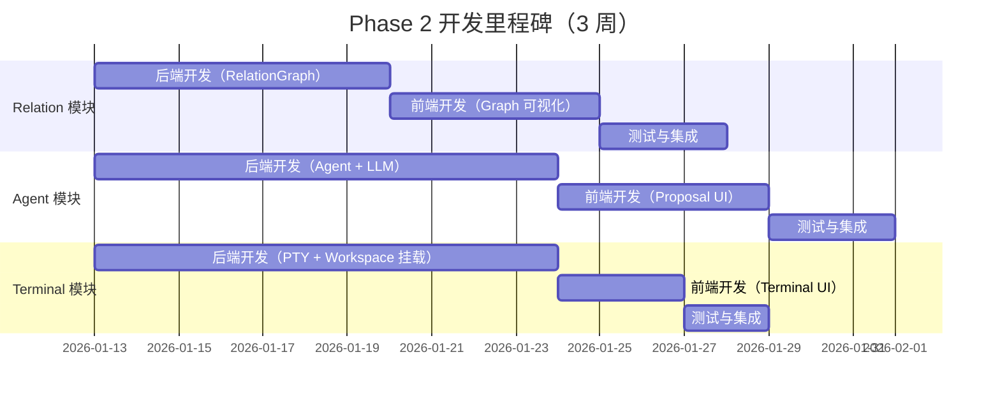

# Phase 2 任务规划与预算

**文档状态**: Draft
**创建日期**: 2026-01-13
**最后更新**: 2026-01-13
**基于文档**: `target-and-story.md`

---

## 一、总体预算概览

### 1.1 预算分配

| 角色类型 | 总预算（人时） | 占比 | 说明 |
| :--- | :--- | :--- | :--- |
| **研发团队** | 172 人时 | 67% | 后端 + 前端 + 测试 |
| **产品团队** | 85 人时 | 33% | 需求 + 设计 + 研究 + Dogfooding |
| **总计** | 257 人时 | 100% | 约 3 周（每周 85-90 人时） |

### 1.2 时间安排

- **总工期**: 3 周
- **团队配置**: 5 人（2 后端 + 1.5 前端 + 0.5 测试 + 1 产品）
- **每周投入**: 85-90 人时
- **风险预留**: 见第五章（包含 Terminal 文件同步的额外风险）

### 1.3 功能范围

**研发功能（8 个）**：
- Terminal 模块：F1 (P0), F2 (P1)
- Agent 模块：F3 (P0), F4 (P0), F5 (P0), F6 (P0)
- Relation 模块：F7 (P0), F8 (P1)

**产品研究（5 个）**：
- R1, R2, R3 (P0)
- R4, R5 (P1)

---

## 二、研发任务规划（172 人时）

**说明**: F2 (Terminal-Block 交互能力) 涉及文件监听和自动同步机制，技术复杂度高于初始预估。Terminal 模块总人时从 18 增加到 28（后端）+ 10（前端），总研发人时从 160 增加到 172。

### 2.1 后端开发（100 人时）

#### 2.1.1 Terminal 模块（28 人时）

| 编号 | 任务名称 | 预估人时 | 对应用户故事 |
| :--- | :--- | :--- | :--- |
| **B-TERM-01** | Terminal PTY 增强 | 8 | F1: Terminal 灵活执行 |
| **B-TERM-02** | 工作目录管理 | 4 | F1: Terminal 灵活执行 |
| **B-TERM-03** | 文件输出捕获 | 3 | F1: Terminal 灵活执行 |
| **B-TERM-04** | Workspace 挂载机制 | 6 | F2: Terminal-Block 交互能力 |
| **B-TERM-05** | 物理文件自动生成 | 4 | F2: Terminal-Block 交互能力 |
| **B-TERM-06** | 文件监听与同步 | 8 | F2: Terminal-Block 交互能力 |
| **B-TERM-07** | Agent 调用方式配置 | 3 | F2: Terminal-Block 交互能力 |

#### 2.1.2 Agent 模块（52 人时）

| 编号 | 任务名称 | 预估人时 | 对应用户故事 |
| :--- | :--- | :--- | :--- |
| **B-AGENT-01** | Agent Block 数据结构 | 4 | F3: Agent Block 创建与配置 |
| **B-AGENT-02** | Agent Editor 自动创建 | 3 | F3: Agent Block 创建与配置 |
| **B-AGENT-03** | Agent 配置验证 | 3 | F3: Agent Block 创建与配置 |
| **B-AGENT-04** | Anthropic API 封装 | 12 | F4: LLM API 集成 |
| **B-AGENT-05** | 结构化输出解析 | 4 | F4: LLM API 集成 |
| **B-AGENT-06** | API 错误处理 | 4 | F4: LLM API 集成 |
| **B-AGENT-07** | Proposal Event 定义 | 4 | F5: Proposal 交互机制 |
| **B-AGENT-08** | Proposal 状态机 | 3 | F5: Proposal 交互机制 |
| **B-AGENT-09** | Command 执行逻辑 | 5 | F5: Proposal 交互机制 |
| **B-AGENT-10** | 上下文收集器 | 6 | F6: Agent 上下文感知与执行 |
| **B-AGENT-11** | Token 截断策略 | 4 | F6: Agent 上下文感知与执行 |

#### 2.1.3 Relation 模块（20 人时）

| 编号 | 任务名称 | 预估人时 | 对应用户故事 |
| :--- | :--- | :--- | :--- |
| **B-REL-01** | RelationGraph 数据结构 | 6 | F7: Relation 数据结构与索引 |
| **B-REL-02** | 双向索引实现 | 4 | F7: Relation 数据结构与索引 |
| **B-REL-03** | 环检测算法 | 5 | F7: Relation 数据结构与索引 |
| **B-REL-04** | Relation API 实现 | 5 | F7: Relation 数据结构与索引 |

**后端开发小计**: 100 人时

---

### 2.2 前端开发（52 人时）

#### 2.2.1 Terminal 模块（10 人时）

| 编号 | 任务名称 | 预估人时 | 对应用户故事 |
| :--- | :--- | :--- | :--- |
| **F-TERM-01** | Terminal UI 增强 | 5 | F1: Terminal 灵活执行 |
| **F-TERM-02** | Workspace 状态展示 | 3 | F2: Terminal-Block 交互能力 |
| **F-TERM-03** | Agent 调用方式配置 UI | 2 | F2: Terminal-Block 交互能力 |

#### 2.2.2 Agent 模块（28 人时）

| 编号 | 任务名称 | 预估人时 | 对应用户故事 |
| :--- | :--- | :--- | :--- |
| **F-AGENT-01** | Agent 配置表单 | 4 | F3: Agent Block 创建与配置 |
| **F-AGENT-02** | Agent 聊天界面 | 6 | F3: Agent Block 创建与配置 |
| **F-AGENT-03** | LLM 调用集成 | 3 | F4: LLM API 集成 |
| **F-AGENT-04** | Proposal Card 组件 | 8 | F5: Proposal 交互机制 |
| **F-AGENT-05** | Diff 预览实现 | 4 | F5: Proposal 交互机制 |
| **F-AGENT-06** | Approval 执行逻辑 | 3 | F5: Proposal 交互机制 |

#### 2.2.3 Relation 模块（14 人时）

| 编号 | 任务名称 | 预估人时 | 对应用户故事 |
| :--- | :--- | :--- | :--- |
| **F-REL-01** | RelationGraph 组件 | 8 | F8: Relation Graph 可视化 |
| **F-REL-02** | DAG 布局实现 | 4 | F8: Relation Graph 可视化 |
| **F-REL-03** | 节点交互逻辑 | 2 | F8: Relation Graph 可视化 |

**前端开发小计**: 52 人时

---

### 2.3 测试与集成（20 人时）

| 编号 | 任务名称 | 预估人时 | 覆盖范围 |
| :--- | :--- | :--- | :--- |
| **T-UNIT-01** | 后端单元测试 | 8 | Terminal + Agent + Relation |
| **T-INT-01** | 集成测试 | 8 | Agent Proposal 流程 + Relation 查询 |
| **T-E2E-01** | E2E 测试 | 4 | Dogfooding 场景完整流程 |

**测试小计**: 20 人时

---

**研发总计**: 172 人时（后端 100 + 前端 52 + 测试 20）

---

## 三、产品任务规划（85 人时）

### 3.1 需求与交互设计（35 人时）

| 编号 | 任务名称 | 预估人时 | 对应研究主题 |
| :--- | :--- | :--- | :--- |
| **P-REQ-01** | Terminal 交互规范 | 5 | - |
| **P-REQ-02** | Agent 交互规范 | 8 | R2: Proposal 交互设计 |
| **P-REQ-03** | Relation 可视化规范 | 5 | R4: Traceability 形式探索 |
| **P-UX-01** | Proposal UI 原型 | 8 | R2: Proposal 交互设计 |
| **P-UX-02** | Agent 对话界面设计 | 5 | - |
| **P-UX-03** | Relation Graph 设计 | 4 | R4: Traceability 形式探索 |

### 3.2 用户研究（25 人时）

| 编号 | 任务名称 | 预估人时 | 对应研究主题 |
| :--- | :--- | :--- | :--- |
| **P-COMP-01** | AI 协作竞品分析 | 10 | R1: AI 协作竞品分析 |
| **P-DOG-01** | Dogfooding 场景 1 | 8 | R3: Dogfooding 效果追踪 |
| **P-DOG-02** | Dogfooding 场景 2 | 7 | R3: Dogfooding 效果追踪 |

### 3.3 知识沉淀（25 人时）

| 编号 | 任务名称 | 预估人时 | 对应研究主题 |
| :--- | :--- | :--- | :--- |
| **P-DOC-01** | 交互规范文档输出 | 6 | - |
| **P-DOC-02** | Dogfooding 效果报告 | 8 | R3: Dogfooding 效果追踪 |
| **P-DOC-03** | 竞品分析报告 | 5 | R1: AI 协作竞品分析 |
| **P-DOC-04** | Agent Prompt 模板 | 6 | R5: Agent System Prompt 模板 |

**产品总计**: 85 人时（需求设计 35 + 用户研究 25 + 知识沉淀 25）

---

## 四、里程碑与依赖

### 4.1 按模块划分的里程碑



### 4.2 里程碑说明

| 里程碑 | 时间节点 | 验收标准 | 优先级 |
| :--- | :--- | :--- | :--- |
| **M1: Relation 后端完成** | Week 1 结束 | ✓ RelationGraph 可查询 <br> ✓ 环检测可用 <br> ✓ 单元测试通过 | P0 |
| **M2: Relation 前端完成** | Week 2 中期 | ✓ React Flow 渲染关系图 <br> ✓ 支持节点交互 | P1 |
| **M3: Agent 后端完成** | Week 1.5 结束 | ✓ Agent 可生成 Proposal <br> ✓ LLM API 调用成功 <br> ✓ 上下文收集可用 | P0 |
| **M4: Agent 前端完成** | Week 2 结束 | ✓ Proposal Card 展示 <br> ✓ Approve/Reject 可用 | P0 |
| **M5: Terminal 后端完成** | Week 1.5 结束 | ✓ Terminal 支持 cd 和命令执行 <br> ✓ Workspace 挂载可用 <br> ✓ 文件监听基础功能 | P0/P1 |
| **M6: Terminal 前端完成** | Week 2 中期 | ✓ Terminal UI 增强 | P0/P1 |
| **M7: E2E 测试通过** | Week 3 结束 | ✓ Dogfooding 场景完整通过 | P0 |

### 4.3 关键依赖关系

| 依赖类型 | 说明 |
| :--- | :--- |
| **Relation → Agent** | Agent 需要 Relation API 读取 Block 关系 |
| **Agent 后端 → Agent 前端** | 前端依赖 Proposal Event 和 Tauri Commands |
| **Terminal → Agent** | F2 的 Agent 调用方式配置依赖 Agent 基础功能 |
| **Agent + Terminal → Dogfooding** | Dogfooding 依赖 Agent + Terminal Workspace 功能 |
| **设计规范 → 研发** | 研发依赖产品输出的交互规范 |

---

## 五、风险预留与缓冲

### 5.1 历史风险回顾

**Phase 1 开发风险**：
- 在涉及 Core 和 Engine 核心模块时，实际耗时是预估的 **2 倍**
- 主要原因：架构设计调整、Event Sourcing 理解成本、CBAC 权限模型复杂度

**Phase 1 产品风险**：
- 实验方向调整导致返工，产品需求变更频繁
- 用户研究结论与初始假设不符，需要重新设计

### 5.2 Phase 2 风险评估

**开发侧风险**：
1. **规范化改善**：Phase 2 已引入开发规范（CLAUDE.md + Extension 指南），预计可减少 30% 返工
2. **新的风险点**：
   - **F2 文件同步机制（高风险）**：涉及文件监听（notify crate）、自动同步覆盖 block、冲突检测，复杂度高，预计耗时可能是预估的 1.5-2 倍
   - LLM API 集成的不确定性（流式输出、错误处理）
   - Proposal 机制的复杂状态管理
   - RelationGraph 性能优化需求
3. **规范修改风险**：严格遵守规范可能导致灵活性不足，需要根据实际情况调整规范本身

**产品侧风险**：
1. **Dogfooding 发现核心假设不成立**：如果 Proposal 首次通过率 < 40%，需要重新设计交互
2. **竞品分析结论影响方向**：可能需要调整 Agent 能力范围
3. **用户研究结论与预期不符**：需要快速迭代 UI 方案

### 5.3 风险预留策略

**总预算**: 257 人时（研发 172 + 产品 85）
**总工期**: 3 周（约 270-285 人时，5 人团队）
**风险预留**: 45-70 人时（约 17-27% 缓冲）

| 风险类型 | 预留时间 | 应对策略 |
| :--- | :--- | :--- |
| **LLM 集成调试** | 10-15 人时 | 优先实现 Mock 测试，延后真实 API 调用 |
| **文件同步机制复杂度** | 12-20 人时 | F2 涉及文件监听、冲突检测，是新的高风险点。优先实现单向同步，双向同步推迟 |
| **规范修改返工** | 10-15 人时 | 每周一次规范评审，快速调整 |
| **产品方向调整** | 8-12 人时 | Week 2 初进行中期评审，及时止损 |
| **性能优化需求** | 5-8 人时 | 优先完成功能，性能优化推迟到 Phase 3 |

**风险应对原则**：
- Week 1 结束：评估 Relation + Terminal 基础功能，决定是否继续 Agent 开发
- Week 2 结束：评估 Agent Proposal 效果，决定是否投入 Week 3 优化
- Week 3：聚焦 P0 功能，P1 功能根据实际进度决定
- **F2 降级策略**：如果文件监听和自动同步超出预期时间，降级为手动触发同步（提供 "Sync to Block" 按钮），自动同步推迟到 Phase 3

---

## 六、产研协作流程

### 6.1 协作时间线

```
┌────────────────────────────────────────────────────────────────────┐
│                      二阶段产研协作流程                              │
├────────────────────────────────────────────────────────────────────┤
│                                                                    │
│  Week 0                                                            │
│  ┌────────────────┐                                                │
│  │ 产品：完成本报告 │────────────────┐                              │
│  └────────────────┘                 │                              │
│                                     v                              │
│  Week 1                    ┌─────────────────────┐                 │
│  ┌────────────────────┐    │ 研发：评审规范可行性  │                 │
│  │ 产品：输出交互规范  │───>│ 研发：开始后端开发    │                 │
│  └────────────────────┘    └─────────────────────┘                 │
│                                     │                              │
│  Week 2                             v                              │
│  ┌────────────────────┐    ┌─────────────────────┐                 │
│  │ 产品：参与 Dogfooding│<──│ 研发：交付最小可用版本│                 │
│  │      记录问题      │    └─────────────────────┘                 │
│  └────────────────────┘                                            │
│           │                                                        │
│  Week 3   v                                                        │
│  ┌────────────────────┐    ┌─────────────────────┐                 │
│  │ 产品：输出 UI 迭代方案│──>│ 研发：迭代优化 UI     │                │
│  └────────────────────┘    └─────────────────────┘                 │
│                                                                    │
└────────────────────────────────────────────────────────────────────┘
```

### 6.2 关键协作机制

| 机制 | 描述 |
| :--- | :--- |
| **契约文档** | 产品输出的「交互规范」是研发的需求输入 |
| **灰度交付** | 研发每完成一个 Story，立即交付给产品体验 |
| **问题清单制** | 产品在 Dogfooding 过程中维护「问题清单」，研发按优先级处理 |

### 6.3 产研协作的输入输出

| 阶段 | 产品输入 | 研发输入 | 产品输出 | 研发输出 |
| :--- | :--- | :--- | :--- | :--- |
| **Week 0** | target-and-story.md | - | 交互规范（Agent/Terminal/Relation） | - |
| **Week 1** | 交互规范 | CLAUDE.md + 技术规范 | - | 后端基础功能（Relation + Terminal） |
| **Week 2** | 最小可用版本 | 产品反馈 | 问题清单（优先级排序） | Agent Proposal 功能 + 前端 UI |
| **Week 3** | 问题清单 | UI 迭代方案 | Dogfooding 报告 + 竞品分析 | P0 功能完成 + Bug 修复 |

### 6.4 协作质量保障

**评审机制**：
- **Week 1 初**：交互规范评审（产品主导，研发参与）
- **Week 2 初**：中期进度评审（研发主导，产品确认优先级）
- **Week 3 末**：Phase 2 验收评审（产品 + 研发联合）

