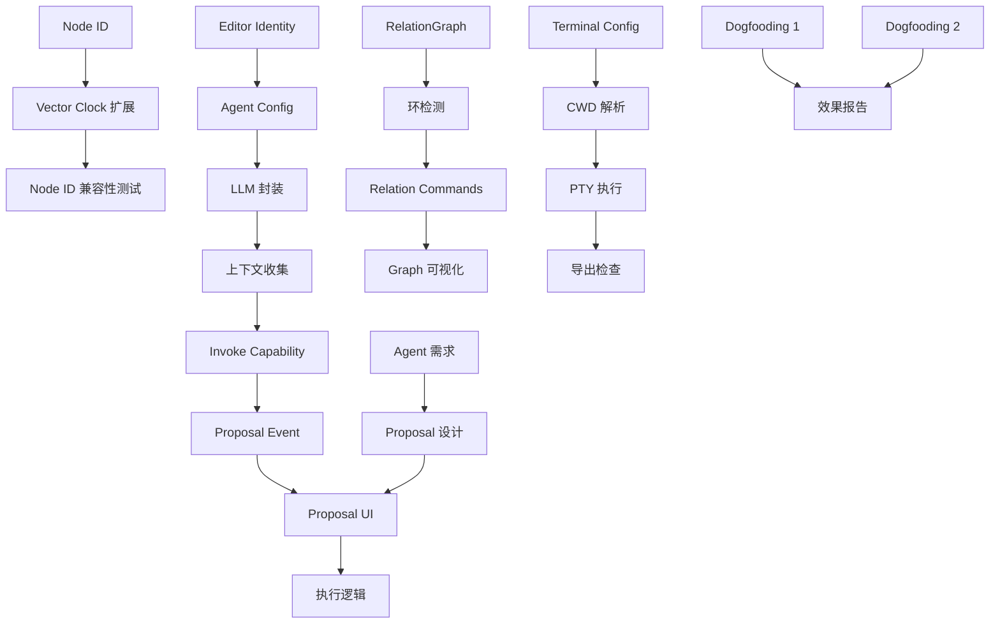

# Phase 2 任务规划与预算

**文档状态**: Draft
**创建日期**: 2026-01-13
**基于文档**: `target-and-story.md`, `function&task.md`, `agent&terminal-design-v2.md`, `collaboration-design.md`

---

## 一、总体预算概览

### 1.1 预算分配

| 角色类型 | 总预算（人时） | 占比 | 说明 |
| :--- | :--- | :--- | :--- |
| **研发团队** | 160 人时 | 64% | 后端 + 前端 + 测试 + 技术文档 |
| **产品团队** | 85 人时 | 36% | 需求 + 设计 + 研究 + Dogfooding |
| **总计** | 245 人时 | 100% | 约 6 人周（按每周 40 人时） |

### 1.2 研发预算拆解

| 类别 | 人时 | 占比 | 说明 |
| :--- | :--- | :--- | :--- |
| **后端开发** | 72 人时 | 45% | 核心功能实现 |
| **前端开发** | 56 人时 | 35% | UI/UX 实现 |
| **测试** | 20 人时 | 12.5% | 单元测试 + 集成测试 + E2E |
| **代码审查与重构** | 8 人时 | 5% | Code Review + 技术债务 |
| **技术文档** | 4 人时 | 2.5% | API 文档 + 架构文档更新 |
| **小计** | **160 人时** | **100%** | |

### 1.3 产品预算拆解

| 类别 | 人时 | 占比 | 说明 |
| :--- | :--- | :--- | :--- |
| **需求分析与拆解** | 16 人时 | 19% | 用户故事细化 + 验收标准 |
| **交互设计** | 20 人时 | 23% | Proposal UI + Terminal 交互 + Agent 对话 |
| **用户研究** | 12 人时 | 14% | Dogfooding 准备 + 用户访谈 |
| **竞品分析补充** | 8 人时 | 9% | AI 协作能力对比 |
| **Dogfooding 执行与跟踪** | 20 人时 | 24% | 实际使用 + 问题收集 |
| **产品文档** | 9 人时 | 11% | 交互规范 + 迭代方案 |
| **小计** | **85 人时** | **100%** | |

---

## 二、研发任务规划（160 人时）

### 2.1 后端开发（72 人时）

#### 2.1.1 Core 基础设施模块（8 人时）

**任务目标**: 建立 Node ID 系统和 Editor Identity 管理，为去中心化协作和 AI Agent 参与做准备。

| 任务编号 | 任务名称 | 预估人时 | 输入 | 输出 | 验收标准 |
| :--- | :--- | :--- | :--- | :--- | :--- |
| **B-CORE-01** | Node ID 生成与持久化 | 3 | - | `utils/node.rs` | ✓ `~/.elfiee/node_id` 生成   ✓ 幂等性测试通过   ✓ 启动时自动初始化 |
| **B-CORE-02** | Editor Identity 扩展 | 3 | `models/editor.rs` | 更新的 Editor 模型 | ✓ 支持 `editor_type` 字段   ✓ 支持 Agent 类型 Editor   ✓ 序列化测试通过 |
| **B-CORE-03** | Config 管理增强 | 2 | Node ID 模块 | 配置读取 API | ✓ 读取 Node ID 的 Tauri Command   ✓ 前端 TS 类型生成 |

#### 2.1.2 Event 模块（14 人时）

**任务目标**: 扩展 Vector Clock 支持多设备，定义 Terminal 和 Agent Proposal Event。

| 任务编号 | 任务名称 | 预估人时 | 输入 | 输出 | 验收标准 |
| :--- | :--- | :--- | :--- | :--- | :--- |
| **B-EVT-01** | Vector Clock Key 格式扩展 | 6 | `models/event.rs` | 更新的 Event 模型 | ✓ Key 格式为 `node_id:editor_id`   ✓ 向后兼容旧格式   ✓ 冲突检测测试通过 |
| **B-EVT-02** | Terminal Event 定义 | 3 | Event 系统 | `terminal.execute`   `terminal.output` | ✓ Event Schema 定义   ✓ StateProjector apply 逻辑   ✓ 序列化测试 |
| **B-EVT-03** | Agent Proposal Event 定义 | 5 | Event 系统 | `ai_agent.propose` | ✓ Proposal 结构定义   ✓ 状态机（Pending/Approved/Rejected）   ✓ 查询 API |

#### 2.1.3 Relation 模块（10 人时）

**任务目标**: 建立 Relation Graph 内存索引，支持因果链追溯和环检测。

| 任务编号 | 任务名称 | 预估人时 | 输入 | 输出 | 验收标准 |
| :--- | :--- | :--- | :--- | :--- | :--- |
| **B-REL-01** | RelationGraph 数据结构 | 4 | `Block.children` | `RelationGraph` 内存索引 | ✓ 双向索引（outgoing/incoming）   ✓ 从 Block.children 派生   ✓ 图遍历性能测试 |
| **B-REL-02** | 环检测算法 | 3 | RelationGraph | 环检测函数 | ✓ DFS/BFS 实现   ✓ add_relation 前检测   ✓ 边界测试（自环、多环） |
| **B-REL-03** | Relation Tauri Commands | 3 | RelationGraph | `get_parents`   `get_children`   `add_relation` | ✓ CBAC 权限检查   ✓ TS 类型绑定生成   ✓ 错误处理完整 |

#### 2.1.4 Terminal 模块（12 人时）

**任务目标**: 实现 Terminal External Mode，支持关联 Directory 在外部路径执行命令。

| 任务编号 | 任务名称 | 预估人时 | 输入 | 输出 | 验收标准 |
| :--- | :--- | :--- | :--- | :--- | :--- |
| **B-TERM-01** | TerminalConfig 结构定义 | 3 | - | `TerminalConfig` 模型   `terminal.create` Capability | ✓ 支持 `linked_directory_id`   ✓ 配置验证逻辑   ✓ Block Type 注册 |
| **B-TERM-02** | CWD 动态解析 | 4 | TerminalConfig   Directory Metadata | `get_terminal_cwd()` | ✓ 关联模式读取 `external_root_path`   ✓ 独立模式 fallback   ✓ 路径解析测试 |
| **B-TERM-03** | PTY 执行与输出捕获 | 5 | CWD 解析逻辑 | `terminal.execute` Command   `terminal.output` Event | ✓ 使用正确 CWD 启动 PTY   ✓ stdout/stderr 捕获   ✓ 生成 output Event |

#### 2.1.5 Agent 模块（20 人时）

**任务目标**: 实现 AI Agent 核心能力，包括 LLM 调用、上下文收集、Proposal 生成。

| 任务编号 | 任务名称 | 预估人时 | 输入 | 输出 | 验收标准 |
| :--- | :--- | :--- | :--- | :--- | :--- |
| **B-AGENT-01** | AgentConfig 数据结构 | 3 | - | `AgentConfig` 模型   `ai_agent.create` Capability | ✓ editor_id 自动生成   ✓ 支持 provider/model/prompt   ✓ 配置验证 |
| **B-AGENT-02** | LLM API 客户端封装 | 8 | - | `llm/anthropic.rs`   `llm/openai.rs` | ✓ Anthropic API 完整集成   ✓ 结构化输出解析   ✓ 错误处理和重试   ✓ Mock 测试覆盖 |
| **B-AGENT-03** | 上下文收集器 | 4 | RelationGraph   Block State | `collect_context()` | ✓ 读取 children Blocks   ✓ 读取关联 Directory 文件列表   ✓ 读取 Terminal 配置   ✓ 上下文截断策略 |
| **B-AGENT-04** | Invoke Capability | 5 | LLM 封装   上下文收集器 | `ai_agent.invoke` Capability | ✓ 调用 LLM 生成 Proposal   ✓ 解析 LLM 返回的命令   ✓ 生成 `ai_agent.propose` Event   ✓ 集成测试 |

#### 2.1.6 Directory 模块（4 人时）

**任务目标**: 增强 Directory Export，支持 Dirty Blocks 检测。

| 任务编号 | 任务名称 | 预估人时 | 输入 | 输出 | 验收标准 |
| :--- | :--- | :--- | :--- | :--- | :--- |
| **B-DIR-01** | Export 性能优化 | 2 | `directory.export` | 增量导出逻辑 | ✓ 仅导出变更 Blocks   ✓ `last_export_time` 元数据 |
| **B-DIR-02** | Dirty Blocks 检测 | 2 | Block Metadata | `get_dirty_blocks()` API | ✓ 对比 `updated_at` 和 `last_export_time`   ✓ Tauri Command 暴露 |

#### 2.1.7 CBAC 权限适配（4 人时）

**任务目标**: 确保 Agent 和 Node ID 扩展不破坏现有权限系统。

| 任务编号 | 任务名称 | 预估人时 | 输入 | 输出 | 验收标准 |
| :--- | :--- | :--- | :--- | :--- | :--- |
| **B-CBAC-01** | Agent 权限测试 | 2 | CBAC 系统 | 测试用例 | ✓ Agent 作为 Editor 的权限检查   ✓ Owner 规则不受影响   ✓ Grant 规则正常工作 |
| **B-CBAC-02** | Node ID 兼容性测试 | 2 | Vector Clock 扩展 | 测试用例 | ✓ `node_id:editor_id` 解析正确   ✓ 权限检查只看 editor_id 部分   ✓ 回归测试通过 |

---

### 2.2 前端开发（56 人时）

#### 2.2.1 Agent 交互界面（20 人时）

**任务目标**: 实现 Agent 对话界面和 Proposal 审批流程。

| 任务编号 | 任务名称 | 预估人时 | 输入 | 输出 | 验收标准 |
| :--- | :--- | :--- | :--- | :--- | :--- |
| **F-AGENT-01** | AgentChatPanel 组件 | 6 | 设计稿 | 聊天界面组件 | ✓ 消息列表渲染（User/Agent）   ✓ 输入框和发送按钮   ✓ Loading 状态   ✓ 滚动到底部 |
| **F-AGENT-02** | ProposalCard 组件 | 8 | Proposal Event Schema   设计稿 | Proposal 预览组件 | ✓ Reasoning 展示   ✓ Diff 预览（Monaco）   ✓ Approve/Reject 按钮   ✓ 展开/折叠 |
| **F-AGENT-03** | Proposal 执行逻辑 | 4 | Tauri Commands | 批准后执行流程 | ✓ 解析 `proposed_commands`   ✓ 依次调用 Commands   ✓ 传递 Agent editor_id   ✓ 错误处理和回滚 |
| **F-AGENT-04** | AgentConfigForm 组件 | 2 | Agent 配置 Schema | Agent 配置编辑器 | ✓ Provider/Model 选择   ✓ System Prompt 编辑   ✓ API Key 配置提示 |

#### 2.2.2 Terminal 界面增强（12 人时）

**任务目标**: 支持 Terminal External Mode 和导出检查交互。

| 任务编号 | 任务名称 | 预估人时 | 输入 | 输出 | 验收标准 |
| :--- | :--- | :--- | :--- | :--- | :--- |
| **F-TERM-01** | ExportPromptDialog 组件 | 4 | 设计稿 | 导出提示对话框 | ✓ 三选项（Export & Run / Run / Cancel）   ✓ "记住选择"复选框   ✓ sessionStorage 集成 |
| **F-TERM-02** | Terminal 执行前检查 | 3 | Tauri Commands | 导出检查逻辑 | ✓ 检测 `linked_directory_id`   ✓ 读取用户偏好   ✓ 调用 `directory.export` |
| **F-TERM-03** | Terminal UI 模式指示 | 3 | Terminal Config | 模式展示 UI | ✓ Internal/External 标识   ✓ 关联 Directory 名称   ✓ CWD 显示 |
| **F-TERM-04** | Terminal 配置面板 | 2 | Terminal Config Schema | 配置界面 | ✓ 关联 Directory 选择   ✓ Shell/Env 配置 |

#### 2.2.3 Relation 可视化（10 人时）

**任务目标**: 实现 Relation Graph 可视化，支持因果链追溯。

| 任务编号 | 任务名称 | 预估人时 | 输入 | 输出 | 验收标准 |
| :--- | :--- | :--- | :--- | :--- | :--- |
| **F-REL-01** | RelationGraphView 组件 | 6 | React Flow   Relation API | 关系图组件 | ✓ 节点渲染（Block 类型）   ✓ 边渲染（Relation 类型）   ✓ DAG 层级布局 |
| **F-REL-02** | 节点交互逻辑 | 2 | RelationGraphView | 交互功能 | ✓ 点击跳转到 Block   ✓ Hover 显示详情 |
| **F-REL-03** | Graph 面板集成 | 2 | RelationGraphView | Editor 集成 | ✓ Tab 切换到 Graph 视图   ✓ 高亮当前 Block |

#### 2.2.4 状态管理与通用功能（14 人时）

**任务目标**: Zustand Store 扩展，支持多文件、Agent、Dirty Blocks 管理。

| 任务编号 | 任务名称 | 预估人时 | 输入 | 输出 | 验收标准 |
| :--- | :--- | :--- | :--- | :--- | :--- |
| **F-STATE-01** | Agent Store 模块 | 3 | Zustand | Agent 状态管理 | ✓ Agent 列表   ✓ 当前对话状态   ✓ Proposal 列表 |
| **F-STATE-02** | Terminal Store 模块 | 3 | Zustand | Terminal 状态管理 | ✓ Terminal 实例管理   ✓ 输出缓冲   ✓ 导出偏好缓存 |
| **F-STATE-03** | Relation Store 模块 | 2 | Zustand | Relation 状态管理 | ✓ Graph 数据缓存   ✓ 选中节点状态 |
| **F-STATE-04** | Dirty Blocks 追踪 | 2 | Directory Store | Dirty 状态管理 | ✓ `markBlockDirty` action   ✓ `clearDirtyBlocks` action |
| **F-STATE-05** | 多文件状态隔离 | 4 | 现有 Store | 文件级状态作用域 | ✓ 文件切换状态不混乱   ✓ 内存清理 |

---

### 2.3 测试（20 人时）

#### 2.3.1 单元测试（8 人时）

| 任务编号 | 任务名称 | 预估人时 | 测试对象 | 验收标准 |
| :--- | :--- | :--- | :--- | :--- |
| **T-UNIT-01** | Core 模块单元测试 | 2 | Node ID   Editor Identity | ✓ 覆盖率 > 90%   ✓ 边界条件测试 |
| **T-UNIT-02** | Event 模块单元测试 | 2 | Vector Clock   Proposal Event | ✓ 覆盖率 > 90%   ✓ 序列化/反序列化 |
| **T-UNIT-03** | Relation 模块单元测试 | 2 | RelationGraph   环检测 | ✓ 覆盖率 > 90%   ✓ 图算法正确性 |
| **T-UNIT-04** | LLM 封装单元测试 | 2 | Anthropic Client   Mock 测试 | ✓ 覆盖率 > 85%   ✓ 错误场景测试 |

#### 2.3.2 集成测试（8 人时）

| 任务编号 | 任务名称 | 预估人时 | 测试场景 | 验收标准 |
| :--- | :--- | :--- | :--- | :--- |
| **T-INT-01** | Terminal External Mode 集成测试 | 3 | Directory 关联   CWD 解析   命令执行 | ✓ 完整流程通过   ✓ Event 正确生成 |
| **T-INT-02** | Agent Proposal 集成测试 | 3 | 上下文收集   LLM 调用   Proposal 生成 | ✓ Mock LLM 测试   ✓ 完整流程通过 |
| **T-INT-03** | Relation 集成测试 | 2 | 添加关系   查询父子节点   环检测 | ✓ 与 Block 操作集成   ✓ CBAC 权限检查 |

#### 2.3.3 E2E 测试（4 人时）

| 任务编号 | 任务名称 | 预估人时 | 测试场景 | 验收标准 |
| :--- | :--- | :--- | :--- | :--- |
| **T-E2E-01** | Dogfooding 场景 E2E | 4 | 完整用户故事   (创建 Agent → Proposal → Terminal 测试) | ✓ Playwright 脚本   ✓ 端到端流程通过 |

---

### 2.4 代码审查与重构（8 人时）

| 任务编号 | 任务名称 | 预估人时 | 活动 | 验收标准 |
| :--- | :--- | :--- | :--- | :--- |
| **R-REV-01** | 后端代码审查 | 4 | 审查所有后端 PR | ✓ 所有 PR 经过审查   ✓ 问题记录和修复 |
| **R-REV-02** | 前端代码审查 | 3 | 审查所有前端 PR | ✓ 所有 PR 经过审查   ✓ 问题记录和修复 |
| **R-REV-03** | 技术债务清理 | 1 | 重构临时代码   优化性能热点 | ✓ 债务清单完成 |

---

### 2.5 技术文档（4 人时）

| 任务编号 | 任务名称 | 预估人时 | 输出 | 验收标准 |
| :--- | :--- | :--- | :--- | :--- |
| **D-TECH-01** | Architecture 文档更新 | 2 | 更新 `ARCHITECTURE_OVERVIEW.md` | ✓ 增加 Node ID 说明   ✓ 增加 Relation Graph 说明   ✓ 增加 Agent 架构 |
| **D-TECH-02** | Extension 开发指南 | 1 | `AGENT_EXTENSION_GUIDE.md` | ✓ Agent 开发步骤   ✓ LLM 接入指南 |
| **D-TECH-03** | Tauri Commands API 文档 | 1 | API 文档更新 | ✓ 所有新 Commands 有文档   ✓ 示例代码 |

---

## 三、产品任务规划（85 人时）

### 3.1 需求分析与拆解（16 人时）

**任务目标**: 将用户故事细化为可执行的需求文档，定义验收标准。

| 任务编号 | 任务名称 | 预估人时 | 输入 | 输出 | 验收标准 |
| :--- | :--- | :--- | :--- | :--- | :--- |
| **P-REQ-01** | Agent 功能需求细化 | 4 | `target-and-story.md` | Agent 需求文档 | ✓ 用户故事细化（3-5 个）   ✓ 验收标准清单   ✓ 边界场景定义 |
| **P-REQ-02** | Terminal 功能需求细化 | 3 | `target-and-story.md` | Terminal 需求文档 | ✓ Internal/External 模式定义   ✓ 导出策略需求   ✓ 用户偏好管理需求 |
| **P-REQ-03** | Relation 功能需求细化 | 3 | `target-and-story.md` | Relation 需求文档 | ✓ Relation 类型定义   ✓ 可视化需求   ✓ 交互需求 |
| **P-REQ-04** | Dogfooding 需求定义 | 3 | `target-and-story.md` | Dogfooding 计划 | ✓ 实验设计   ✓ 数据收集方案   ✓ 成功标准 |
| **P-REQ-05** | 需求评审与确认 | 3 | 所有需求文档 | 评审记录 | ✓ 研发团队评审   ✓ 需求冲突解决   ✓ 优先级排序 |

---

### 3.2 交互设计（20 人时）

**任务目标**: 设计核心交互流程和界面原型，输出设计规范。

| 任务编号 | 任务名称 | 预估人时 | 输入 | 输出 | 验收标准 |
| :--- | :--- | :--- | :--- | :--- | :--- |
| **P-UX-01** | Proposal 交互流程设计 | 6 | Agent 需求 | 交互流程图   Figma 原型 | ✓ Reasoning 展示方案   ✓ Diff 预览方案   ✓ Approve/Reject 交互   ✓ 边界场景处理 |
| **P-UX-02** | Terminal 导出提示设计 | 3 | Terminal 需求 | 对话框原型   交互规范 | ✓ 三选项设计   ✓ "记住选择"交互   ✓ 错误提示设计 |
| **P-UX-03** | Agent 对话界面设计 | 4 | Agent 需求 | 聊天界面原型 | ✓ 消息布局   ✓ Loading 状态   ✓ 错误状态 |
| **P-UX-04** | Relation Graph 可视化设计 | 4 | Relation 需求 | Graph 交互原型 | ✓ 节点/边样式   ✓ 布局方案   ✓ 交互反馈 |
| **P-UX-05** | 设计评审与迭代 | 3 | 所有设计稿 | 最终设计方案 | ✓ 研发评审   ✓ 可实现性确认   ✓ 设计规范输出 |

---

### 3.3 用户研究（12 人时）

**任务目标**: 准备 Dogfooding 环境，进行用户访谈，收集反馈。

| 任务编号 | 任务名称 | 预估人时 | 输入 | 输出 | 验收标准 |
| :--- | :--- | :--- | :--- | :--- | :--- |
| **P-USR-01** | Dogfooding 环境准备 | 3 | 开发环境 | Dogfooding 环境 | ✓ 测试数据准备   ✓ 团队成员培训   ✓ 使用手册 |
| **P-USR-02** | 用户访谈计划 | 2 | Dogfooding 计划 | 访谈提纲 | ✓ 访谈对象（3-5 人）   ✓ 访谈问题设计   ✓ 数据收集表 |
| **P-USR-03** | 用户访谈执行 | 4 | 访谈提纲 | 访谈记录 | ✓ 完成 3-5 次访谈   ✓ 录音/笔记   ✓ 初步洞察 |
| **P-USR-04** | 用户反馈整理 | 3 | 访谈记录 | 反馈报告 | ✓ 问题清单（20+ 条）   ✓ 优先级排序   ✓ 改进建议 |

---

### 3.4 竞品分析补充（8 人时）

**任务目标**: 补充 AI 协作场景下的竞品对比，明确 Elfiee 差异化。

| 任务编号 | 任务名称 | 预估人时 | 输入 | 输出 | 验收标准 |
| :--- | :--- | :--- | :--- | :--- | :--- |
| **P-COMP-01** | 规则驱动型竞品分析 | 2 | Cursor Rules   Claude Skills | 能力对比表 | ✓ 规则存储方式   ✓ 校准机制   ✓ 优劣势分析 |
| **P-COMP-02** | 意图-执行连接型竞品分析 | 2 | Linear   CodeStream | 能力对比表 | ✓ 决策记录方式   ✓ 追溯能力   ✓ 优劣势分析 |
| **P-COMP-03** | 结果打分型竞品分析 | 2 | LangSmith   Evals | 能力对比表 | ✓ 评估方式   ✓ 适用场景   ✓ 优劣势分析 |
| **P-COMP-04** | 竞品分析报告 | 2 | 所有对比表 | 竞品分析文档 | ✓ Elfiee 差异化总结   ✓ 竞争策略建议 |

---

### 3.5 Dogfooding 执行与跟踪（20 人时）

**任务目标**: 使用 Elfiee 开发 Elfiee，验证完整闭环，收集问题。

| 任务编号 | 任务名称 | 预估人时 | 输入 | 输出 | 验收标准 |
| :--- | :--- | :--- | :--- | :--- | :--- |
| **P-DOG-01** | Dogfooding 场景 1: PDF 导出功能 | 8 | 开发环境 | 完整记录   Event 链条 | ✓ 需求 → Proposal → 代码 → 测试   ✓ Event 记录完整   ✓ Relation 可追溯 |
| **P-DOG-02** | Dogfooding 场景 2: 新 Extension 开发 | 6 | 开发环境 | 完整记录   Event 链条 | ✓ 使用 Agent 辅助开发   ✓ Terminal 运行测试   ✓ 问题收集 |
| **P-DOG-03** | 问题实时记录与分类 | 4 | Dogfooding 过程 | 问题清单 | ✓ 每日问题记录   ✓ 分类（Bug/改进/新需求）   ✓ 严重程度标记 |
| **P-DOG-04** | Dogfooding 效果报告 | 2 | 问题清单   Event 数据 | Dogfooding 报告 | ✓ 效率对比（vs Phase 1）   ✓ Proposal 通过率   ✓ 改进方向 |

---

### 3.6 产品文档（9 人时）

**任务目标**: 输出产品规范文档，指导后续开发和迭代。

| 任务编号 | 任务名称 | 预估人时 | 输入 | 输出 | 验收标准 |
| :--- | :--- | :--- | :--- | :--- | :--- |
| **P-DOC-01** | Agent 交互规范 | 3 | 需求 + 设计 | Agent 交互规范文档 | ✓ 触发方式   ✓ 输入/输出 Schema   ✓ 审批流程 |
| **P-DOC-02** | Terminal 交互规范 | 2 | 需求 + 设计 | Terminal 交互规范文档 | ✓ 模式切换   ✓ 导出策略   ✓ 配置管理 |
| **P-DOC-03** | Relation 可视化规范 | 2 | 需求 + 设计 | Relation 规范文档 | ✓ Relation 类型   ✓ 可视化样式   ✓ 交互行为 |
| **P-DOC-04** | Phase 3 迭代方案 | 2 | Dogfooding 报告 | Phase 3 规划草案 | ✓ 优先改进清单   ✓ 新功能方向   ✓ 资源预估 |

---

## 四、里程碑与时间线

### 4.1 Sprint 划分（按 2 周一个 Sprint）

| Sprint | 时间 | 研发重点 | 产品重点 | 里程碑 |
| :--- | :--- | :--- | :--- | :--- |
| **Sprint 1**   (Week 1-2) | 80 人时 | Core + Event + Relation   基础设施完成 | 需求细化   交互设计 | ✓ Node ID 系统上线   ✓ Relation Graph 可查询   ✓ Proposal UI 原型完成 |
| **Sprint 2**   (Week 3-4) | 80 人时 | Terminal + Agent   核心功能完成 | 竞品分析   Dogfooding 准备 | ✓ Terminal External Mode 可用   ✓ Agent 生成 Proposal   ✓ Proposal 可审批执行 |
| **Sprint 3**   (Week 5-6) | 85 人时 | 前端集成 + 测试   系统联调 | Dogfooding 执行   用户访谈 | ✓ E2E 测试通过   ✓ Dogfooding 完成 1 个场景   ✓ 问题清单输出 |

### 4.2 关键里程碑

| 里程碑 | 时间节点 | 验收标准 |
| :--- | :--- | :--- |
| **M1: 基础设施就绪** | Week 2 结束 | ✓ Node ID + Vector Clock 扩展完成   ✓ RelationGraph 可用   ✓ 集成测试通过 |
| **M2: 核心功能可用** | Week 4 结束 | ✓ Terminal External Mode 可用   ✓ Agent 可生成和执行 Proposal   ✓ Relation 可视化上线 |
| **M3: Phase 2 完成** | Week 6 结束 | ✓ Dogfooding 完成 1-2 个真实场景   ✓ Proposal 首次通过率 > 60%   ✓ 问题清单 > 20 条   ✓ 竞品分析报告完成 |

---

## 五、风险预留与缓冲

### 5.1 风险识别

| 风险类型 | 风险描述 | 概率 | 影响 | 缓解措施 |
| :--- | :--- | :--- | :--- | :--- |
| **技术风险** | LLM API 调用不稳定，影响 Agent 功能 | 中 | 高 | ✓ 预留 Mock 测试   ✓ 设计降级方案   ✓ 预留 4 人时调试 |
| **集成风险** | Tauri 前后端类型不一致，导致返工 | 中 | 中 | ✓ 优先完成 Tauri Specta 配置   ✓ 预留 3 人时修复 |
| **产品风险** | Dogfooding 发现核心假设不成立 | 低 | 高 | ✓ 提前设计备选方案   ✓ 预留 6 人时快速调整 |
| **人力风险** | 团队成员请假或离职 | 低 | 中 | ✓ 关键任务双人备份   ✓ 预留 5 人时交接 |

### 5.2 预留时间

| 类型 | 预留人时 | 占比 | 用途 |
| :--- | :--- | :--- | :--- |
| **技术风险缓冲** | 4 人时 | 1.6% | LLM 集成调试 |
| **集成风险缓冲** | 3 人时 | 1.2% | 类型不一致修复 |
| **产品风险缓冲** | 6 人时 | 2.4% | 方案调整 |
| **人力风险缓冲** | 5 人时 | 2% | 交接和返工 |
| **总预留** | 18 人时 | 7.3% | 总预算 263 人时 |

**实际总预算**: 245 人时（研发 160 + 产品 85） + 18 人时预留 = **263 人时**

---

## 六、资源配置建议

### 6.1 团队配置

| 角色 | 人数 | 主要职责 | 关键技能 |
| :--- | :--- | :--- | :--- |
| **后端开发** | 2 人 | Core + Event + Agent + Terminal | Rust + Tauri + Event Sourcing |
| **前端开发** | 1.5 人 | UI 组件 + 状态管理 + 集成 | React + TypeScript + Zustand |
| **全栈开发** | 0.5 人 | 测试 + 代码审查 | Rust + React + Playwright |
| **产品经理** | 1 人 | 需求 + 设计 + Dogfooding | 交互设计 + 用户研究 |
| **总计** | **5 人** | | |

### 6.2 时间安排

- **总工期**: 6 周（3 个 Sprint）
- **每周投入**: 约 40-45 人时
- **总投入**: 245-263 人时

---

## 七、验收标准

### 7.1 研发验收

| 类别 | 验收标准 |
| :--- | :--- |
| **功能完整性** | ✓ F1-F10 功能全部完成（见 `target-and-story.md`）   ✓ 所有 Tauri Commands 有 TS 类型绑定 |
| **代码质量** | ✓ 单元测试覆盖率 > 85%   ✓ 集成测试覆盖核心流程   ✓ E2E 测试至少 1 个完整场景   ✓ 所有 PR 经过代码审查 |
| **文档完整性** | ✓ Architecture 文档更新   ✓ API 文档完整   ✓ Extension 开发指南 |
| **性能要求** | ✓ Relation Graph 查询 < 100ms（1000 节点）   ✓ Terminal 命令响应 < 500ms   ✓ Agent Proposal 生成 < 30s |

### 7.2 产品验收

| 类别 | 验收标准 |
| :--- | :--- |
| **需求完整性** | ✓ 所有用户故事有验收标准   ✓ 边界场景有定义 |
| **设计完整性** | ✓ 核心交互有 Figma 原型   ✓ 设计规范输出 |
| **Dogfooding** | ✓ 完成 1-2 个真实开发场景   ✓ Proposal 首次通过率 > 60%   ✓ 问题清单 > 20 条 |
| **竞品分析** | ✓ 补充 AI 协作能力对比   ✓ Elfiee 差异化清晰 |

---

## 八、附录

### 8.1 任务依赖关系

### 8.2 任务编号说明

- **B-**: Backend（后端任务）
- **F-**: Frontend（前端任务）
- **T-**: Test（测试任务）
- **R-**: Review（审查任务）
- **D-**: Documentation（文档任务）
- **P-**: Product（产品任务）

---

**文档维护者**: 产品 + 研发团队
**最后更新**: 2026-01-13
**下一步**: Sprint 1 启动会议，分配具体任务负责人
