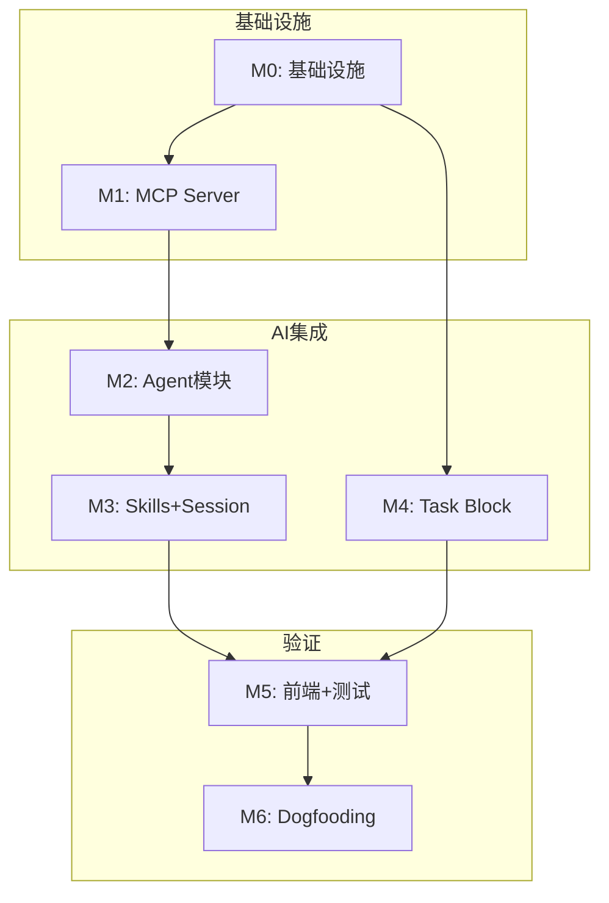

# Phase 2 任务规划与预算（v3）

## 一、总体预算概览

### 1.1 预算分配

| 模块 | 人时 | 说明 |
| :--- | :--- | :--- |
| **基础设施** | 24 | Block 快照 (7) + Relation (12) + .elf/ (5) |
| **AI 集成** | 63 | Agent (15) + MCP (14) + Skills (5) + Session (14) + Task (15) |
| **前端开发** | 16 | Task UI (6) + Agent UI (6) + 基础 UI (4) |
| **测试** | 12 | 核心路径测试 |
| **产品研究** | 55 | Dogfooding (25) + 指标 (15) + 归因 (15) |
| **缓冲预留** | 20 | 风险应对 (~10%) |
| **总计** | **190** | **约 2.5-3 周** |

### 1.2 功能范围对照

**基础设施模块**：
- Block 快照：I1 (write 时同步物理文件)
- Relation 增强：I2 (implement 关系 + DAG 环检测 + 反向索引)
- .elf/ 初始化：I10 (系统目录自动创建)

**AI 集成模块**：
- Agent 模块：F1, F3 (Agent Block + create/enable/disable + MCP 配置合并)
- MCP Server：F4, F5 (协议实现 + 独立 Engine)
- Skills 模块：F7 (elfiee-client 模板)
- Session 同步：F10-F13 (JSONL 监听 + 解析 + 写入)
- Task Block：F16 (write/read/commit/archive)

**产品研究**：
- R1 Dogfooding 实验设计
- R2 评价指标定义
- R3 归因分析方法

---

## 二、基础设施模块（24 人时）

> **重要架构变更**：所有内容均 Block 化。Directory Block 存储索引（entries），Content Block 存储实际内容（`block-{uuid}/body.*`）。索引与内容通过 Relation 关联，权限独立管理。

### 2.1 Block 快照功能（7 人时）

**设计决策**：
- **Event 继续存储完整内容**：保持 AI 可查看完整历史的能力（Event Sourcing 核心价值）
- **物理文件作为快照**：用于 symlink（如 SKILLS.md → ~/.claude/skills/）和迁移
- **Dir Block 也有快照**：`block-{uuid}/body.json` 存储 entries 索引的完整快照
- **已实现**：`block-{uuid}/` 目录自动创建（`inject_block_dir` in actor.rs）
- **已实现**：Dir Block entries 只存索引（`directory_import.rs`）

**文件结构**: `src-tauri/src/extensions/`

| 编号 | 任务名称 | 文件位置 | 详细内容 | 预估人时 | 对应模块 |
| :--- | :--- | :--- | :--- | :--- | :--- |
| **I1-01** | markdown.write 快照 | `extensions/markdown/markdown_write.rs` | write 时同步写入 `block-{uuid}/body.md` 物理文件（Event 保持完整内容不变） | 2 | I1 |
| **I1-02** | code.write 快照 | `extensions/code/code_write.rs` | write 时同步写入 `block-{uuid}/body.{ext}` 物理文件 | 2 | I1 |
| **I1-03** | directory.import 快照 | `extensions/directory/directory_import.rs` | import 时为每个 Content Block 同步写入 `block-{uuid}/body.*` 物理文件，并为 Dir Block 写入 `block-{uuid}/body.json`（存储 entries 索引快照） | 2 | I1 |
| **I1-04** | Dir Block 快照同步 | `extensions/directory/directory_import.rs` | 每次 Dir Block 的 entries 变化时（添加/删除文件），同步更新 `block-{uuid}/body.json` 快照 | 1 | I1 |

**已实现，无需改动**：
- I2-01 Dir Block entries 结构 ✅
- I3-01 Block 目录自动创建 ✅（`inject_block_dir`）
- I3-02 Block 目录删除 ❌ 不需要（Event 记录删除即可，物理文件保留供历史查看）

### 2.3 基础设施：Relation 系统增强（12 人时）

**设计变更**：构建纯粹的"逻辑因果图" (Logical Causal Graph)。
- **单一关系**：仅使用 `implement`，表示"上游定义/决定下游" (如 Task -> Code, Test -> Code)。
- **排除干扰**：Directory 的物理包含关系（存 `entries` JSON）、代码的引用关系（AST 分析）均**不进入** Relation Graph。
- **严格 DAG**：坚决拒绝环。工程逻辑流应当是单向的（PRD -> Test -> Code），不允许反向依赖。

| 编号 | 任务名称 | 文件位置 | 详细内容 | 预估人时 | 对应模块 |
| :--- | :--- | :--- | :--- | :--- | :--- |
| **I2-01** | Relation 逻辑收敛 | `models/block.rs` | 确认 `Block.children` 仅用于存储逻辑因果关系。代码层面定义常量 `RELATION_IMPLEMENT = "implement"`。 | 2 | I6 |
| **I2-02** | Dir Block 纯化 | `extensions/directory/directory_import.rs` | 确认 `directory.import` **仅**更新 `contents.entries` (JSON) 索引，**不**向 `Block.children` 添加关系。确保物理结构不污染逻辑图。 | 2 | I9 |
| **I2-03** | 严格 DAG 环检测 | `capabilities/builtins/link.rs` | 在 `core.link` 操作时，对 `implement` 关系执行严格环检测 (DFS)。如果发现 A->B->...->A 的环，**拒绝操作**并报错，强迫保持单向流。 | 6 | I7 |
| **I2-04** | 反向索引构建 | `engine/state.rs` | 在 `StateProjector` 中构建内存反向索引 `parents: HashMap<String, Vec<String>>`，加速查询"谁定义了我"。 | 2 | I8 |

### 2.4 .elf/ 元数据管理（5 人时）

**核心定位**：`.elf/` 是 Elfiee 的**系统级配置**，通过软连接注入到外部项目的 `.claude/skills/` 目录中。

**目录结构**：
```
.elf/                            # 唯一的 Dir Block（所有人可读写）
└── Agents/
    ├── elfiee-client/           # 系统级 Skill：教 Claude 如何使用 Elfiee
    │   ├── SKILL.md             # Skill 定义（YAML Frontmatter，通过软连接生效）
    │   ├── mcp.json             # MCP 配置模板（agent.enable 时合并到 .claude/mcp.json）
    │   ├── scripts/             # 空目录（预留）
    │   ├── assets/              # 空目录（预留）
    │   └── references/          # 参考文档
    │       └── capabilities.md  # Elfiee Capabilities 文档
    └── session/                 # 统一 Session 存储（按项目组织）
        └── {project-name}/      # 从 ~/.claude/projects/ 同步的 session
            └── session_*.jsonl
```

**设计要点**：
- **唯一系统级 Agent**：`.elf/Agents/` 只有 `elfiee-client/`，后续可导入外部 skill 成为通用 Agent
- **软连接注入**：通过 agent.enable 将 `elfiee-client/` 软连接到外部项目 `.claude/skills/elfiee-client/`
- **MCP 配置独立注入**：`mcp.json` 是模板，agent.enable 时合并写入到外部项目 `.claude/mcp.json`（Claude 只从此路径读取 MCP 配置）
- **Session 统一存储**：所有项目的活跃 session 同步到 `.elf/Agents/session/{project-name}/`，无法通过软连接管理
- **快照格式**：`block-{uuid}/body.json` 存储 entries 结构，供软连接使用

**文件结构**: `src-tauri/src/extensions/directory/`

| 编号 | 任务名称 | 文件位置 | 详细内容 | 预估人时 | 对应模块 |
| :--- | :--- | :--- | :--- | :--- | :--- |
| **I10-01** | .elf/ Dir Block 初始化 | `extensions/directory/elf_meta.rs` (新建) | 创建 .elf 文件时自动生成 `.elf/` Dir Block，entries 包含：`Agents/elfiee-client/`（含 `SKILL.md`、`mcp.json`、空的 `scripts/`, `assets/` 目录、`references/capabilities.md`）及 `Agents/session/` 空目录。生成快照，授予所有人 `directory.write` 权限。 | 5 | I10 |

**已实现，无需改动**：
- directory.export ✅（checkout.rs）
- 部分导出 ✅（source_path 参数）
- 动态路径注入 ✅（inject_block_dir）

**不需要做**：
- 项目级 SKILLS 生成（移到 3.1 F3-02，由 Agent 创建时触发）
- 前端 .elf/ 过滤（前端正常显示，不需要特殊处理）
- 增量导入支持（后续同步机制）

---

## 三、AI 集成模块（61 人时）

### 3.1 Agent 模块（15 人时）

**核心设计**：
- **Agent 是 Block 类型**：`block_type: "agent"`，记录项目级 AI 集成配置
- **内置共用工具**：`.elf/Agents/elfiee-client/` 是静态资源目录，所有 Agent Block 共享
- **自动软连接**：创建 Agent Block 时，自动将 `elfiee-client/` 软连接到目标项目 `.claude/skills/`
- **MCP 配置注入**：创建时合并 MCP 配置到目标项目 `.claude/mcp.json`
- **前提条件**：目标项目必须已有 `.claude/` 目录（已初始化 Claude）

**数据结构**：
```rust
// block_type: "agent"
pub struct AgentContents {
    pub name: String,              // Agent 名称（默认 "elfiee"）
    pub target_project_id: String, // 关联的外部项目 Dir Block ID
    pub status: AgentStatus,       // enabled | disabled
}

pub enum AgentStatus {
    Enabled,   // 已启用（软连接存在，MCP 配置已注入）
    Disabled,  // 已禁用（软连接已清理）
}
```

**内置工具目录结构**：
```
.elf/Agents/elfiee-client/       # 静态资源，所有 Agent 共享
├── SKILL.md                     # Claude Skills 定义
├── mcp.json                     # MCP 配置模板
└── references/
    └── capabilities.md          # Elfiee Capabilities 文档
```

**工作流**：
1. `agent.create(target_project_id)` → 创建 Agent Block + 自动执行 enable
2. `agent.disable(agent_block_id)` → 清理软连接 + 移除 MCP 配置 + 状态改为 Disabled
3. `agent.enable(agent_block_id)` → 重新创建软连接 + 注入 MCP 配置 + 状态改为 Enabled

**幂等性设计**：
- **enable 已启用的 Agent** → 更新配置（重新创建软连接和 MCP 配置）
- **disable 已禁用的 Agent** → 静默成功

**文件结构**: `src-tauri/src/extensions/agent/`

| 编号 | 任务名称 | 文件位置 | 详细内容 | 预估人时 | 对应模块 |
| :--- | :--- | :--- | :--- | :--- | :--- |
| **F1-01** | Agent 数据结构 | `extensions/agent/mod.rs` | 定义 `AgentContents`（name, target_project_id, status）、`AgentStatus` 枚举、各 Capability 的 Payload 类型 | 2 | F1 |
| **F1-02** | agent.create Capability | `extensions/agent/agent_create.rs` (新建) | 实现 `agent.create(target_project_id)`：①检查目标项目 `.claude/` 存在 ②创建 Agent Block ③自动调用 enable 逻辑（软连接 + MCP 配置）④返回提示重启 Claude | 4 | F1 |
| **F3-01** | agent.enable Capability | `extensions/agent/agent_enable.rs` (新建) | 实现 `agent.enable(agent_block_id)`：①获取 target_project_id 对应的外部路径 ②创建软连接 `.claude/skills/elfiee-client/` → `.elf/Agents/elfiee-client/` ③合并 MCP 配置 ④更新状态为 Enabled | 3 | F3 |
| **F3-02** | agent.disable Capability | `extensions/agent/agent_disable.rs` (新建) | 实现 `agent.disable(agent_block_id)`：①清理软连接 ②从 `.claude/mcp.json` 移除 `elfiee` 配置 ③更新状态为 Disabled | 3 | F3 |
| **F3-03** | MCP 配置合并器 | `utils/mcp_config.rs` (新建) | 实现幂等的 MCP 配置合并：①`merge_server(config_path, server_name, server_config)` ②`remove_server(config_path, server_name)` ③替换 `{elf_path}` 占位符 | 3 | F3 |

### 3.2 MCP Server 模块（14 人时）

**核心设计**：
- **MCP Server 独立运行**：嵌入独立的 Engine 实例，无需 GUI
- **配置由 agent.enable 注入**：MCP 配置写入外部项目 `.claude/mcp.json`，需重启 Claude 激活
- **直接操作 EventStore**：MCP 和 GUI 都追加 Event 到 `_eventstore.db`，SQLite WAL 模式支持并发写入
- **通用 tool: execute_command**：MCP Server 只提供一个工具，执行 Elfiee 命令
- **SKILL.md 定义工作流**：YAML 格式的静态模板，Phase 2 手动维护
- **无需实时同步**：GUI（如果开着）定期重新加载 StateProjector，读取最新 Events

**文件结构**: `src-tauri/src/mcp/` (新建模块)

| 编号 | 任务名称 | 文件位置 | 详细内容 | 预估人时 | 对应模块 |
| :--- | :--- | :--- | :--- | :--- | :--- |
| **F4-01** | MCP Server 入口 | `mcp/mod.rs` (新建) | 创建 MCP Server 入口，支持 `elfiee mcp-server --elf {path}` 命令，解析命令行参数 | 2 | F4 |
| **F4-02** | MCP 协议实现 | `mcp/protocol.rs` (新建) | 实现 MCP JSON-RPC 协议：`tools/list` 返回 execute_command，`tools/call` 执行命令，stdin/stdout 通信 | 5 | F4 |
| **F4-03** | execute_command tool | `mcp/tools.rs` (新建) | 实现 MCP tool `execute_command(agent_id, capability, payload)`：解析参数 → 构造 Command → 调用 Engine → 返回结果（JSON 格式） | 3 | F4 |
| **F5-01** | Engine 独立模式 | `engine/standalone.rs` (新建) | 为 MCP Server 创建独立 Engine：打开 .elf 文件（解压到临时目录），加载 EventStore（WAL 模式），构建 StateProjector，无需 GUI | 3 | F5 |
| **F5-02** | GUI EventStore 重载 | `commands/reload.rs` (新建) | 为 GUI 提供 Tauri 命令 `reload_events()`：重新从 EventStore 加载所有 Events，重建 StateProjector（用于检测外部 MCP 的修改） | 1 | F5 |

**跨模型 MCP 兼容性（研究发现）**：

| 平台 | MCP 支持 | 配置格式 | 配置位置 | 备注 |
| :--- | :--- | :--- | :--- | :--- |
| **Claude Code** | ✅ 原生 | JSON (`mcpServers`) | `.claude/mcp.json` | Phase 2 主要目标 |
| **OpenAI Codex** | ✅ 原生 | TOML (`mcp_servers`) | `codex.toml` | 格式略有不同 |
| **Qwen Agent** | ✅ 框架支持 | Python/JSON | 代码配置 | 通过 Qwen-Agent 框架 |
| **DeepSeek** | ✅ MCP Server | JSON | 自定义 | 标准 MCP 协议 |

**Phase 2 策略**：仅支持 Claude Code，使用标准 MCP 协议实现。
**Phase 3+ 扩展**：添加配置适配器，支持 TOML/Python 等格式输出，实现跨模型兼容。

### 3.3 Skills 模块（5 人时）

**核心设计**：
- **唯一系统级 Skill**：只有 `elfiee-client`，教 Claude 如何使用 Elfiee
- **静态模板**：Phase 2 使用手动维护的模板（SKILL.md + mcp.json）
- **在 I10-01 创建**：`.elf/Agents/elfiee-client/` 从模板复制，替换 `{elf_path}` 占位符
- **SKILL.md 通过软连接生效**：agent.enable 创建软连接后，Claude 自动读取 SKILL.md
- **mcp.json 作为模板**：agent.enable 时合并到外部项目 `.claude/mcp.json`，不通过软连接生效
- **Phase 3+ 可导入外部 skill**：将外部项目开发的 skill 转换为系统级 Agent

**文件结构**: `src-tauri/templates/` (新建目录)

| 编号 | 任务名称 | 文件位置 | 详细内容 | 预估人时 | 对应模块 |
| :--- | :--- | :--- | :--- | :--- | :--- |
| **F7-01** | elfiee-client SKILL 模板 | `templates/elfiee-client/SKILL.md` (新建) | 系统级 SKILL 模板（YAML Frontmatter），包含所有 core.* 和基础 capabilities（markdown.*, code.*, directory.*），定义 MCP tool `execute_command` 的使用方式 | 2 | F7 |
| **F7-02** | elfiee-client MCP 配置模板 | `templates/elfiee-client/mcp.json` (新建) | MCP 配置**模板**（由 agent.enable 合并到 `.claude/mcp.json`），格式：`{"mcpServers": {"elfiee": {"command": "elfiee", "args": ["mcp-server", "--elf", "{elf_path}"]}}}`，`{elf_path}` 在 agent.enable 时替换为实际路径 | 1 | F7 |
| **F7-03** | 模板复制工具 | `utils/template_copy.rs` (新建) | 工具函数：从 `templates/elfiee-client/` 复制文件到 `.elf/Agents/elfiee-client/` Block 目录，替换占位符（elf_path），生成快照 | 2 | F7 |

### 3.4 Session 同步模块（14 人时）

**核心设计**：
- **基于路径计算 Session 目录**：根据 external_path 计算 Claude session 目录（`~/.claude/projects/{path-hash}/`，规则：`/` → `-`）
- **监听外部 JSONL**：使用 `notify` 监听计算出的 session 目录下所有 `.jsonl` 文件变化
- **逐行同步**：每次文件更新，解析新增 JSONL 行，用 `code.write` 追加到内部 Session Block
- **统一 Session 存储**：`.elf/Agents/session/{project-name}/session_{session_id}.jsonl`（Code Block, language="jsonl"）
- **简化实现**：无需时序保证（自然由 Event 顺序保证），关联功能移到其他模块

**Session 目录计算**：
```
external_path = /home/yaosh/projects/elfiee
↓ 转换规则（/ → -）
session_dir = ~/.claude/projects/-home-yaosh-projects-elfiee/
```

**文件结构**: `src-tauri/src/sync/` (新建模块)

| 编号 | 任务名称 | 文件位置 | 详细内容 | 预估人时 | 对应模块 |
| :--- | :--- | :--- | :--- | :--- | :--- |
| **F10-01** | Session 目录计算器 | `sync/session_path.rs` (新建) | 根据 external_path 计算对应的 `~/.claude/projects/{path-hash}/` 目录路径（规则：将 `/` 替换为 `-`） | 2 | F10 |
| **F11-01** | JSONL 文件监听器 | `sync/watcher.rs` (新建) | 使用 `notify` crate 监听计算出的 session 目录下所有 `.jsonl` 文件变化，支持多项目同时监听，实现 start/stop 生命周期管理 | 4 | F11 |
| **F12-01** | JSONL 增量解析器 | `sync/parser.rs` (新建) | 解析 Claude Code JSONL 格式（用户消息、assistant 消息、tool_use），记录文件偏移量（使用 `BufReader.seek`），只解析新增行 | 4 | F12 |
| **F13-01** | Session Block 写入器 | `sync/writer.rs` (新建) | 每解析一行 JSONL，用 `code.write` 追加到 `.elf/Agents/session/{project-name}/session_{session_id}.jsonl` Code Block（如不存在则先用 core.create 创建，project-name 从 Dir Block 获取） | 4 | F13 |

### 3.5 Task Block 模块（15 人时）

**核心设计**：
- **独立 Block 类型**：`block_type: "task"`，与 Markdown 平级（枚举关系，非继承）
- **专属 Capabilities**：`task.write`, `task.read`, `task.commit`, `task.archive`
- **不管理 Hooks**：依赖外部项目已有的 pre-commit, pre-push（用户自己配置）

**数据结构**：
```rust
// block_type: "task"
pub struct TaskContents {
    pub title: String,           // 任务标题（用于分支名、commit message 前缀）
    pub description: String,     // 任务描述（Markdown 格式）
    pub status: TaskStatus,      // pending | in_progress | committed | archived
}

pub enum TaskStatus {
    Pending,      // 待开始
    InProgress,   // 进行中
    Committed,    // 已提交
    Archived,     // 已归档
}
```

**核心用例**：
```
Task Block (定义任务标题和描述)
    ↓ implement 关系（通过 Relation Graph 查询）
[code blocks...] (关联的代码修改)
    ↓ task.commit
1. 查询 Task 的所有 implement 下游 Blocks
2. 导出这些 Blocks 到外部目录（调用 directory.export）
3. git add → git commit（commit message 从 Task 提取）
4. 外部项目的 pre-commit/pre-push 自动执行
5. 更新 Task 状态为 Committed
    ↓ task.archive
6. 生成归档文档到 .elf/Archives/
7. 更新 Task 状态为 Archived
```

**文件结构**: `src-tauri/src/extensions/task/` (新建模块)

| 编号 | 任务名称 | 文件位置 | 详细内容 | 预估人时 | 对应模块 |
| :--- | :--- | :--- | :--- | :--- | :--- |
| **F16-01** | Task 数据结构 | `extensions/task/mod.rs` (新建) | 定义 `TaskContents`、`TaskStatus`、各 Capability 的 Payload 类型 | 2 | F16 |
| **F16-02** | task.write / task.read | `extensions/task/task_rw.rs` (新建) | 实现 Task Block 的读写能力，写入时同步快照到 `block-{uuid}/body.md`（Markdown 格式：`# {title}\n\n{description}`） | 3 | F16 |
| **F16-03** | task.commit Capability | `extensions/task/task_commit.rs` (新建) | 实现 `task.commit`：①通过 Relation Graph 查询 `implement` 下游 Blocks ②调用 `directory.export` 导出 ③执行 `git add && git commit -m "{title}: {description 首行}"`④可选 `--push` ⑤更新状态为 Committed | 5 | F16 |
| **F16-04** | task.archive Capability | `extensions/task/task_archive.rs` (新建) | 实现 `task.archive`：①生成归档 Markdown（task 内容 + 关联 Blocks + commit hash + 时间戳）②创建 `.elf/Archives/{date}-{title}.md` Markdown Block ③更新状态为 Archived | 5 | F16 |

---

## 四、前端开发（16 人时）

**设计原则**：
- 复用现有组件（BlockEditor, VfsTree, AgentContext 等）
- 最小化新增 UI，只覆盖必要的后端接口
- 其他 UI 功能通过 Dogfooding 自举开发

### 4.1 Block 类型扩展（6 人时）

| 编号 | 任务名称 | 文件位置 | 详细内容 | 预估人时 | 对应模块 |
| :--- | :--- | :--- | :--- | :--- | :--- |
| **UI-01** | Task Block 编辑器 | `src/components/editor/TaskBlockEditor.tsx` (新建) | 复用 BlockEditor 结构，添加 title/description 字段、状态显示、Commit/Archive 按钮 | 4 | F16 |
| **UI-02** | VfsTree Task 图标 | `src/components/editor/VfsTree.tsx` (修改) | 为 task 类型 Block 添加专属图标，显示状态标记 | 2 | F16 |

### 4.2 Agent 管理（6 人时）

| 编号 | 任务名称 | 文件位置 | 详细内容 | 预估人时 | 对应模块 |
| :--- | :--- | :--- | :--- | :--- | :--- |
| **UI-03** | Agent Enable/Disable | `src/components/editor/AgentContext.tsx` (修改) | 扩展现有 AgentContext，添加 Enable/Disable 按钮，显示启用状态和 MCP 连接状态 | 4 | F3 |
| **UI-04** | Session 同步状态 | `src/components/editor/ContextPanel.tsx` (修改) | 在 ContextPanel 显示 Session 同步状态（同步中/已同步/错误） | 2 | F10-F13 |

### 4.3 基础设施 UI（4 人时）

| 编号 | 任务名称 | 文件位置 | 详细内容 | 预估人时 | 对应模块 |
| :--- | :--- | :--- | :--- | :--- | :--- |
| **UI-05** | .elf/ 目录置顶 | `src/components/editor/VfsTree.tsx` (修改) | 将 `.elf/` 目录置顶显示，添加特殊图标 | 2 | I10 |
| **UI-06** | Relation 指示器 | `src/components/editor/BlockEditor.tsx` (修改) | 在 Block 编辑器显示 implement 关系（上游/下游 Block 列表） | 2 | I7-I8 |

---

## 五、测试（12 人时）

**设计原则**：
- 聚焦核心路径测试
- 复杂 UI 测试通过 Dogfooding 验证

| 编号 | 任务名称 | 文件位置 | 详细内容 | 预估人时 | 覆盖范围 |
| :--- | :--- | :--- | :--- | :--- | :--- |
| **T-01** | Block 快照测试 | `extensions/*/tests.rs` | 测试 write 时物理文件同步写入 | 2 | I1 |
| **T-02** | Relation DAG 测试 | `engine/state_test.rs` | 测试环检测、反向索引 | 2 | I6-I8 |
| **T-03** | Agent enable/disable 测试 | `extensions/agent/tests.rs` | 测试幂等性、MCP 配置合并、软连接创建 | 3 | F1-F3 |
| **T-04** | MCP Server 测试 | `mcp/tests.rs` | 测试 execute_command 工具、JSON-RPC 协议 | 2 | F4-F5 |
| **T-05** | Task Block 测试 | `extensions/task/tests.rs` | 测试 commit/archive 流程、状态转换 | 3 | F16 |

---

## 六、产品任务规划（55 人时）

### 6.1 Dogfooding 实验设计（25 人时）

| 编号 | 任务名称 | 预估人时 | 对应研究主题 | 详细内容 |
| :--- | :--- | :--- | :--- | :--- |
| **P-DOG-01** | Dogfooding 场景设计 | 8 | R1 | 设计 2-3 个真实开发场景（添加 Capability、修复 Bug、重构模块） |
| **P-DOG-02** | 环境准备与配置 | 5 | R1 | 准备 Dogfooding 环境：创建测试 .elf 项目、配置 Claude Code |
| **P-DOG-03** | Dogfooding 执行 - 场景 1 | 6 | R1 | 执行第一个场景，记录操作过程、问题、改进建议 |
| **P-DOG-04** | Dogfooding 执行 - 场景 2 | 6 | R1 | 执行第二个场景，对比改进效果 |

### 6.2 评价指标定义（15 人时）

| 编号 | 任务名称 | 预估人时 | 对应研究主题 | 详细内容 |
| :--- | :--- | :--- | :--- | :--- |
| **P-METRIC-01** | 效率指标定义 | 5 | R2 | CLI 调用成功率、会话同步延迟、导出+提交耗时 |
| **P-METRIC-02** | 完整性指标定义 | 5 | R2 | Event 覆盖率、会话-代码关联准确率、归档质量 |
| **P-METRIC-03** | 数据采集方案 | 5 | R2 | 日志格式、采集点、存储方式、分析脚本 |

### 6.3 归因分析（15 人时）

| 编号 | 任务名称 | 预估人时 | 对应研究主题 | 详细内容 |
| :--- | :--- | :--- | :--- | :--- |
| **P-ATTR-01** | 分析框架设计 | 5 | R3 | 哪些环节提效、哪些是瓶颈、如何量化改进空间 |
| **P-ATTR-02** | Dogfooding 数据分析 | 6 | R3 | 分析执行数据，识别关键问题和改进点 |
| **P-ATTR-03** | 归因报告输出 | 4 | R3 | 问题清单、优先级排序、Phase 3 建议 |

---

## 七、里程碑与依赖

### 7.1 里程碑划分

| 里程碑 | 时间节点 | 开发内容 | 验收标准 | 对应任务 |
| :--- | :--- | :--- | :--- | :--- |
| **M0: 基础设施** | Week 1 Day 1-3 | Block 快照、Relation DAG、.elf/ 初始化 | ✓ write 时同步物理文件 <br> ✓ implement 关系 + 环检测 <br> ✓ .elf/ 自动创建 | I1, I2, I10 |
| **M1: MCP Server** | Week 1 Day 4-5 | MCP 协议、execute_command、独立 Engine | ✓ `elfiee mcp-server --elf {path}` 可运行 <br> ✓ Claude 可通过 MCP 调用 Elfiee | F4, F5 |
| **M2: Agent 模块** | Week 2 Day 1-2 | agent.enable/disable、MCP 配置合并 | ✓ 软连接创建成功 <br> ✓ MCP 配置幂等合并 <br> ✓ 重启后 Claude 可连接 | F1, F3 |
| **M3: Skills + Session** | Week 2 Day 3-5 | elfiee-client 模板、Session JSONL 同步 | ✓ SKILL.md 生效 <br> ✓ 会话自动同步到 .elf/ | F7, F10-F13 |
| **M4: Task Block** | Week 3 Day 1-2 | task.write/read/commit/archive | ✓ Task Block CRUD <br> ✓ commit 导出关联代码 <br> ✓ archive 生成文档 | F16 |
| **M5: 前端 + 测试** | Week 3 Day 3-4 | Task 编辑器、Agent UI、核心测试 | ✓ UI 覆盖所有接口 <br> ✓ 核心路径测试通过 | UI-01~06, T-01~05 |
| **M6: Dogfooding** | Week 3 Day 5 ~ Week 4 | 产品验证、Bug 修复、归因报告 | ✓ 完成 2 个场景 <br> ✓ P0 Bug 修复 <br> ✓ 归因报告输出 | P-DOG, P-ATTR |

### 7.2 关键依赖关系



| 依赖关系 | 说明 |
| :--- | :--- |
| **M0 → M1** | MCP Server 依赖 Block 快照和 .elf/ 结构 |
| **M1 → M2** | Agent enable 需要 MCP Server 可运行 |
| **M2 → M3** | Skills 模板和 Session 同步依赖 Agent 启用 |
| **M0 → M4** | Task Block 依赖 Relation 系统 |
| **M3, M4 → M5** | 前端需要后端接口就绪 |
| **M5 → M6** | Dogfooding 依赖全部功能可用 |

---

### 7.3 简化时间线

```
Week 1: 基础设施 + MCP Server
├── Day 1-3: M0 基础设施（Block 快照、Relation、.elf/）
└── Day 4-5: M1 MCP Server（协议、execute_command）

Week 2: Agent + Session + Task
├── Day 1-2: M2 Agent 模块（enable/disable、MCP 配置）
├── Day 3-5: M3 Skills + Session（模板、JSONL 同步）
└── Day 1-2: M4 Task Block（write/read/commit/archive）

Week 3: 前端 + 测试 + Dogfooding
├── Day 1-2: M4 Task Block 完成
├── Day 3-4: M5 前端 + 测试
└── Day 5+:  M6 Dogfooding 开始

Week 4: Dogfooding + 收尾
└── Dogfooding 验证、Bug 修复、归因报告
```

---

## 八、风险预留与缓冲

### 8.1 风险评估

| 风险类型 | 风险等级 | 描述 |
| :--- | :--- | :--- |
| **MCP 协议兼容性** | 中 | Claude MCP 规范可能变化 |
| **Session 同步稳定性** | 中 | 文件监听、增量解析 |
| **Git 操作权限** | 低 | 外部项目可能有特殊 hooks |

### 8.2 风险预留策略

**总预算**: 188 人时
**风险预留**: 20 人时（约 10% 缓冲）

| 风险类型 | 预留时间 | 应对策略 |
| :--- | :--- | :--- |
| **MCP 协议问题** | 8 人时 | 参考官方 SDK，保持协议简单 |
| **Session 同步问题** | 6 人时 | 降级为手动触发同步 |
| **其他意外** | 6 人时 | 灵活调配 |

### 8.3 降级策略

| 功能 | 正常实现 | 降级方案 |
| :--- | :--- | :--- |
| **Session 同步** | 自动监听 | 手动触发同步 |
| **task.commit** | 自动导出+提交 | 手动 export + 外部 git |
| **反向索引** | 实时更新 | 查询时遍历 |

---

## 九、人时汇总

| 模块 | 人时 | 说明 |
| :--- | :--- | :--- |
| **基础设施** | 24 | Block 快照 + Relation + .elf/ |
| **AI 集成** | 63 | Agent (15) + MCP (14) + Skills (5) + Session (14) + Task (15) |
| **前端开发** | 16 | Task UI + Agent UI + 基础 UI |
| **测试** | 12 | 核心路径测试 |
| **产品研究** | 55 | Dogfooding + 指标 + 归因 |
| **缓冲预留** | 20 | 风险应对 |
| **总计** | **190** | **约 2.5-3 周** |
