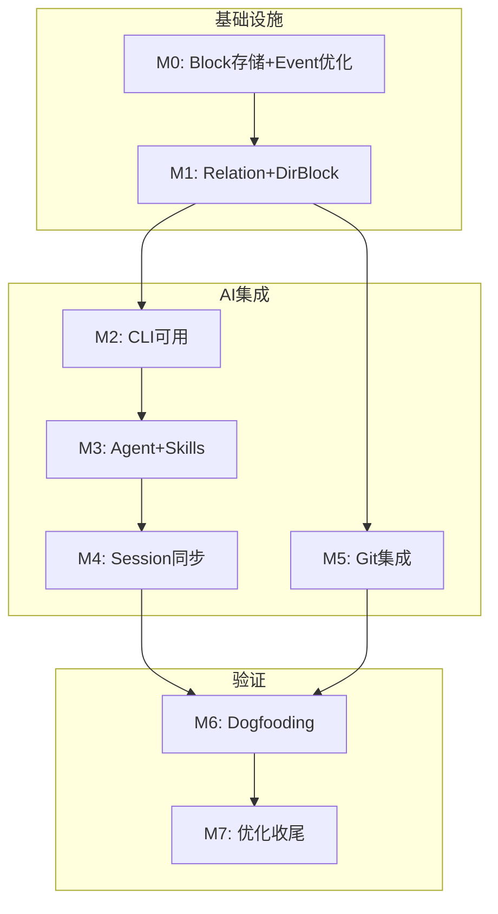

# Phase 2 任务规划与预算（v3）

## 一、总体预算概览

### 1.1 预算分配

| 角色类型 | 总预算（人时） | 占比 | 说明 |
| :--- | :--- | :--- | :--- |
| **研发团队** | 240 人时 | 72% | 基础设施 + AI 集成 + 测试 |
| **产品团队** | 55 人时 | 17% | Dogfooding 实验 + 指标 + 归因 |
| **缓冲预留** | 35 人时 | 11% | 风险应对 |
| **总计** | 330 人时 | 100% | 约 3.5-4 周 |

### 1.2 功能范围对照

**基础设施模块（12 个）**：
- Block 存储改造：I1 (P0), I2 (P0), I3 (P0)
- Event 存储优化：I4 (P0), I5 (P1)
- Relation 增强：I6 (P0), I7 (P1), I8 (P0)
- Dir Block 改造：I9 (P0), I10 (P0), I11 (P0), I12 (P0)

**AI 集成模块（17 个）**：
- Agent 模块：F1 (P0), F2 (P0), F3 (P0)
- CLI 模块：F4 (P0), F5 (P0), F6 (P1)
- Skills 模块：F7 (P0), F8 (P0), F9 (P0)
- Session 同步：F10 (P0), F11 (P0), F12 (P0), F13 (P1)
- Git 集成：F14 (P0), F15 (P0), F16 (P0), F17 (P1)

**产品研究（3 个）**：
- R1 Dogfooding 实验设计 (P0)
- R2 评价指标定义 (P0)
- R3 归因分析方法 (P0)

---

## 二、基础设施模块（80 人时）

> **重要架构变更**：所有内容均 Block 化。Directory Block 存储索引（entries），Content Block 存储实际内容（`block-{uuid}/body.*`）。索引与内容通过 Relation 关联，权限独立管理。

### 2.1 Block 存储改造（30 人时）

**文件结构**: `src-tauri/src/engine/` + `src-tauri/src/extensions/`

| 编号 | 任务名称 | 文件位置 | 详细内容 | 预估人时 | 对应模块 |
| :--- | :--- | :--- | :--- | :--- | :--- |
| **I1-01** | 物理文件存储层 | `engine/block_storage.rs` (新建) | 实现 `BlockStorage` trait：`read_body(block_id)` 和 `write_body(block_id, content)`，支持 `block-{uuid}/body.*` 路径 | 6 | I1 |
| **I1-02** | code.write 改造 | `extensions/code/code_write.rs` | 将内容写入 `block-{uuid}/body.{ext}` 物理文件，Event.value 只存操作元数据（file_path, operation, editor_id） | 5 | I1 |
| **I1-03** | markdown.write 改造 | `extensions/markdown/markdown_write.rs` | 将内容写入 `block-{uuid}/body.md` 物理文件，Event.value 只存操作元数据 | 4 | I1 |
| **I2-01** | Dir Block entries 结构 | `extensions/directory/mod.rs` | 修改 `contents.entries` 只存索引 `{path: {id, type}}`，不存文件内容 | 4 | I2, I9 |
| **I2-02** | 索引-内容关系建立 | `extensions/directory/directory_import.rs` | 创建 Content Block 时自动建立 Dir Block → Content Block 的 `contains` 关系 | 4 | I2, I6 |
| **I3-01** | Block 目录自动创建 | `engine/actor.rs` | `core.create` 时自动创建 `block-{uuid}/` 目录，支持 `body.*` + `assets/` 结构 | 4 | I3 |
| **I3-02** | Block 目录删除 | `extensions/core/core_delete.rs` | `core.delete` 时处理物理目录（软删除：移动到 `.trash/`） | 3 | I3 |

### 2.2 Event 存储优化（12 人时）

**文件结构**: `src-tauri/src/engine/`

| 编号 | 任务名称 | 文件位置 | 详细内容 | 预估人时 | 对应模块 |
| :--- | :--- | :--- | :--- | :--- | :--- |
| **I4-01** | Event 轻量化结构 | `engine/event_store.rs` | Event.value 只存操作元数据（operation, path, hash），不存完整内容 | 4 | I4 |
| **I4-02** | StateProjector 物理文件加载 | `engine/state.rs` | 投影时从 `block-{uuid}/body.*` 读取内容，而非 Event.value | 5 | I4 |
| **I5-01** | 可选 Diff 存储 | `engine/event_store.rs` | 支持配置存储增量 diff（可选），使用 `similar` crate 计算 | 3 | I5 |

### 2.3 Relation 增强（18 人时）

**文件结构**: `src-tauri/src/engine/` + `src-tauri/src/models/`

| 编号 | 任务名称 | 文件位置 | 详细内容 | 预估人时 | 对应模块 |
| :--- | :--- | :--- | :--- | :--- | :--- |
| **I6-01** | 关系类型枚举扩展 | `models/relation.rs` (新建) | 定义关系类型枚举：`contains`, `tracks`, `implements`, `archives`, `generated_by` | 3 | I6, I8 |
| **I6-02** | core.link 支持新类型 | `extensions/core/core_link.rs` | 扩展 `core.link` 支持新的关系类型，验证关系类型有效性 | 3 | I6, I8 |
| **I7-01** | RelationGraph 反向索引 | `engine/relation_graph.rs` (新建) | 维护 `incoming` 反向索引，支持 `get_parents(block_id)` 查询 | 5 | I7 |
| **I7-02** | StateProjector 集成 | `engine/state.rs` | 在 `apply_event` 时更新 `RelationGraph`，维护双向索引 | 4 | I7 |
| **I8-01** | 关系查询 API | `commands/relation.rs` (新建) | 暴露 `query_relations`、`get_parents`、`get_children` Tauri 命令 | 3 | I8 |

### 2.4 Dir Block 改造（20 人时）

**文件结构**: `src-tauri/src/extensions/directory/`

| 编号 | 任务名称 | 文件位置 | 详细内容 | 预估人时 | 对应模块 |
| :--- | :--- | :--- | :--- | :--- | :--- |
| **I10-01** | .elf/ 元数据目录结构 | `extensions/directory/elf_meta.rs` (新建) | 定义 `.elf/` 目录结构：SKILLS.md, Agents/, git/hooks/，自动创建对应 Block | 5 | I10 |
| **I10-02** | 通用 SKILLS.md 模板 | `templates/skills_template.md` (新建) | 内置通用 SKILLS.md 模板，包含 core.create, markdown.write 等基础命令 | 3 | I10, F7 |
| **I10-03** | 前端 .elf/ 过滤 | `extensions/directory/mod.rs` | 提供 `is_elf_meta_block()` 方法，前端只显示 SKILLS/Agents/Hooks | 2 | I10 |
| **I11-01** | directory.import 改造 | `extensions/directory/directory_import.rs` | 复制文件内容到 `block-{uuid}/body.*`，创建索引，建立 `contains` 关系 | 6 | I11 |
| **I11-02** | 增量导入支持 | `extensions/directory/directory_import.rs` | 支持增量导入：检测已存在的 Block，只导入新增/变更文件 | 4 | I11 |
| **I12-01** | directory.export 改造 | `extensions/directory/directory_export.rs` | 从 Content Block 读取内容，写入外部目录，保持目录结构 | 4 | I12 |
| **I12-02** | 部分导出支持 | `extensions/directory/directory_export.rs` | 支持导出指定 Block 子集，而非整个 Directory | 2 | I12 |

---

## 三、AI 集成模块（130 人时）

### 3.1 Agent 模块（22 人时）

**文件结构**: `src-tauri/src/extensions/agent/`

| 编号 | 任务名称 | 文件位置 | 详细内容 | 预估人时 | 对应模块 |
| :--- | :--- | :--- | :--- | :--- | :--- |
| **F1-01** | Agent Block 数据结构 | `extensions/agent/mod.rs` | 定义 `AgentConfig`：provider, session_id, editor_id, linked_projects | 3 | F1 |
| **F1-02** | agent.create Capability | `extensions/agent/agent_create.rs` | 实现 `agent.create`，创建 Agent Block，生成 editor_id = `{provider}:{session_id}` | 4 | F1 |
| **F2-01** | Claude Session 扫描器 | `extensions/agent/session_scanner.rs` (新建) | 扫描 `~/.claude/projects/` 下的 `.jsonl` 文件，解析活跃 session 列表 | 5 | F2 |
| **F2-02** | Session 列表 API | `commands/agent.rs` (新建) | 暴露 `scan_claude_sessions` Tauri 命令，返回 session_id, project_path, last_active | 2 | F2 |
| **F3-01** | Agent 关联命令 | `extensions/agent/agent_link.rs` (新建) | 实现 `agent.link_session`：关联 session，创建 Editor，建立项目关联 | 5 | F3 |
| **F3-02** | Agent 目录生成 | `extensions/agent/agent_create.rs` | Agent 创建时生成 `.elf/Agents/{name}/` 目录，包含 SKILLS.md | 3 | F3 |

### 3.2 CLI 模块（28 人时）

**文件结构**: `src-tauri/src/cli/` (新建模块)

| 编号 | 任务名称 | 文件位置 | 详细内容 | 预估人时 | 对应模块 |
| :--- | :--- | :--- | :--- | :--- | :--- |
| **F4-01** | CLI 入口模块 | `cli/mod.rs` (新建) | 创建 CLI 入口，解析命令行参数：`elfiee --agent {id} {capability} {args}` | 4 | F4 |
| **F4-02** | CLI 参数解析 | `cli/parser.rs` (新建) | 使用 `clap` 解析命令行，支持 `--project`, `--agent`, `--json` 参数 | 3 | F4 |
| **F4-03** | CLI 输出格式化 | `cli/output.rs` (新建) | 支持 JSON 输出和人类可读输出，返回 block_id、执行状态 | 2 | F4 |
| **F5-01** | CLI-Engine IPC 通信 | `cli/ipc.rs` (新建) | Unix Socket（Linux/Mac）或 Named Pipe（Windows）与运行中 Elfiee 通信 | 6 | F5 |
| **F5-02** | CLI 直接操作模式 | `cli/direct.rs` (新建) | Elfiee 未运行时直接操作 .elf 文件（SQLite），打开 Engine 执行命令 | 5 | F5 |
| **F5-03** | Engine Socket 服务 | `engine/socket_server.rs` (新建) | Engine 启动 Socket 服务，接收 CLI 命令并执行 | 4 | F5 |
| **F6-01** | elfiee-ext-gen 协议层改造 | `elfiee-ext-gen/src/generator.rs` | 将直接生成改为调用 CLI：`elfiee core.create` + `elfiee code.write` | 4 | F6 |

### 3.3 Skills 模块（16 人时）

**文件结构**: `src-tauri/src/commands/` + `templates/`

| 编号 | 任务名称 | 文件位置 | 详细内容 | 预估人时 | 对应模块 |
| :--- | :--- | :--- | :--- | :--- | :--- |
| **F7-01** | Skills 生成器 | `commands/skills.rs` (新建) | 扫描注册的 Capabilities，生成 SKILLS.md 格式 | 4 | F7 |
| **F7-02** | 多级 SKILLS 合并 | `commands/skills.rs` | 实现通用 + 项目级 + Agent 级 SKILLS 合并逻辑 | 3 | F7, F8 |
| **F8-01** | 项目级 SKILLS 自动创建 | `extensions/directory/directory_import.rs` | 导入项目时自动创建 `.elf/projects/{name}/SKILLS.md` | 3 | F8 |
| **F8-02** | 项目级 SKILLS 模板 | `templates/project_skills.md` (新建) | 项目级 SKILLS 模板，包含工作流规范占位符 | 2 | F8 |
| **F9-01** | Symlink 管理器 | `commands/symlink.rs` (新建) | 创建/删除 symlink 到 `~/.claude/skills/` | 4 | F9 |

### 3.4 Session 同步模块（28 人时）

**文件结构**: `src-tauri/src/sync/` (新建模块)

| 编号 | 任务名称 | 文件位置 | 详细内容 | 预估人时 | 对应模块 |
| :--- | :--- | :--- | :--- | :--- | :--- |
| **F10-01** | JSONL 文件监听器 | `sync/watcher.rs` (新建) | 使用 `notify` crate 监听 `~/.claude/projects/{path}/*.jsonl` | 5 | F10 |
| **F10-02** | 监听器生命周期管理 | `sync/watcher.rs` | 实现 start/stop/pause，支持多项目同时监听 | 3 | F10 |
| **F11-01** | JSONL 解析器 | `sync/parser.rs` (新建) | 解析 Claude Code JSONL 格式，提取 tool_use、用户消息、响应 | 4 | F11 |
| **F11-02** | 增量解析优化 | `sync/parser.rs` | 记录文件偏移量，只解析新增内容 | 3 | F11 |
| **F12-01** | Session Log Block 创建 | `sync/log_writer.rs` (新建) | 创建 `session/log-{timestamp}.md` Block，使用 `markdown.write` | 4 | F12 |
| **F12-02** | 时序保证机制 | `sync/log_writer.rs` | 确保会话 Event 在代码变更 Event 之前 | 4 | F12 |
| **F13-01** | Session-Code 关联 | `sync/relation.rs` (新建) | 通过 Vector Clock 匹配，建立 `generated_by` 关系 | 5 | F13 |

### 3.5 Git 集成模块（36 人时）

**文件结构**: `src-tauri/src/git/` (新建模块)

| 编号 | 任务名称 | 文件位置 | 详细内容 | 预估人时 | 对应模块 |
| :--- | :--- | :--- | :--- | :--- | :--- |
| **F14-01** | Hooks 复制器 | `git/hooks.rs` (新建) | 复制原 `.git/hooks/` 到 `.elf/git/hooks/`，追加 Elfiee 检查逻辑 | 5 | F14 |
| **F14-02** | Hooks 模板生成 | `git/hooks.rs` | 生成带 Elfiee 检查的 pre-commit, post-merge 模板 | 3 | F14 |
| **F15-01** | core.hooksPath 管理 | `git/hooks.rs` | 实现 `set_hooks_path` 和 `restore_hooks_path` | 4 | F15 |
| **F15-02** | Git 配置备份 | `git/config.rs` (新建) | 打开项目时备份原 Git 配置，关闭时恢复 | 3 | F15 |
| **F16-01** | Task 信息提取 | `git/task_parser.rs` (新建) | 从 task.md 提取 title（分支名）和 content（commit message） | 3 | F16 |
| **F16-02** | 分支创建命令 | `git/branch.rs` (新建) | 实现 `create_branch_from_task`，自动命名分支 | 3 | F16 |
| **F16-03** | 一键导出+提交 | `git/commit.rs` (新建) | `directory.export` → git add → git commit，可选 push | 6 | F16 |
| **F17-01** | Merge 检测器 | `git/merge_detector.rs` (新建) | 监听 git reflog 或定期检查，检测 merge 事件 | 4 | F17 |
| **F17-02** | 归档文档生成 | `git/archive.rs` (新建) | 汇总对话 + 编辑 Events，生成 summary markdown | 5 | F17 |

---

## 四、前端开发（30 人时）

### 4.1 基础设施相关 UI（8 人时）

| 编号 | 任务名称 | 文件位置 | 详细内容 | 预估人时 | 对应模块 |
| :--- | :--- | :--- | :--- | :--- | :--- |
| **UI-I-01** | .elf/ 目录置顶展示 | `src/components/FileTree.tsx` | 将 SKILLS/Agents/Hooks 置顶，添加特殊图标 | 3 | I10 |
| **UI-I-02** | 关系可视化 | `src/components/RelationGraph.tsx` (新建) | 显示 Block 间的关系图，支持 `contains`, `implements` 等 | 5 | I7, I8 |

### 4.2 Agent 模块 UI（10 人时）

| 编号 | 任务名称 | 文件位置 | 详细内容 | 预估人时 | 对应模块 |
| :--- | :--- | :--- | :--- | :--- | :--- |
| **UI-F-01** | Claude Session 选择器 | `src/components/Agent/SessionSelector.tsx` (新建) | 显示活跃 sessions 列表，支持搜索和选择 | 4 | F2 |
| **UI-F-02** | Agent 关联向导 | `src/components/Agent/AgentLinkWizard.tsx` (新建) | 多步骤向导：选择 session → 配置 → 确认 | 4 | F3 |
| **UI-F-03** | Symlink 状态指示 | `src/components/Agent/SymlinkStatus.tsx` (新建) | 显示 symlink 状态，支持手动修复 | 2 | F9 |

### 4.3 Session 同步 UI（6 人时）

| 编号 | 任务名称 | 文件位置 | 详细内容 | 预估人时 | 对应模块 |
| :--- | :--- | :--- | :--- | :--- | :--- |
| **UI-F-04** | Session Log 查看器 | `src/components/Session/LogViewer.tsx` (新建) | 时间线展示对话记录，高亮 tool_use | 4 | F12 |
| **UI-F-05** | 同步状态指示器 | `src/components/Session/SyncStatus.tsx` (新建) | 显示同步状态，手动同步按钮 | 2 | F10 |

### 4.4 Git 模块 UI（6 人时）

| 编号 | 任务名称 | 文件位置 | 详细内容 | 预估人时 | 对应模块 |
| :--- | :--- | :--- | :--- | :--- | :--- |
| **UI-F-06** | 一键导出+提交面板 | `src/components/Git/CommitPanel.tsx` (新建) | 显示待导出 Blocks，编辑 commit message | 4 | F16 |
| **UI-F-07** | 归档查看器 | `src/components/Git/ArchiveViewer.tsx` (新建) | 渲染归档 markdown，支持关联跳转 | 2 | F17 |

---

## 五、测试（20 人时）

| 编号 | 任务名称 | 文件位置 | 详细内容 | 预估人时 | 覆盖范围 |
| :--- | :--- | :--- | :--- | :--- | :--- |
| **T-I-01** | Block 存储单元测试 | `engine/block_storage_test.rs` | 测试物理文件读写、目录创建/删除 | 3 | I1-I3 |
| **T-I-02** | Relation 单元测试 | `engine/relation_graph_test.rs` | 测试双向索引、关系类型验证 | 2 | I6-I8 |
| **T-I-03** | Dir Block 集成测试 | `extensions/directory/tests.rs` | 测试 import/export 完整流程 | 3 | I9-I12 |
| **T-F-01** | CLI 单元测试 | `cli/tests.rs` | 测试参数解析、IPC 通信 Mock | 3 | F4-F5 |
| **T-F-02** | Agent 单元测试 | `extensions/agent/tests.rs` | 测试 session 扫描、Agent 关联 | 2 | F1-F3 |
| **T-F-03** | Session 同步集成测试 | `sync/tests.rs` | 测试 JSONL 解析、增量解析、时序 | 3 | F10-F13 |
| **T-F-04** | Git 模块单元测试 | `git/tests.rs` | 测试 Hooks 管理、Task 解析 | 2 | F14-F17 |
| **T-E2E-01** | 端到端测试 | `tests/integration/e2e.rs` | 完整 Dogfooding 场景自动化 | 2 | 全模块 |

---

## 六、产品任务规划（55 人时）

### 6.1 Dogfooding 实验设计（25 人时）

| 编号 | 任务名称 | 预估人时 | 对应研究主题 | 详细内容 |
| :--- | :--- | :--- | :--- | :--- |
| **P-DOG-01** | Dogfooding 场景设计 | 8 | R1 | 设计 2-3 个真实开发场景（添加 Capability、修复 Bug、重构模块） |
| **P-DOG-02** | 环境准备与配置 | 5 | R1 | 准备 Dogfooding 环境：创建测试 .elf 项目、配置 Claude Code |
| **P-DOG-03** | Dogfooding 执行 - 场景 1 | 6 | R1 | 执行第一个场景，记录操作过程、问题、改进建议 |
| **P-DOG-04** | Dogfooding 执行 - 场景 2 | 6 | R1 | 执行第二个场景，对比改进效果 |

### 6.2 评价指标定义（15 人时）

| 编号 | 任务名称 | 预估人时 | 对应研究主题 | 详细内容 |
| :--- | :--- | :--- | :--- | :--- |
| **P-METRIC-01** | 效率指标定义 | 5 | R2 | CLI 调用成功率、会话同步延迟、导出+提交耗时 |
| **P-METRIC-02** | 完整性指标定义 | 5 | R2 | Event 覆盖率、会话-代码关联准确率、归档质量 |
| **P-METRIC-03** | 数据采集方案 | 5 | R2 | 日志格式、采集点、存储方式、分析脚本 |

### 6.3 归因分析（15 人时）

| 编号 | 任务名称 | 预估人时 | 对应研究主题 | 详细内容 |
| :--- | :--- | :--- | :--- | :--- |
| **P-ATTR-01** | 分析框架设计 | 5 | R3 | 哪些环节提效、哪些是瓶颈、如何量化改进空间 |
| **P-ATTR-02** | Dogfooding 数据分析 | 6 | R3 | 分析执行数据，识别关键问题和改进点 |
| **P-ATTR-03** | 归因报告输出 | 4 | R3 | 问题清单、优先级排序、Phase 3 建议 |

---

## 七、里程碑与依赖

### 7.1 里程碑划分

| 里程碑 | 时间节点 | 开发内容 | 验收标准 | 对应任务 |
| :--- | :--- | :--- | :--- | :--- |
| **M0: 基础设施-Block 存储** | Week 1 Day 1-3 | Block 物理存储、Event 轻量化 | ✓ 内容存储到 `block-{uuid}/body.*` <br> ✓ Event 只存元数据 <br> ✓ StateProjector 从物理文件加载 | I1-01~I4-02 |
| **M1: 基础设施-Relation & Dir** | Week 1 Day 4-5 | Relation 增强、Dir Block 改造 | ✓ 支持 `contains` 等新关系类型 <br> ✓ 反向索引可用 <br> ✓ .elf/ 元数据自动创建 | I6-01~I12-02 |
| **M2: CLI 可用** | Week 2 Day 1-2 | CLI 入口、IPC、直接操作 | ✓ `elfiee --agent {id} core.create` 可执行 <br> ✓ 支持 IPC 和直接操作两种模式 | F4-01~F5-03 |
| **M3: Agent + Skills** | Week 2 Day 3-4 | Agent 关联、Skills 生成、Symlink | ✓ 可扫描活跃 Claude sessions <br> ✓ Agent Block 创建成功 <br> ✓ SKILLS symlink 正确 | F1-01~F9-01 |
| **M4: Session 同步** | Week 2 Day 5 ~ Week 3 Day 1 | JSONL 监听、解析、Log 写入 | ✓ Claude 会话自动同步 <br> ✓ 时序正确 <br> ✓ 关系可查询 | F10-01~F13-01 |
| **M5: Git 集成** | Week 3 Day 2-3 | Hooks 管理、导出+提交、归档 | ✓ Hooks 正确复制和切换 <br> ✓ task.md 驱动 Git 操作 <br> ✓ 归档生成成功 | F14-01~F17-02 |
| **M6: Dogfooding** | Week 3 Day 4-5 | 产品执行、研发修复 | ✓ 完成 2 个场景 <br> ✓ P0 Bug 修复 | P-DOG-03~04, T-E2E-01 |
| **M7: 优化与收尾** | Week 4 Day 1-2 | Bug 修复、归因报告 | ✓ P0/P1 Bug 修复 <br> ✓ 归因报告输出 | P-ATTR-02~03 |

### 7.2 关键依赖关系



| 依赖关系 | 说明 | 影响范围 |
| :--- | :--- | :--- |
| **M0 → M1** | Relation 和 Dir Block 依赖 Block 物理存储 | Week 1 Day 4 |
| **M1 → M2** | CLI 依赖 .elf 目录结构和 SKILLS 模板 | Week 2 Day 1 |
| **M2 → M3** | Agent 关联依赖 CLI 和 Symlink 能力 | Week 2 Day 3 |
| **M3 → M4** | Session 同步依赖 Agent（需要 editor_id） | Week 2 Day 5 |
| **M1 → M5** | Git 集成依赖 Dir Block 和 Relation | Week 3 Day 2 |
| **M4, M5 → M6** | Dogfooding 依赖全部核心功能就绪 | Week 3 Day 4 |

---

### 7.3 开发节奏时间线

```
┌────────────────────────────────────────────────────────────────────────────┐
│                    Phase 2 开发时间线（4 周）                                 │
├────────────────────────────────────────────────────────────────────────────┤
│                                                                            │
│  Week 1（基础设施周）                                                        │
│  ┌──────────────────────────────────────────────────────────────────────┐  │
│  │ Day 1-3: M0 Block 存储 + Event 优化                                    │  │
│  │   - Block 物理存储层                                                   │  │
│  │   - code.write / markdown.write 改造                                  │  │
│  │   - Event 轻量化                                                      │  │
│  │   - StateProjector 物理文件加载                                        │  │
│  └──────────────────────────────────────────────────────────────────────┘  │
│           │                                                                │
│           v                                                                │
│  ┌──────────────────────────────────────────────────────────────────────┐  │
│  │ Day 4-5: M1 Relation 增强 + Dir Block 改造                             │  │
│  │   - 关系类型扩展、反向索引                                              │  │
│  │   - .elf/ 元数据目录自动创建                                           │  │
│  │   - directory.import/export 改造                                      │  │
│  └──────────────────────────────────────────────────────────────────────┘  │
│           │                                                                │
│           v                                                                │
│  Week 2（AI 集成周）                                                        │
│  ┌──────────────────────────────────────────────────────────────────────┐  │
│  │ Day 1-2: M2 CLI 可用                                                   │  │
│  │   - CLI 入口和参数解析                                                 │  │
│  │   - IPC 通信 / 直接操作模式                                            │  │
│  └──────────────────────────────────────────────────────────────────────┘  │
│           │                                                                │
│           v                                                                │
│  ┌──────────────────────────────────────────────────────────────────────┐  │
│  │ Day 3-4: M3 Agent + Skills                                             │  │
│  │   - Claude Session 扫描                                               │  │
│  │   - Agent 关联流程                                                     │  │
│  │   - SKILLS 合并和 Symlink                                              │  │
│  └──────────────────────────────────────────────────────────────────────┘  │
│           │                                                                │
│           v                                                                │
│  ┌──────────────────────────────────────────────────────────────────────┐  │
│  │ Day 5 ~ Week 3 Day 1: M4 Session 同步                                  │  │
│  │   - JSONL 监听和解析                                                   │  │
│  │   - Session Log 写入                                                   │  │
│  │   - 时序保证和关系关联                                                  │  │
│  └──────────────────────────────────────────────────────────────────────┘  │
│           │                                                                │
│           v                                                                │
│  Week 3（集成验证周）                                                        │
│  ┌──────────────────────────────────────────────────────────────────────┐  │
│  │ Day 2-3: M5 Git 集成                                                   │  │
│  │   - Hooks 复制和切换                                                   │  │
│  │   - 一键导出+提交                                                      │  │
│  │   - Merge 检测和归档                                                   │  │
│  └──────────────────────────────────────────────────────────────────────┘  │
│           │                                                                │
│           v                                                                │
│  ┌──────────────────────────────────────────────────────────────────────┐  │
│  │ Day 4-5: M6 Dogfooding                                                 │  │
│  │   - 产品执行 2 个场景                                                   │  │
│  │   - 研发修复 P0 Bug                                                    │  │
│  └──────────────────────────────────────────────────────────────────────┘  │
│           │                                                                │
│           v                                                                │
│  Week 4（优化收尾周）                                                        │
│  ┌──────────────────────────────────────────────────────────────────────┐  │
│  │ Day 1-2: M7 优化与收尾                                                  │  │
│  │   - Bug 修复                                                          │  │
│  │   - 归因报告输出                                                       │  │
│  │   - Phase 3 建议整理                                                   │  │
│  └──────────────────────────────────────────────────────────────────────┘  │
│                                                                            │
└────────────────────────────────────────────────────────────────────────────┘
```

---

## 八、风险预留与缓冲

### 8.1 风险评估

| 风险类型 | 风险等级 | 描述 | 影响模块 |
| :--- | :--- | :--- | :--- |
| **Block 存储迁移** | 高 | 现有实现需要较大改动，可能影响已有功能 | I1-I4, 全模块 |
| **CLI IPC 通信** | 中 | 跨平台 IPC 实现复杂 | F4-F5 |
| **Session 同步稳定性** | 中 | 文件监听、增量解析、时序保证 | F10-F13 |
| **Claude 格式变化** | 低 | session 文件格式可能变化 | F2, F11 |

### 8.2 风险预留策略

**总预算**: 330 人时
**风险预留**: 35 人时（约 11% 缓冲）

| 风险类型 | 预留时间 | 应对策略 |
| :--- | :--- | :--- |
| **Block 存储迁移问题** | 12 人时 | 分阶段迁移，保持向后兼容 |
| **CLI IPC 调试** | 8 人时 | 优先实现直接操作模式，IPC 延后 |
| **Session 同步问题** | 8 人时 | 降级为手动同步 |
| **其他意外** | 7 人时 | 灵活调配 |

### 8.3 降级策略

| 功能 | 正常实现 | 降级方案 |
| :--- | :--- | :--- |
| **CLI 通信** | IPC + 直接操作 | 仅直接操作模式 |
| **Session 同步** | 自动监听 | 手动触发同步 |
| **Git Merge 检测** | 自动检测 | 手动触发归档 |
| **反向索引** | 实时更新 | 定期重建 |

---

## 九、人时汇总

| 模块 | 后端 | 前端 | 测试 | 产品 | 小计 |
| :--- | :--- | :--- | :--- | :--- | :--- |
| **基础设施** | 80 | 8 | 8 | - | 96 |
| **AI 集成** | 130 | 22 | 12 | - | 164 |
| **产品研究** | - | - | - | 55 | 55 |
| **缓冲预留** | - | - | - | - | 35 |
| **总计** | 210 | 30 | 20 | 55 | **330** |

---

## 十、与 target-and-story_v2.md 模块对照

| 分类 | target-and-story_v2 编号 | task-and-cost_v3 任务编号 |
| :--- | :--- | :--- |
| **Block 存储** | I1, I2, I3 | I1-01~I3-02 |
| **Event 优化** | I4, I5 | I4-01~I5-01 |
| **Relation 增强** | I6, I7, I8 | I6-01~I8-01 |
| **Dir Block 改造** | I9, I10, I11, I12 | I10-01~I12-02 |
| **Agent 模块** | F1, F2, F3 | F1-01~F3-02 |
| **CLI 模块** | F4, F5, F6 | F4-01~F6-01 |
| **Skills 模块** | F7, F8, F9 | F7-01~F9-01 |
| **Session 同步** | F10, F11, F12, F13 | F10-01~F13-01 |
| **Git 集成** | F14, F15, F16, F17 | F14-01~F17-02 |
| **产品研究** | R1, R2, R3 | P-DOG-*, P-METRIC-*, P-ATTR-* |
