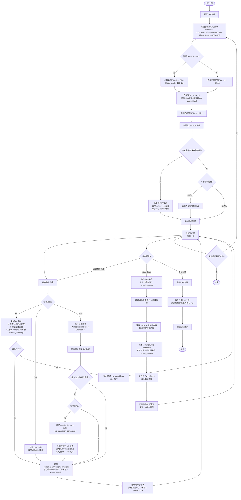

# Terminal Extension 需求文档

## 1. 概述

### 1.1 功能目标

Terminal Extension 为 Elfiee 提供交互式终端功能，允许用户在 Block 中执行系统命令、管理命令历史、保存和恢复终端会话。同时，当用户执行文件操作相关命令时，系统会自动将文件变更同步到 `.elf` 文件中。

### 1.2 核心价值

- **交互式命令执行**: 在 Elfiee 中直接执行系统命令
- **会话持久化**: 保存和恢复终端会话状态
- **命令历史管理**: 自动记录所有执行的命令及其输出
- **安全的目录管理**: 基于 Block 的目录隔离和安全路径管理
- **文件操作实时同步**: 文件操作命令（`mkdir`, `touch`, `vi`, `vim` 等）执行后自动同步到 `.elf` 文件

### 1.3 技术架构

- **前端**: React + xterm.js 提供终端界面
- **后端**: Rust Extension 提供命令执行能力
- **存储**: Event Store 架构，基于 EAVT 模型
- **通信**: Tauri + tauri-specta 类型安全通信

## 2. 前端需求

### 2.1 Terminal Tab 显示

**需求描述**: 
- Terminal Tab 应该根据当前选中的 Block 类型自动显示/隐藏
- 当选中 `terminal` 类型的 Block 时，显示 Terminal Tab
- 当选中其他类型的 Block 时，隐藏 Terminal Tab

**技术要求**:
- 在 `App.tsx` 中实现智能 Tab 切换逻辑
- 支持自动选中 Terminal Block（如果存在）

### 2.2 xterm.js 集成

**需求描述**:
- 使用 xterm.js 提供完整的终端界面
- 支持终端主题配置（绿色主题）
- 支持窗口大小自适应（FitAddon）
- 支持光标闪烁和字体配置

**技术要求**:
- 终端主题: 黑色背景，绿色前景色
- 字体: Consolas, "Courier New", monospace
- 字体大小: 14px
- 支持窗口 resize 自动适配

### 2.3 命令输入处理

**需求描述**:
- 支持键盘输入和命令编辑
- 支持特殊键处理:
  - `Enter`: 执行命令
  - `Backspace`: 删除字符
  - `Ctrl+C`: 中断当前输入
  - `Ctrl+L`: 清屏
- 实时显示用户输入的命令

**技术要求**:
- 使用 xterm.js `onData` 事件处理输入
- 维护输入缓冲区
- 防止命令执行期间的重复输入

### 2.4 命令输出显示

**需求描述**:
- 实时显示命令执行结果
- 显示命令退出码（如果非零）
- 清理 ANSI 转义序列
- 格式化输出显示

**技术要求**:
- 使用 `writeTerminalOutput` 函数清理和格式化输出
- 移除 ANSI 转义序列
- 移除不可打印字符
- 按行显示输出

### 2.5 提示符显示

**需求描述**:
- 显示当前工作目录作为提示符
- 格式: `{directory} $ `
- 在命令执行后自动显示新提示符

**技术要求**:
- 使用 `writePrompt` 函数
- 支持相对路径显示（相对于 root_path）
- 路径分隔符统一为 `/`

### 2.6 会话恢复

**需求描述**:
- 当 Terminal Block 有保存的内容时，自动恢复显示
- 显示保存时间和内容统计信息
- 显示会话分隔符，区分恢复内容和新内容

**技术要求**:
- 检查 Block 的 `saved_content` 字段
- 解析 `saved_at` 时间戳
- 显示恢复信息: 保存时间、行数、字符数
- 逐行恢复保存的内容

### 2.7 命令历史显示

**需求描述**:
- 在终端初始化时显示命令历史
- 显示历史命令及其输出
- 显示命令退出码（如果非零）

**技术要求**:
- 调用 `getTerminalHistory` API
- 格式化显示历史记录
- 仅在无保存内容时显示历史（避免重复）

### 2.8 终端内容保存

**需求描述**:
- 提供 Save 按钮保存当前终端缓冲区内容
- 保存完整的终端显示内容
- 保存当前工作目录
- 保存时间戳
- 显示保存状态和进度

**技术要求**:
- 使用 xterm.js `buffer.active` API 获取缓冲区内容
- 逐行提取终端内容
- 调用 `terminal.write` capability 保存
- 显示保存成功/失败通知
- 显示保存状态指示（行数统计）

**保存结果**:
- Save 按钮会向后端发送 `terminal.write` 命令，写入 `saved_content`、`saved_at`、`current_directory` 等字段
- 后端将这些字段存入 Block 的 `contents` 中，并作为事件写入 Event Store（`events.db` 的 `events` 表）
- 事件保存后，Block 的最新 state 会携带 `saved_content` 等字段，可用于 UI 显示和会话恢复
- 保存内容最终存放在 `.elf` 文件内部的 Event Store 中，随着文件保存一起打包
- **重要**: Save 按钮**仅保存终端内容**，不会创建新的 Markdown Block 或其他文件，所有文件变更都通过文件操作命令自动同步

### 2.9 Block 验证

**需求描述**:
- 验证当前选中的 Block 是否为 `terminal` 类型
- 如果未选中 Terminal Block，显示友好的提示信息
- 提示用户如何创建 Terminal Block

**技术要求**:
- 检查 `selectedBlock.block_type === 'terminal'`
- 显示清晰的错误提示
- 提供创建 Terminal Block 的指导

### 2.10 状态管理

**需求描述**:
- 维护当前工作目录状态
- 跟踪 Terminal Block ID
- 管理终端初始化状态
- 管理保存状态

**技术要求**:
- 使用 React ref 存储目录状态
- 使用 React state 管理 UI 状态
- 在命令执行后更新目录状态

## 3. 后端需求

### 3.1 Terminal Extension 架构

**需求描述**:
- 实现 Terminal Extension，提供三个 capabilities:
  - `terminal.execute`: 执行系统命令
  - `terminal.write`: 写入/保存终端内容
  - `terminal.read`: 读取终端状态和历史

**技术要求**:
- Extension 位于 `src-tauri/src/extensions/terminal/`
- 使用 `#[capability]` 宏定义 capabilities
- 完整的类型定义和文档

### 3.2 terminal.execute Capability

**需求描述**:
- 执行真实的系统命令
- 记录命令历史（命令、输出、退出码、时间戳）
- 更新当前工作目录状态
- 支持特殊命令处理（cd, pwd）

**Payload 结构**:
```rust
pub struct TerminalExecutePayload {
    pub command: String,
}
```

**功能要求**:
1. **命令验证**:
   - 命令长度限制（最大 10000 字符）
   - 基本安全验证

2. **特殊命令处理**:
   - `cd`: 虚拟目录切换，更新 `current_directory` 和 `current_path`
   - `pwd`: 返回当前虚拟工作目录
   - 其他命令: 执行真实系统命令

3. **目录管理**:
   - 维护 `root_path`: Block 的根目录（从 `_block_dir` 或配置获取）
   - 维护 `current_path`: 当前绝对路径
   - 维护 `current_directory`: 当前相对路径（相对于 root_path）
   - 安全验证: 防止目录遍历攻击，确保路径在 root_path 内

   **路径说明**:
   - **root_path**: 从 `.elf` 文件解压出来的临时目录下的 `block-{block_id}` 目录。这是 Block 的根目录，所有文件操作都被限制在这个目录内。
   - **绝对路径 (`current_path`)**: 从系统根目录开始的完整路径，用于实际执行系统命令。初始值等于 `root_path`。
   - **相对路径 (`current_directory`)**: 相对于 `root_path` 的路径，用于在终端中显示给用户。初始值为 `.`。

   **工作原理**:
   - 当打开 `.elf` 文件时，系统会将其解压到一个临时目录（TempDir）
   - 每个 Block 在临时目录下有独立的目录：`block-{block_id}`
   - 后端在运行时会将 `_block_dir` 注入到 Block contents 中，指向这个临时目录
   - Terminal 使用这个 `_block_dir` 作为 `root_path`，确保所有命令执行都在这个隔离的目录内

   **Windows 示例**:
   ```
   假设:
   - .elf 文件解压到临时目录: C:\Users\Alice\AppData\Local\Temp\tmpa1b2c3d4e5f6
   - Block ID: abc-123-def
   - Block 目录: C:\Users\Alice\AppData\Local\Temp\tmpa1b2c3d4e5f6\block-abc-123-def
   - 假设 block 目录下已存在 src 和 src\components 目录
   
   初始状态:
   - root_path: "C:\Users\Alice\AppData\Local\Temp\tmpa1b2c3d4e5f6\block-abc-123-def"
   - current_path: "C:\Users\Alice\AppData\Local\Temp\tmpa1b2c3d4e5f6\block-abc-123-def"  (绝对路径)
   - current_directory: "."  (相对路径，表示在根目录)
   
   执行 cd src 后 (目录存在):
   - root_path: "C:\Users\Alice\AppData\Local\Temp\tmpa1b2c3d4e5f6\block-abc-123-def"  (不变)
   - current_path: "C:\Users\Alice\AppData\Local\Temp\tmpa1b2c3d4e5f6\block-abc-123-def\src"  (绝对路径)
   - current_directory: "src"  (相对路径，相对于 root_path)
   - 说明: 系统会先检查 src 目录是否存在，存在则切换成功
   
   执行 cd src\components 后 (目录存在):
   - root_path: "C:\Users\Alice\AppData\Local\Temp\tmpa1b2c3d4e5f6\block-abc-123-def"  (不变)
   - current_path: "C:\Users\Alice\AppData\Local\Temp\tmpa1b2c3d4e5f6\block-abc-123-def\src\components"  (绝对路径)
   - current_directory: "src/components"  (相对路径，路径分隔符统一为 /)
   - 说明: 系统会先检查 src\components 目录是否存在，存在则切换成功
   
   执行 cd nonexistent 后 (目录不存在):
   - root_path: "C:\Users\Alice\AppData\Local\Temp\tmpa1b2c3d4e5f6\block-abc-123-def"  (不变)
   - current_path: "C:\Users\Alice\AppData\Local\Temp\tmpa1b2c3d4e5f6\block-abc-123-def"  (不变，切换失败)
   - current_directory: "."  (不变)
   - 错误输出: "cd: nonexistent: No such file or directory"
   - 说明: 系统检查 nonexistent 目录不存在，命令失败，当前目录不变
   
   执行 cd .. 后:
   - root_path: "C:\Users\Alice\AppData\Local\Temp\tmpa1b2c3d4e5f6\block-abc-123-def"  (不变)
   - current_path: "C:\Users\Alice\AppData\Local\Temp\tmpa1b2c3d4e5f6\block-abc-123-def\src"  (绝对路径，回到上一级)
   - current_directory: "src"  (相对路径)
   
   执行 cd ..\.. 后 (尝试超出 root_path):
   - root_path: "C:\Users\Alice\AppData\Local\Temp\tmpa1b2c3d4e5f6\block-abc-123-def"  (不变)
   - current_path: "C:\Users\Alice\AppData\Local\Temp\tmpa1b2c3d4e5f6\block-abc-123-def"  (绝对路径，被限制在 root_path)
   - current_directory: "."  (相对路径，安全限制生效)
   ```

   **Linux/macOS 示例**:
   ```
   假设:
   - .elf 文件解压到临时目录: /tmp/tmpa1b2c3d4e5f6
   - Block ID: abc-123-def
   - Block 目录: /tmp/tmpa1b2c3d4e5f6/block-abc-123-def
   - 假设 block 目录下已存在 src 和 src/components 目录
   
   初始状态:
   - root_path: "/tmp/tmpa1b2c3d4e5f6/block-abc-123-def"
   - current_path: "/tmp/tmpa1b2c3d4e5f6/block-abc-123-def"  (绝对路径)
   - current_directory: "."  (相对路径，表示在根目录)
   
   执行 cd src 后 (目录存在):
   - root_path: "/tmp/tmpa1b2c3d4e5f6/block-abc-123-def"  (不变)
   - current_path: "/tmp/tmpa1b2c3d4e5f6/block-abc-123-def/src"  (绝对路径)
   - current_directory: "src"  (相对路径，相对于 root_path)
   - 说明: 系统会先检查 src 目录是否存在，存在则切换成功
   
   执行 cd src/components 后 (目录存在):
   - root_path: "/tmp/tmpa1b2c3d4e5f6/block-abc-123-def"  (不变)
   - current_path: "/tmp/tmpa1b2c3d4e5f6/block-abc-123-def/src/components"  (绝对路径)
   - current_directory: "src/components"  (相对路径)
   - 说明: 系统会先检查 src/components 目录是否存在，存在则切换成功
   
   执行 cd nonexistent 后 (目录不存在):
   - root_path: "/tmp/tmpa1b2c3d4e5f6/block-abc-123-def"  (不变)
   - current_path: "/tmp/tmpa1b2c3d4e5f6/block-abc-123-def"  (不变，切换失败)
   - current_directory: "."  (不变)
   - 错误输出: "cd: nonexistent: No such file or directory"
   - 说明: 系统检查 nonexistent 目录不存在，命令失败，当前目录不变
   
   执行 cd .. 后:
   - root_path: "/tmp/tmpa1b2c3d4e5f6/block-abc-123-def"  (不变)
   - current_path: "/tmp/tmpa1b2c3d4e5f6/block-abc-123-def/src"  (绝对路径，回到上一级)
   - current_directory: "src"  (相对路径)
   
   执行 cd ../.. 后 (尝试超出 root_path):
   - root_path: "/tmp/tmpa1b2c3d4e5f6/block-abc-123-def"  (不变)
   - current_path: "/tmp/tmpa1b2c3d4e5f6/block-abc-123-def"  (绝对路径，被限制在 root_path)
   - current_directory: "."  (相对路径，安全限制生效)
   ```

   **目录存在性检查**:
   - `cd` 命令在执行前会先检查目标目录是否存在
   - 使用 `std::fs::metadata()` 检查目录是否存在
   - 如果目录不存在，返回错误: `"cd: {target}: No such file or directory"`
   - 如果目标路径是文件而非目录，返回错误: `"cd: {target}: Not a directory"`
   - 只有目录存在且验证通过后，才会更新 `current_path` 和 `current_directory`

   **安全机制**:
   - 所有路径操作都会验证 `current_path` 是否在 `root_path` 内
   - 使用 `canonicalize()` 规范化路径，防止 `../` 遍历攻击
   - 如果尝试访问 `root_path` 外的目录，会被限制在 `root_path`
   - 终端提示符显示 `current_directory`（相对路径），更友好易读

4. **命令执行**:
   - Windows: 使用 `cmd.exe /c`
   - Unix: 使用 `sh -c`
   - 设置工作目录为 `current_path`
   - 捕获 stdout 和 stderr
   - 返回退出码

5. **文件操作实时同步**:
   - **检测文件操作命令**: 自动检测是否为文件操作相关命令
     - 创建文件/目录: `mkdir`, `touch`, `echo > file`, `cat > file`, `vi/vim newfile`
     - 编辑文件: `vi`, `vim`, `nano`, `echo "content" >> file`
     - 删除文件: `rm`, `rmdir`
     - 移动/复制文件: `mv`, `cp`
     - 修改文件权限: `chmod`, `chown`
     - Windows 特定: `type nul > file`, `del`, `move`, `copy`, `md`, `rd`
   - **同步机制**: 
     - 文件操作命令执行成功后（`exit_code == 0`），自动触发文件同步
     - 在事件中添加 `needs_file_sync: true` 标记
     - 后端在 `execute_command` 中检测到标记后，异步调用 `ElfArchive::save()` 将临时目录内容同步到 `.elf` 文件
     - **单向同步**: 临时目录 → `.elf` 文件（文件系统自动处理临时目录变更）
     - **同步时机**: 文件操作命令执行成功后立即同步，确保数据持久化
   - **工作原理**:
     - 所有文件操作都在临时目录（`block-{block_id}`）中进行
     - 文件系统自动处理文件创建/更新/删除（操作系统特性）
     - 文件操作成功后，将临时目录内容打包到 `.elf` 文件
     - 后续操作继续在临时目录中进行，文件已存在可直接使用

6. **历史记录**:
   - 创建历史条目: `{command, output, timestamp, exit_code}`
   - 追加到 `history` 数组
   - 保存到 Block contents
   - 如果是文件操作命令且成功，添加 `needs_file_sync` 和 `file_operation_command` 标记

**返回事件**:
- 更新 Block contents，包含:
  - `history`: 命令历史数组
  - `current_directory`: 当前相对目录
  - `current_path`: 当前绝对路径
  - `root_path`: 根目录路径
  - `needs_file_sync`: 布尔值（可选），标记是否需要文件同步
  - `file_operation_command`: 字符串（可选），文件操作命令内容

### 3.3 terminal.write Capability

**需求描述**:
- 写入内容到终端 Block
- 主要用于保存终端缓冲区内容
- 支持保存元数据（时间戳、目录等）

**Payload 结构**:
```rust
pub struct TerminalWritePayload {
    pub data: Option<serde_json::Value>,
    pub saved_content: Option<String>,
    pub saved_at: Option<String>,
    pub current_directory: Option<String>,
    pub root_path: Option<String>,
    pub current_path: Option<String>,
}
```

**功能要求**:
1. **内容保存**:
   - 保存 `saved_content`: 终端缓冲区完整内容
   - 保存 `saved_at`: ISO 8601 时间戳
   - 保存 `current_directory`: 当前工作目录

2. **路径管理**:
   - 主要用于在保存时更新 `current_directory`
   - 不负责修改 `root_path` 或 `current_path`

**返回事件**:
- 更新 Block contents，包含保存的内容和元数据

### 3.4 terminal.read Capability

**需求描述**:
- 读取终端 Block 的完整状态
- 返回命令历史和当前状态

**Payload 结构**:
```rust
pub struct TerminalReadPayload {
    // 当前无参数，返回完整状态
}
```

**功能要求**:
1. **状态查询**:
   - 返回命令历史数组
   - 返回当前工作目录
   - 返回保存的内容（如果存在）

**返回数据**:
- 完整的终端状态，包括历史、目录、保存内容等

### 3.5 安全要求

**需求描述**:
- 防止目录遍历攻击
- 命令长度限制
- 路径验证和规范化

**技术要求**:
1. **路径安全**:
   - 验证所有路径操作都在 `root_path` 内
   - 规范化路径（使用 `canonicalize`）
   - 防止 `../` 遍历到 root_path 外

2. **命令安全**:
   - 命令长度限制（10000 字符）
   - 基本输入验证
   - 注意: 当前允许任意命令执行，生产环境可能需要白名单/黑名单

3. **并发安全**:
   - Event Store 的 Actor model 确保数据一致性
   - 命令执行是同步的，避免竞态条件

### 3.6 跨平台支持

**需求描述**:
- 支持 Windows 和 Unix-like 系统
- 使用平台特定的命令执行方式

**技术要求**:
- Windows: `cmd.exe /c {command}`
- Unix: `sh -c {command}`
- 使用 Rust 条件编译 `#[cfg(target_os = "windows")]`

## 4. 数据存储需求

### 4.1 Event Store 架构

**需求描述**:
- 所有终端状态通过 Event Store 管理
- 使用 EAVT (Entity-Attribute-Value-Timestamp) 模型
- 无需临时文件，直接持久化到 Event Store

**数据结构**:
```json
{
  "entity": "terminal-block-uuid",
  "attribute": "editor-id/terminal.execute",
  "value": {
    "contents": {
      "history": [
        {
          "command": "echo hello",
          "output": "hello",
          "timestamp": "2025-01-XX...",
          "exit_code": 0
        },
        {
          "command": "mkdir test",
          "output": "",
          "timestamp": "2025-01-XX...",
          "exit_code": 0
        }
      ],
      "current_directory": ".",
      "current_path": "/absolute/path",
      "root_path": "/absolute/root/path",
      "saved_content": "终端缓冲区内容",
      "saved_at": "2025-01-XX...",
      "needs_file_sync": true,
      "file_operation_command": "mkdir test"
    }
  }
}
```

**注意**: 
- `needs_file_sync` 和 `file_operation_command` 字段仅在执行文件操作命令且成功时出现
- 后端检测到 `needs_file_sync: true` 后，会异步调用 `ElfArchive::save()` 将临时目录内容同步到 `.elf` 文件

### 4.2 状态字段说明

**history** (数组):
- 命令历史条目列表
- 每个条目包含: `command`, `output`, `timestamp`, `exit_code`

**current_directory** (字符串):
- 当前工作目录的相对路径（相对于 root_path）
- 例如: `.`, `subdir`, `subdir/nested`

**current_path** (字符串):
- 当前工作目录的绝对路径
- 用于系统命令执行

**root_path** (字符串):
- Block 的根目录绝对路径
- 从 `_block_dir` 或配置获取
- 用于安全验证

**saved_content** (字符串, 可选):
- 保存的终端缓冲区完整内容
- 用于会话恢复

**saved_at** (字符串, 可选):
- 保存时间戳（ISO 8601）
- 用于显示保存时间

**needs_file_sync** (布尔值, 可选):
- 标记是否需要文件同步
- 当执行文件操作命令（`mkdir`, `touch`, `vi`, `vim` 等）且成功时，设置为 `true`
- 后端检测到此标记后，会异步调用 `ElfArchive::save()` 将临时目录内容同步到 `.elf` 文件

**file_operation_command** (字符串, 可选):
- 文件操作命令内容
- 记录触发文件同步的命令，用于日志和调试

### 4.3 持久化策略

**需求描述**:
- 每次命令执行后立即保存到 Event Store
- Save 操作立即持久化
- 支持历史版本追踪（Event Store 特性）
- **文件操作自动同步**: 文件操作命令（`mkdir`, `touch`, `vi`, `vim` 等）执行成功后，自动将临时目录内容同步到 `.elf` 文件

**技术要求**:
- 使用 `create_event` 创建事件
- 事件立即持久化
- 支持查询历史状态
- 文件操作命令检测到 `needs_file_sync: true` 标记后，异步调用 `ElfArchive::save()` 同步文件
- **单向同步**: 临时目录 → `.elf` 文件（文件系统自动处理临时目录变更）

## 5. 前后端通信需求

### 5.1 TauriClient Terminal 接口

**需求描述**:
- 提供类型安全的 Terminal 操作接口
- 使用 tauri-specta 自动生成 TypeScript bindings

**接口要求**:
1. **executeCommand**:
   - 执行命令
   - 参数: `fileId`, `blockId`, `command`, `editorId`
   - 返回: Promise<void>

2. **getTerminalHistory**:
   - 获取命令历史
   - 参数: `fileId`, `blockId`
   - 返回: `TerminalCommandEntry[]`

3. **getTerminalState**:
   - 获取完整终端状态
   - 参数: `fileId`, `blockId`
   - 返回: `TerminalState`

4. **writeToTerminal**:
   - 写入/保存终端内容
   - 参数: `fileId`, `blockId`, `payload`, `editorId`
   - 返回: Promise<void>

### 5.2 类型定义

**需求描述**:
- 前后端类型必须一致
- 使用 tauri-specta 确保类型安全

**TypeScript 类型**:
```typescript
interface TerminalCommandEntry {
  command: string;
  output: string;
  timestamp: string;
  exit_code: number;
}

interface TerminalState {
  history: TerminalCommandEntry[];
  currentDirectory: string;
  savedContent?: string;
  savedAt?: string;
}
```

## 6. 用户体验需求

### 6.1 初始化体验

**需求描述**:
- 显示初始化状态指示
- 自动恢复保存的会话或显示欢迎信息

### 6.2 命令执行体验

**需求描述**:
- 实时显示命令输出
- 清晰的错误提示
- 显示命令退出码（如果非零）

### 6.3 保存体验

**需求描述**:
- Save 按钮状态清晰（Save）
- 显示保存进度（Saving...）
- 保存成功后显示通知
- 显示保存状态指示（行数统计）
- **重要**: Save 按钮仅保存终端会话内容，不创建新文件；文件操作命令会自动触发文件同步

### 6.4 错误处理

**需求描述**:
- 友好的错误消息
- 网络错误处理
- 命令执行错误处理
- 状态验证错误处理

## 7. 测试需求

### 7.1 单元测试

**需求描述**:
- 后端 capabilities 必须有完整的单元测试
- 测试命令执行逻辑
- 测试特殊命令处理（cd, pwd）
- 测试路径安全验证
- 测试历史记录管理

### 7.2 集成测试

**需求描述**:
- 端到端测试命令执行流程
- 测试前后端通信
- 测试状态持久化
- 测试会话恢复

### 7.3 类型测试

**需求描述**:
- tauri-specta 确保前后端类型一致性
- TypeScript 类型检查通过

## 8. 性能需求

### 8.1 响应时间

- 终端初始化和命令执行的响应时间应保持在合理范围内
- 不做硬性毫秒级指标要求，实际表现取决于系统负载和命令自身执行时间

### 8.2 资源使用

- 终端缓冲区大小: 支持至少 1000 行
- 命令历史: 无硬性限制（建议 UI 显示最近 100 条）
- 内存使用: 合理范围内

## 9. 未来增强（可选）

### 9.1 命令历史导航

- 上下箭头键浏览命令历史
- Tab 自动完成

### 9.2 终端主题

- 多种颜色主题支持
- 用户自定义配色方案

### 9.3 性能优化

- 大量输出时的虚拟化显示
- 命令历史限制和清理策略

## 10. 验收标准

### 10.1 功能完整性

- [x] 可以创建 Terminal Block
- [x] 可以执行系统命令（ls, pwd, echo, cd 等）
- [x] 命令历史自动记录和显示
- [x] 可以保存终端内容
- [x] 可以恢复保存的会话
- [x] 目录切换正常工作
- [x] 跨平台支持（Windows/Unix）
- [x] 文件操作命令（mkdir, touch, vi, vim 等）自动触发文件同步到 `.elf` 文件
- [x] Save 按钮仅保存终端会话内容，不创建新文件

### 10.2 安全性

- [x] 路径遍历防护有效
- [x] 命令长度限制有效
- [x] 目录隔离正常工作

### 10.3 用户体验

- [x] 界面响应流畅
- [x] 错误提示清晰
- [x] 状态指示明确
- [x] 操作直观易用

### 10.4 代码质量

- [x] 类型安全（前后端类型一致）
- [x] 测试覆盖完整
- [x] 代码可维护性良好
- [x] 文档完整

---

## 11. 用户使用流程示例

### 11.1 完整使用流程图

以下流程图展示了用户使用 Terminal 功能的完整过程，从打开文件到保存和恢复会话：



### 11.2 详细步骤说明

#### 步骤 1: 打开文件
- 用户打开 `.elf` 文件
- 系统调用 `ElfArchive::open()` 解压文件到临时目录
- 临时目录路径：
  - Windows: `C:\Users\{username}\AppData\Local\Temp\tmp{随机字符串}`
  - Linux: `/tmp/tmp{随机字符串}`

#### 步骤 2: 创建/选择 Terminal Block
- 如果文件中有 Terminal Block，自动选中
- 如果没有，用户需要创建一个新的 Terminal Block
- Block ID 示例: `abc-123-def`

#### 步骤 3: 初始化终端
- 后端在运行时注入 `_block_dir` 到 Block contents
- `_block_dir` 路径: `{临时目录}/block-{block_id}`
- 前端检测到 Terminal Block，显示 Terminal Tab
- 初始化 xterm.js 终端实例

#### 步骤 4: 会话恢复
- 检查 Block contents 中是否有 `saved_content`
- 如果有，恢复显示保存的内容，包括：
  - 保存时间 (`saved_at`)
  - 内容统计（行数、字符数）
  - 完整的终端缓冲区内容
- 如果没有保存内容，显示命令历史（如果存在）

#### 步骤 5: 执行命令
- 用户输入命令（如 `cd src`, `ls`, `echo hello`, `mkdir test`, `touch file.txt`）
- 前端发送 `terminal.execute` capability 请求
- 后端处理命令：
  - **cd 命令**: 检查目录存在性 → 验证路径安全 → 更新路径状态
  - **pwd 命令**: 返回当前相对路径
  - **其他命令**: 在 `current_path` 目录下执行系统命令
- **文件操作检测与同步**:
  - 后端自动检测是否为文件操作命令（`mkdir`, `touch`, `vi`, `vim`, `rm`, `mv`, `cp` 等）
  - 如果检测到文件操作命令且执行成功（`exit_code == 0`）：
    - 在事件中添加 `needs_file_sync: true` 标记
    - 添加 `file_operation_command` 字段记录命令内容
    - 后端在 `execute_command` 中检测到标记后，异步调用 `ElfArchive::save()` 将临时目录内容同步到 `.elf` 文件
    - **单向同步**: 临时目录 → `.elf` 文件（文件系统自动处理临时目录变更）
- 前端显示命令输出
- 命令执行结果暂存于内存状态，等待用户根据需要点击 Save 落盘
- **注意**: 文件操作命令会自动触发文件同步，无需手动保存文件

**非交互式命令的输出显示机制**:

系统会根据命令的执行结果智能显示输出：

1. **命令执行成功且有输出**:
   - 使用 `writeTerminalOutput` 函数处理输出
   - 清理 ANSI 转义序列（如颜色代码）
   - 移除不可打印字符
   - 规范化换行符（`\r\n` → `\n`）
   - 按行逐行显示输出内容

2. **命令执行成功但无输出**:
   - 对于非 `cd` 命令，显示 `[command completed]`
   - 对于 `cd` 命令，不显示额外信息（静默切换）

3. **命令执行失败**:
   - 显示 `[command failed]`
   - 显示退出码（exit code）

**输出显示示例**:

**示例 1: `ls` 命令（有输出）**
```
. $ ls
file1.txt
file2.md
src
. $ 
```
- 用户输入: `ls`
- 系统执行命令，获取文件列表
- 清理输出中的 ANSI 转义序列（如果有）
- 逐行显示文件列表
- 显示新的提示符

**示例 2: `echo hello` 命令（有输出）**
```
. $ echo hello
hello
. $ 
```
- 用户输入: `echo hello`
- 系统执行命令，捕获 stdout
- 显示输出内容 "hello"
- 显示新的提示符

**示例 3: `mkdir test` 命令（无输出）**
```
. $ mkdir test
[command completed]
. $ 
```
- 用户输入: `mkdir test`
- 系统执行命令，创建目录成功
- 命令无输出，显示 `[command completed]`
- 显示新的提示符

**示例 4: `cd src` 命令（无输出，静默切换）**
```
. $ cd src
src $ 
```
- 用户输入: `cd src`
- 系统检查目录存在性，验证路径安全
- 更新 `current_path` 和 `current_directory`
- 不显示额外信息，直接显示新提示符（目录已切换）

**示例 5: `ls nonexistent` 命令（执行失败）**
```
. $ ls nonexistent
[command failed]
Exit code: 1
. $ 
```
- 用户输入: `ls nonexistent`
- 系统执行命令，但文件不存在
- 命令返回非零退出码
- 显示 `[command failed]` 和退出码
- 显示新的提示符

**示例 6: 多行输出命令（如 `cat file.txt`）**
```
. $ cat file.txt
Line 1: Hello
Line 2: World
Line 3: Test
. $ 
```
- 用户输入: `cat file.txt`
- 系统执行命令，获取多行输出
- 使用 `writeTerminalOutput` 逐行处理
- 每行输出单独显示
- 显示新的提示符

**示例 7: 包含 ANSI 转义序列的命令输出**
```
. $ echo -e "\033[31mRed Text\033[0m"
Red Text
. $ 
```
- 用户输入: `echo -e "\033[31mRed Text\033[0m"`
- 系统执行命令，输出包含 ANSI 颜色代码
- `writeTerminalOutput` 函数自动移除 ANSI 转义序列
- 只显示纯文本 "Red Text"（不显示颜色）
- 显示新的提示符

**输出处理技术细节**:

1. **ANSI 转义序列清理**:
   - 使用正则表达式 `/\u001b\[[0-9;?]*[ -/]*[@-~]/g` 移除所有 ANSI 转义序列
   - 确保终端显示的是纯文本内容

2. **不可打印字符过滤**:
   - 只保留可打印字符（ASCII 32-126）和制表符、换行符
   - 移除控制字符和其他不可见字符

3. **换行符规范化**:
   - 将 Windows 风格的 `\r\n` 统一转换为 `\n`
   - 确保跨平台输出一致性

4. **空输出处理**:
   - 如果清理后的输出为空，不显示任何内容
   - 对于非 `cd` 命令，显示 `[command completed]` 提示

#### 步骤 6: 保存终端内容（仅在点击 Save 时写入 Event Store）
- 用户点击 Save 按钮
- 前端获取 xterm.js 缓冲区完整内容
- 调用 `terminal.write` capability，保存：
  - `saved_content`: 终端缓冲区完整内容
  - `saved_at`: ISO 8601 时间戳
  - `current_directory`: 当前工作目录
- 将"当前命令历史（结构化数据）"与"屏幕快照（saved_content）"一并写入 Event Store
- 显示保存成功通知
- **重要**: Save 按钮**仅保存终端会话内容**，不会创建新的 Markdown Block 或其他文件
- **文件同步**: 所有文件操作（`mkdir`, `touch`, `vi` 等）都会在执行成功后自动同步到 `.elf` 文件，无需通过 Save 按钮处理

#### 步骤 7: 关闭和重新打开
- 用户关闭文件时，系统将临时目录内容打包回 `.elf` 文件
- 清理临时目录
- 重新打开文件时，重复步骤 1-4，自动恢复保存的会话

### 11.3 数据流转示例

**初始状态** (打开文件后):
```json
{
  "block_id": "abc-123-def",
  "contents": {
    "_block_dir": "/tmp/tmpa1b2c3/block-abc-123-def",  // 运行时注入
    "current_directory": ".",
    "current_path": "/tmp/tmpa1b2c3/block-abc-123-def",
    "root_path": "/tmp/tmpa1b2c3/block-abc-123-def",
    "history": []
  }
}
```

**执行命令后（尚未点击 Save，仅在内存中暂存）**：
```json
{
  "block_id": "abc-123-def",
  "contents": {
    "_block_dir": "/tmp/tmpa1b2c3/block-abc-123-def",
    "current_directory": "src",
    "current_path": "/tmp/tmpa1b2c3/block-abc-123-def/src",
    "root_path": "/tmp/tmpa1b2c3/block-abc-123-def",
    "history": [
      {
        "command": "cd src",
        "output": "",
        "timestamp": "2025-01-15T10:30:00Z",
        "exit_code": 0
      },
      {
        "command": "ls",
        "output": "file1.txt\nfile2.md",
        "timestamp": "2025-01-15T10:30:15Z",
        "exit_code": 0
      },
      {
        "command": "mkdir test",
        "output": "",
        "timestamp": "2025-01-15T10:30:30Z",
        "exit_code": 0
      }
    ],
    "needs_file_sync": true,
    "file_operation_command": "mkdir test"
  }
}
```
**注意**: 
- 执行 `mkdir test` 后，事件中包含 `needs_file_sync: true` 标记
- 后端检测到标记后，异步调用 `ElfArchive::save()` 将临时目录中的 `test` 目录同步到 `.elf` 文件
- 文件同步是单向的：临时目录 → `.elf` 文件

**点击 Save 后（命令历史 + 屏幕快照一并写入 Event Store）**:
```json
{
  "block_id": "abc-123-def",
  "contents": {
    "_block_dir": "/tmp/tmpa1b2c3/block-abc-123-def",
    "current_directory": "src",
    "current_path": "/tmp/tmpa1b2c3/block-abc-123-def/src",
    "root_path": "/tmp/tmpa1b2c3/block-abc-123-def",
    "history": [...],
    "saved_content": "Welcome to Elfiee Terminal!\n. $ cd src\nsrc $ ls\nfile1.txt\nfile2.md\nsrc $ ",
    "saved_at": "2025-01-15T10:35:00Z"
  }
}
```

**注意**: `_block_dir` 是运行时注入的，不会持久化到 Event Store 中。

---

**文档版本**: 1.0  
**最后更新**: 2025-01-XX  
**状态**: 需求已实现 ✅

